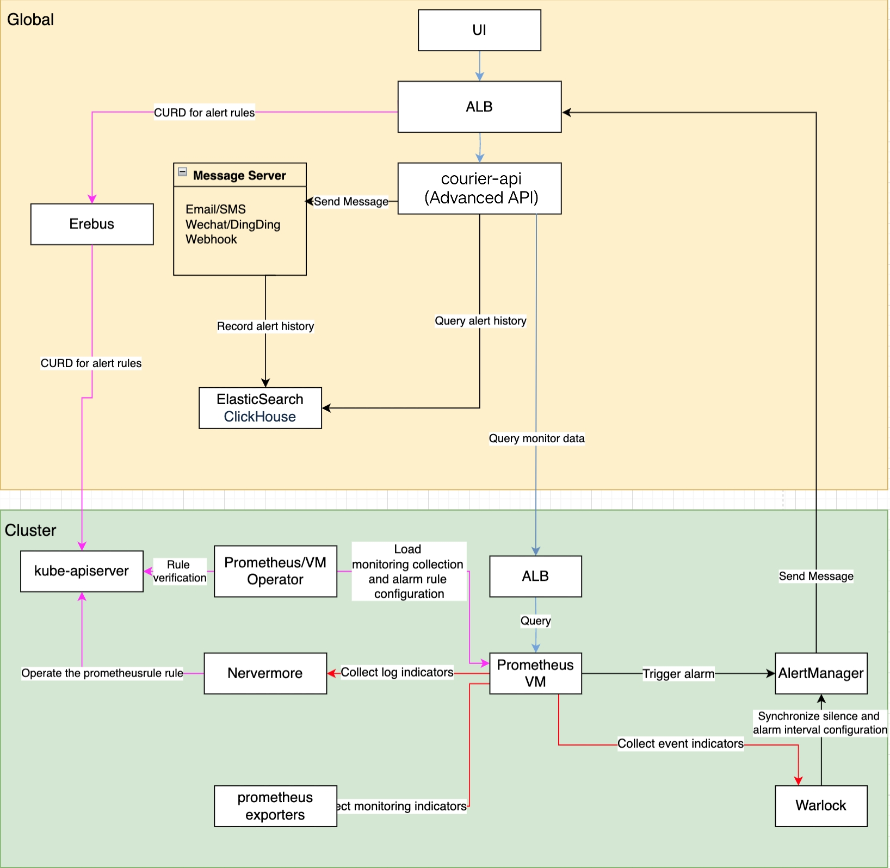

# Архитектура модуля мониторинга

## Общая объяснение архитектуры

Мониторинговая система состоит из следующих основных функциональных модулей:

1. Мониторинговая система
   - Сбор и хранение данных: Сбор и сохранение метрик мониторинга из нескольких источников
   - Запрос данных и визуализация: Предоставление гибких возможностей запроса и визуализации для данных мониторинга
2. Система оповещения
   - Управление правилами оповещения: Настройка и управление политиками оповещения
   - Срабатывание оповещения и уведомление: Оценка правил оповещения и отправка уведомлений
   - Статус оповещения в реальном времени: Предоставление текущего статуса оповещения системы в реальном времени
3. Система уведомлений
   - Настройка уведомлений: Управление шаблонами уведомлений, контактными группами и политиками
   - Уведомительный сервер: Управление конфигурацией различных каналов уведомлений

## Мониторинговая система

### Сбор и хранение данных

1. Обязанности оператора Prometheus/VictoriaMetrics:
   - Загрузка и проверка конфигураций сбора мониторинга
   - Загрузка и проверка конфигураций правил оповещения
   - Синхронизация конфигураций с экземплярами Prometheus/VictoriaMetrics
2. Источники данных мониторинга:
   - Nevermore: Генерирует метрики, связанные с логами
   - Warlock: Генерирует метрики, связанные с событиями
   - Prometheus/VictoriaMetrics: Обнаруживает и собирает метрики различных экспортеров через ServiceMonitor

### Запрос данных и визуализация

1. Процесс запроса данных мониторинга:
   - Браузер инициирует запрос (Путь: `/platform/monitoring.alauda.io/v1beta1`)
   - ALB перенаправляет запрос на компонент Courier
   - API Courier обрабатывает запрос:
     - Встроенные метрики: Получает PromQL через интерфейс индикаторов и выполняет запрос
     - Пользовательские метрики: Непосредственно перенаправляет PromQL на компонент мониторинга
   - Мониторинговая панель получает данные и отображает их

2. Процесс управления мониторинговой панелью:
   - Пользователи получают доступ к ALB кластера `global` (Путь: `/kubernetes/cluster_name/apis/ait.alauda.io/v1alpha2/MonitorDashboard`)
   - ALB перенаправляет запрос на компонент Erebus
   - Erebus маршрутизирует запрос к целевому кластеру мониторинга
   - Компонент Warlock отвечает за:
     - Проверку законности конфигурации мониторинговой панели
     - Управление ресурсом MonitorDashboard CR

## Система оповещения

### Управление правилами оповещения

Процесс конфигурации правила оповещения:

1. Пользователи получают доступ к ALB кластера `global` (Путь: `/kubernetes/cluster_name/apis/monitoring.coreos.com/v1/prometheusrules`)
2. Запрос проходит через ALB -> Erebus -> kube-apiserver целевого кластера
3. Обязанности каждого компонента:
   - Оператор Prometheus/VictoriaMetrics:
     - Проверка законности правил оповещения
     - Управление PrometheusRule CR
   - Nevermore: Прослушивание и обработка метрик оповещения логов
   - Warlock: Прослушивание и обработка метрик оповещения событий

### Рабочий процесс обработки оповещения

1. Оценка оповещения:
   - PrometheusRule/VMRule определяет правила оповещения
   - Prometheus/VictoriaMetrics периодически оценивает правила
2. Уведомление об оповещении:
   - Оповещения отправляются в Alertmanager после срабатывания
   - Alertmanager -> ALB -> API Courier
   - API Courier отвечает за отправку уведомлений
3. Хранение оповещения:
   - История оповещений хранится в ElasticSearch/ClickHouse

### Статус оповещения в реальном времени

1. Сбор статуса:
   - Courier кластера `global` генерирует метрики:
     - cpaas\_active\_alerts: Текущие активные оповещения
     - cpaas\_active\_silences: Текущие настройки молчания
   - Глобальный Prometheus собирает каждые 15 секунд
2. Отображение статуса:
   - Фронт-энд запрашивает и отображает статус в реальном времени через API Courier

## Система уведомлений

### Управление настройкой уведомлений

Процесс управления шаблонами уведомлений, группами контактов для уведомлений и политиками уведомлений следующий:

1. Пользователи получают доступ к стандартному API кластера `global` через браузер
   - Путь доступа: `/apis/ait.alauda.io/v1beta1/namespaces/cpaas-system`
2. Управление связанными ресурсами:
   - Шаблон уведомления: apiVersion: "ait.alauda.io/v1beta1", kind: "NotificationTemplate"
   - Группа контактов для уведомления: apiVersion: "ait.alauda.io/v1beta1", kind: "NotificationGroup"
   - Политика уведомлений: apiVersion: "ait.alauda.io/v1beta1", kind: "Notification"
3. Courier отвечает за:
   - Проверку законности шаблонов уведомлений
   - Проверку законности групп контактов для уведомлений
   - Проверку законности политик уведомлений

### Управление уведомительным сервером

1. Пользователи получают доступ к ALB кластера `global` через браузер
   - Путь доступа: `/kubernetes/global/api/v1/namespaces/cpaas-system/secrets`
2. Управление и подача конфигураций уведомительного сервера
   - Имя ресурса: platform-email-server
3. Courier отвечает за:
   - Проверку законности конфигурации уведомительного сервера
