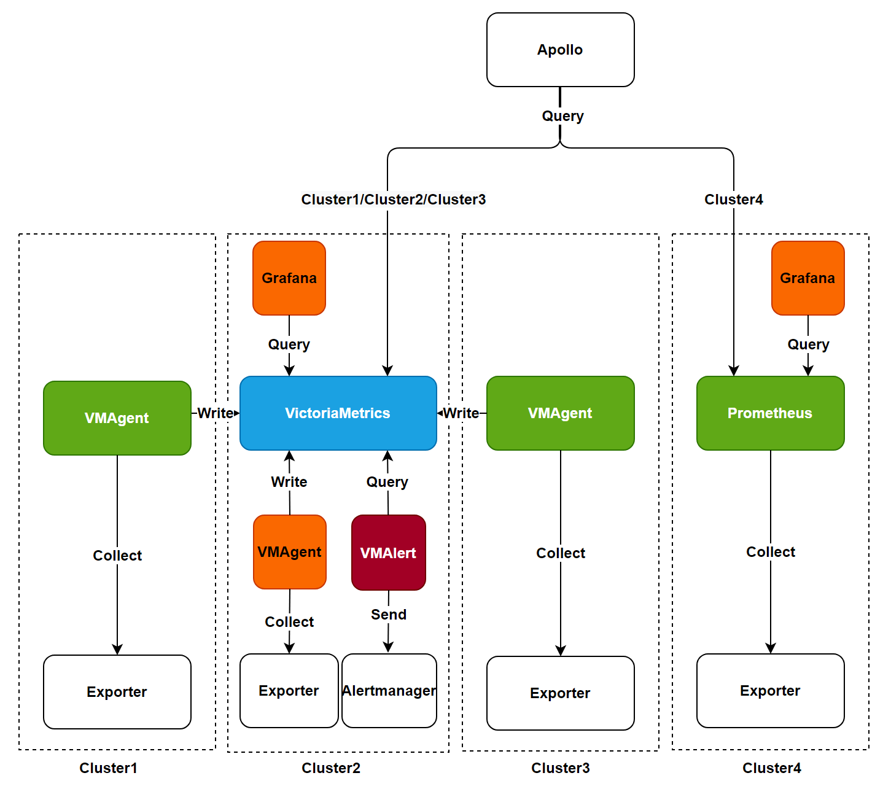

# Руководство по выбору компонентов мониторинга

При установке мониторинга кластера платформа предоставляет два компонента мониторинга на выбор: VictoriaMetrics и Prometheus. Эта статья подробно описывает характеристики и сферы применения этих двух компонентов, помогая вам сделать наиболее подходящий выбор.

## Важные замечания

- При установке компонентов мониторинга кластера можно выбрать только один из VictoriaMetrics или Prometheus.
- Начиная с версии 3.18, VictoriaMetrics была обновлена до статуса Beta, что соответствует условиям использования в производственной среде.
- VictoriaMetrics подходит для сценариев с высокими требованиями к доступности и многокластерного мониторинга.
- Prometheus подходит для сценариев мониторинга одного кластера, особенно для небольших масштабов.

## Список компонентов

### Связанные компоненты Prometheus

| Название компонента      | Описание функции                                                                                |
| ----------------------- | ----------------------------------------------------------------------------------------------- |
| Prometheus Server       | Основной сервер, ответственный за сбор, хранение и запрос данных мониторинга                   |
| Exporters               | Компоненты сбора данных мониторинга, которые раскрывают метрики мониторинга через HTTP-интерфейсы |
| AlertManager            | Центр управления оповещениями, обрабатывающий правила оповещения и уведомления                 |
| PushGateway             | Поддерживает режим «push» для данных мониторинга, используемый для передачи данных в специальных сетевых средах |

### Связанные компоненты VictoriaMetrics

| Название компонента | Описание функции                                               |
| ------------------- | -------------------------------------------------------------- |
| VMStorage           | Двигатель хранения данных мониторинга                         |
| VMInsert            | Компонент записи данных, ответственный за распределение и хранение данных |
| VMSelect            | Компонент сервиса запросов, предоставляющий возможности запросов данных |
| VMAlert             | Компонент оценки и обработки правил оповещения                |
| VMAgent             | Компонент сбора метрик мониторинга                            |

## Сравнение архитектуры

### Архитектура Prometheus

Prometheus — это зрелая система мониторинга с открытым исходным кодом и второй проект, выпущенный CNCF после Kubernetes. Она имеет следующие характеристики:

- Мощные возможности сбора данных.
- Гибкий язык запросов PromQL.
- Обширная экосистема.
- Поддерживает мониторинг кластера на масштабе в тысячу узлов.

### Архитектура VictoriaMetrics

VictoriaMetrics — это решение для мониторинга и база данных временных рядов следующего поколения с высокими показателями производительности, имеющая следующие преимущества:

- Более высокий коэффициент сжатия данных.
- Более низкое потребление ресурсов.
- Нативная поддержка высокой доступности кластера.
- Упрощенное управление эксплуатацией и обслуживанием.

## Сравнение характеристик

| Характеристика                   | Prometheus             | VictoriaMetrics | Описание                                                                              |
| -------------------------------- | ---------------------- | ---------------- | ------------------------------------------------------------------------------------- |
| Установка высокой доступности     | ❌                      | ✅               | VictoriaMetrics поддерживает истинную высокую доступность кластера с лучшей согласованностью данных |
| Установка на одном узле          | ✅                      | ✅               | Оба компонента поддерживают режим установки на одном узле                            |
| Долгосрочное хранение данных     | Требуется удаленное хранилище | Нативно поддерживается | VictoriaMetrics больше подходит для долгосрочного хранения данных                     |
| Эффективность использования ресурсов | Более высокая         | Лучше           | VictoriaMetrics имеет лучшую эффективность использования ресурсов                    |
| Поддержка сообщества              | Очень зрелое           | Быстро развивающееся | У Prometheus более крупная экосистема сообщества                                    |

## Рекомендации по установке

### Обзор архитектуры установки мониторинга

На приведенной выше диаграмме показана архитектура установки и поток данных компонентов мониторинга, поддерживаемых платформой. Платформа предлагает следующие два метода установки на выбор:

**Примечание**: При замене компонентов мониторинга, пожалуйста, убедитесь, что существующие компоненты полностью удалены, и мониторинговые данные не поддерживают кросс-компонентную миграцию.

#### Метод установки Prometheus

Этот метод соответствует архитектуре **cluster4** на приведенной выше диаграмме:

- Использует компоненты Prometheus для сбора и обработки данных мониторинга.
- Запрашивает и отображает данные через панель мониторинга.
- Подходит для сценариев одного кластера.

#### Метод установки VictoriaMetrics

VictoriaMetrics поддерживает следующие два режима установки:

1. **Режим установки одного кластера**
   - Соответствует архитектуре **cluster2** на приведенной выше диаграмме.
   - Все компоненты VictoriaMetrics устанавливаются в одном кластерe.
   - Использует VMAgent для сбора данных и записи в VictoriaMetrics.
   - VMAlert отвечает за оценку правил оповещения.
   - Запрашивает и отображает данные через панель мониторинга.
     **Совет**: Рекомендуется использовать этот режим, когда объем данных менее 1 миллиона в секунду.

2. **Режим установки нескольких кластеров**
   - Соответствует архитектуре **cluster1/cluster2/cluster3** на приведенной выше диаграмме.
   - Устанавливает VMAgent в рабочем кластере в качестве агента сбора данных.
   - VMAgent записывает данные в VictoriaMetrics в центральном кластере мониторинга.
   - Поддерживает единое управление мониторингом между несколькими кластерами.
     **Совет**: Убедитесь, что службы VictoriaMetrics установлены в кластере мониторинга перед установкой VMAgent.

### Рекомендации по выбору

#### Сценарии, подходящие для использования VictoriaMetrics

- **Нужды в высокой производительности и масштабируемости**: Подходит для сценариев мониторинга, которые обрабатывают данные с высокой пропускной способностью и долгосрочного хранения.
- **Соображения по соотношению цены и качества**: Необходима оптимизация затрат на хранение и вычислительные ресурсы.
- **Требования к высокой доступности**: Требуется гарантия высокой доступности компонентов мониторинга.
- **Управление несколькими кластерами**: Необходима единое управление данными мониторинга между несколькими кластерами.

#### Сценарии, подходящие для использования Prometheus

- **Один кластер с небольшим масштабом**: Масштаб мониторинга небольшой, без требований к высокой доступности.
- **Существующие пользователи Prometheus**: Уже имеется полноценная система мониторинга Prometheus.
- **Простые требования к стабильности**: Стремление к простому и надежному решению для мониторинга.
- **Глубокая интеграция с экосистемой**: Тесная интеграция с экосистемой Prometheus с высокими затратами на миграцию.
