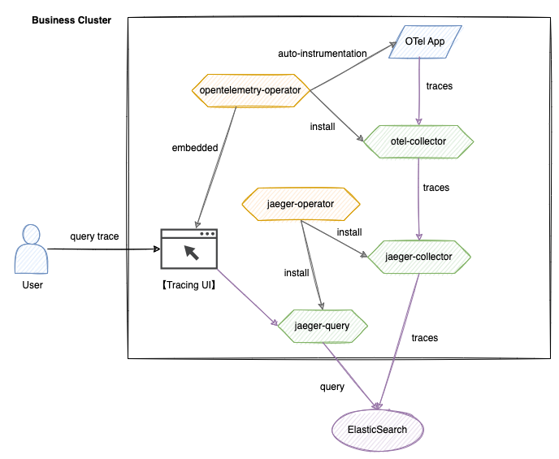

# Архитектура

Эта архитектура построена на стеке технологий OpenTelemetry и Jaeger, обеспечивая полное управление жизненным циклом распределенной трассировки. Система состоит из пяти основных модулей: сбора данных, передачи, хранения, запроса и визуализации.

## Основные компоненты

1. **Система OpenTelemetry**
   - **opentelemetry-operator**\
     Оператор уровня кластера, отвечающий за развертывание и управление компонентом otel-collector, предоставляющий возможность автоматической инъекции OTel.
   - **otel-collector**\
     Принимает данные трассировки от приложений, фильтрует и группирует их, а затем передает их jaeger-collector.
   - **Tracing UI**\
     Самостоятельно разработанный визуальный интерфейс, который интегрируется с API jaeger-query и поддерживает многомерные условия запроса.

2. **Система Jaeger**
   - **jaeger-operator**\
     Развёртывает и управляет компонентами jaeger-collector и jaeger-query.
   - **jaeger-collector**\
     Принимает данные трассировки, переданные и обработанные otel-collector, выполняет преобразование формата и записывает их в Elasticsearch.
   - **jaeger-query**\
     Предоставляет API запроса трассировки, поддерживающий многоусловный поиск, включая TraceID и метки.

3. **Слой хранения**
   - **Elasticsearch**\
     Распределённый механизм хранения, который поддерживает эффективную запись и извлечение огромных объемов данных Span.

## Поток данных

- **Процесс записи**\
  `Приложение -> otel-collector -> jaeger-collector -> Elasticsearch`
  
  Приложение генерирует данные Span через SDK или автоматическую инъекцию, которые стандартизируются otel-collector и затем сохраняются в Elasticsearch через jaeger-collector.

- **Процесс запроса**\
  `Пользователь -> Tracing UI -> jaeger-query -> Elasticsearch`
  
  Пользователь отправляет условия запроса через UI, а jaeger-query извлекает данные из Elasticsearch; UI визуализирует результаты на основе возвращаемых данных.
