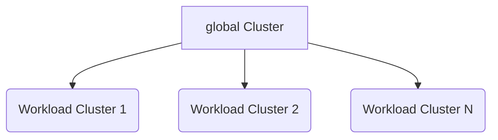

# Архитектура

Архитектура платформы Alauda Container Platform (<Term name="productShort" />) разработана для обеспечения надежного, масштабируемого и гибкого облачного инфраструктурного решения. Этот документ описывает основные архитектурные принципы, типы кластеров и проектные соображения, которые составляют основу нашей платформы.

## Архитектурные концепции

### `global` кластер

`global` кластер является центральной нервной системой платформы Alauda Container Platform. Он служит основным управленческим и контрольным уровнем для всей платформы, отвечая за:

- Управление кластерами по всей платформе
- Управление арендаторами и контроль доступа
- Глобальное планирование и оркестрацию
- Конфигурацию на уровне платформы и соблюдение политик
- Мониторинг и наблюдаемость экосистемы

Ключевые характеристики `global` кластера включают:

- Выделенные физические ресурсы
- Изоляция от обработки рабочих нагрузок
- Централизованные возможности управления
- Высокая доступность и конфигурация безопасности

### Кластеры рабочих нагрузок

**Кластеры рабочих нагрузок** — это среды выполнения, предназначенные для размещения и запуска фактических приложений и сервисов. Эти кластеры:

- Выделены для выполнения рабочих нагрузок приложений
- Способны к горизонтальному масштабированию
- Гибкие в различных типах инфраструктуры
- Управляются и оркестрируются `global` кластером

## Принципы архитектурного проектирования

### 1. Изоляция контрольного уровня

Архитектура требует строгого разделения между `global` кластером и кластерами рабочих нагрузок:

- `global` кластер использует выделенные физические ресурсы
- Предотвращает конкуренцию за ресурсы и ухудшение производительности
- Обеспечивает стабильное и безопасное управление платформой

### 2. Операционная гибкость

<Term name="productShort" /> поддерживает несколько операционных сценариев:

- Полностью разделенные `global` и кластеры рабочих нагрузок (рекомендуется для производства)
- Совмещенные конфигурации для разработки и сред с ограниченными ресурсами
- Гибридные облачные и многооблачные архитектуры

### 3. Доступ и управление кластерами

Два основных метода интеграции кластеров рабочих нагрузок:

a) **Создание новых кластеров рабочих нагрузок**

- Рекомендуемый подход
- Полностью управляется `global` кластером
- Последовательная конфигурация и соблюдение стандартов
- Упрощенное управление жизненным циклом

b) **Присоединение существующих кластеров**

- Поддержка подключения заранее существующих кластеров Kubernetes
- Необходимы проверки версии и совместимости
- Стандартизированные протоколы доступа и управления

## Визуализация архитектуры

## Ключевые преимущества этой архитектуры

- **Улучшенная безопасность**: Изолированные контрольные и исполнительные уровни
- **Масштабируемость**: Легкое добавление новых кластеров рабочих нагрузок
- **Гибкость**: Поддержка разнообразных инфраструктурных сред
- **Эффективность**: Централизованное управление с распределенной обработкой
- **Соблюдение стандартов**: Последовательное соблюдение политик по всем кластерам

## Архитектурные соображения

При планировании архитектуры <Term name="productShort" /> учитывайте:

- Разнообразие инфраструктуры
- Требования к масштабируемости
- Потребности в соблюдении стандартов и безопасности
- Характеристики рабочих нагрузок приложений
