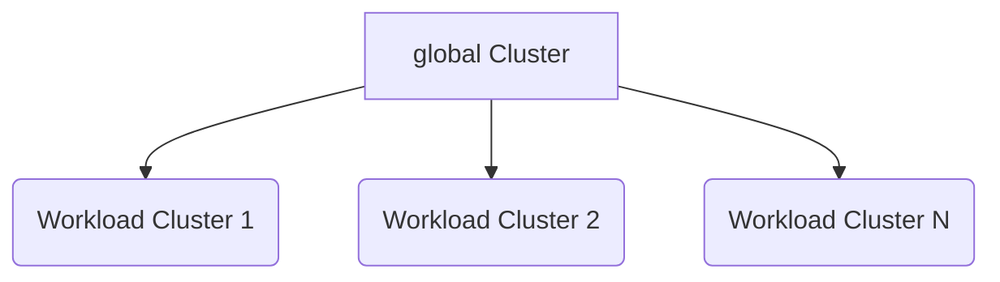

# Архитектура

Архитектура платформы Alauda Container Platform (<Term name="productShort" />) разработана для обеспечения надежного, масштабируемого и гибкого облачного инфраструктурного решения. Этот документ описывает основные архитектурные принципы, типы кластеров и проектные соображения, которые составляют основу нашей платформы.

## Архитектурные концепции

### `global` кластер

`global` кластер является центральной нервной системой платформы Alauda Container Platform. Он служит основным управленческим и контрольным уровнем для всей платформы, отвечая за:

- Управление кластерами по всей платформе
- Управление арендаторами и контроль доступа
- Глобальное планирование и оркестрация
- Конфигурирование и обеспечение соблюдения политик на уровне платформы
- Мониторинг и наблюдаемость за экосистемой

Ключевые характеристики `global` кластера включают:

- Выделенные физические ресурсы
- Изоляция от обработки рабочих нагрузок
- Централизованные возможности управления
- Высокая доступность и настройки безопасности

### Кластеры рабочих нагрузок

**Кластеры рабочих нагрузок** представляют собой среды выполнения, предназначенные для размещения и запуска реальных приложений и услуг. Эти кластеры:

- Выделены для выполнения рабочих нагрузок приложений
- Способны к горизонтальному масштабированию
- Гибкие для различных типов инфраструктуры
- Управляются и оркестрируются `global` кластером

## Принципы архитектурного проектирования

### 1. Изоляция управляющего уровня

Архитектура требует строгого разделения между `global` кластером и кластерами рабочих нагрузок:

- `global` кластер использует выделенные физические ресурсы
- Предотвращает конкуренцию за ресурсы и деградацию производительности
- Обеспечивает стабильное и безопасное управление платформой

### 2. Оперативная гибкость

<Term name="productShort" /> поддерживает несколько операционных сценариев:

- Полностью разделенные `global` и кластеры рабочих нагрузок (рекомендуется для продакшн окружений)
- Совместные конфигурации для разработок и ресурсов с ограниченной емкостью
- Гибридные облачные и многооблачные архитектуры

### 3. Доступ и управление кластерами

Два основных метода интеграции кластера рабочих нагрузок:

a) **Создание новых кластеров рабочих нагрузок**

- Рекомендуемый подход
- Полностью управляется `global` кластером
- Консистентная конфигурация и соблюдение стандартов
- Упрощенное управление жизненным циклом

b) **Присоединение существующих кластеров**

- Поддержка подключения уже существующих кластеров Kubernetes
- Необходимы проверки версии и совместимости
- Стандартизированные протоколы доступа и управления

## Визуализация архитектуры

## Ключевые преимущества данной архитектуры

- **Усиленная безопасность**: Изолированные управляющие и рабочие планы
- **Масштабируемость**: Легкое добавление новых кластеров рабочих нагрузок
- **Гибкость**: Поддержка различных инфраструктурных сред
- **Эффективность**: Централизованное управление с распределенной обработкой
- **Соблюдение стандартов**: Консистентное соблюдение политик между кластерами

## Архитектурные соображения

При планировании архитектуры <Term name="productShort" /> учитывайте:

- Разнообразие инфраструктуры
- Требования к масштабируемости
- Потребности в соблюдении стандартов и безопасности
- Характеристики рабочих нагрузок приложений
