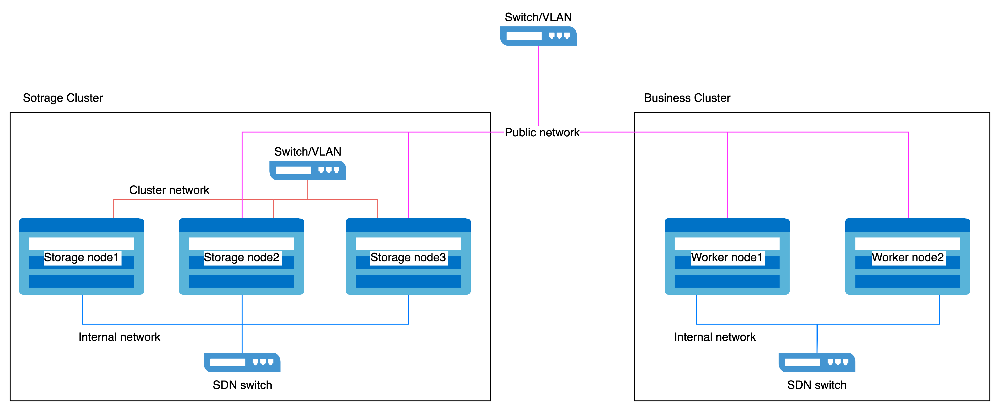

# Настройка выделенного кластера для распределенного хранения

Развертывание выделенного кластера относится к использованию независимого кластера для развертывания распределенного хранения платформы, где другие бизнес-кластеры внутри платформы получают доступ и используют предоставляемые ей услуги хранения через интеграцию.\
Для обеспечения производительности и стабильности распределенного хранения платформы в выделенном кластер хранилища разворачиваются только основные компоненты платформы и компоненты распределенного хранения, избегая совместного размещения других бизнес-нагрузок. Этот подход раздельного развертывания считается рекомендуемой лучшей практикой для распределенного хранения платформы.

## Архитектура

Архитектура разделения хранения и вычислений


## Требования к инфраструктуре

### Требования к платформе

Поддерживается в версии 3.18 и выше.

### Требования к кластеру

Рекомендуется использовать кластер на базе физического оборудования в качестве выделенных кластеров хранения.

### Требования к ресурсам

Пожалуйста, обратитесь к [Основным концепциям](../concepts/concept.mdx) для компонентов развертывания распределенного хранения.

Каждый компонент имеет свои индивидуальные требования к ЦП и памяти. Рекомендуемые конфигурации следующие:

| Процесс | ЦП   | Память |
| :------ | :-:   | :----: |
| MON     |  2c  |   3Gi  |
| MGR     |  3c  |   4Gi  |
| MDS     |  3c  |   8Gi  |
| RGW     |  2c  |   4Gi  |
| OSD     |  4c  |   8Gi  |

В кластере обычно работают:

- 3 MON
- 2 MGR
- несколько OSD
- 2 MDS (если используется CephFS)
- 2 RGW (если используется CephObjectStorage)

На основе распределения компонентов применяются следующие рекомендации по ресурсам на узел:

| ЦП                        | Память                       |
| :------------------------ | :--------------------------- |
| 16c + (4c \* OSD на узел) | 20Gi + (8Gi \* OSD на узел) |

### Требования к устройствам хранения

Рекомендуется развертывать 12 или менее устройств хранения на узел. Это помогает ограничить время восстановления после сбоя узла.

#### Требования к типу устройства хранения

Рекомендуется использовать корпоративные SSD с емкостью 10TiB или меньше на устройство и обеспечить, чтобы все диски были одинаковыми по размеру и типу.

#### Планирование ёмкости

Перед развертыванием необходимо спланировать ёмкость хранения в соответствии с конкретными бизнес-требованиями. По умолчанию распределенная система хранения использует стратегию избыточности с 3 репликами. Поэтому usable capacity рассчитывается путем деления общей первичной ёмкости хранения (от всех устройств хранения) на 3.

Пример для 30(N) узлов (количество реплик = 3), сценарий емкости usable capacity выглядит следующим образом:

| Размер устройства хранения(D) | Устройств хранения на узел(M) | Общая ёмкость(D*M*N) | Usable ёмкость(D*M*N/3) |
| :-----------------------------: | :------------------------------: | :------------------: | :---------------------: |
|             0.5 TiB            |               3                  |          45 TiB      |          15 TiB        |
|              2 TiB             |               6                  |         360 TiB      |         120 TiB        |
|              4 TiB             |               9                  |        1080 TiB      |         360 TiB        |

#### Мониторинг ёмкости и расширение

1. **Превентивное планирование ёмкости**

   Всегда следите за тем, чтобы usable ёмкость хранения превышала потребление. Если заполнение хранилища достигнуто, восстановление требует ручного вмешательства и не может быть решено простым удалением или миграцией данных.

2. **Оповещения по ёмкости**

   Кластер создает оповещения на двух порогах:

   - **80% использование** ("почти полное"): Превентивно **освободите место** или увеличьте кластер.
   - **95% использование** ("полное"): Хранилище полностью исчерпано, и стандартные команды не могут освободить место. Свяжитесь со службой поддержки платформы немедленно.

   Всегда оперативно реагируйте на оповещения и регулярно отслеживайте использование хранилища, чтобы избежать сбоев.

3. **Рекомендации по масштабированию**

   - **Избегайте**: Добавления устройств хранения в существующие узлы.
   - **Рекомендуется**: Масштабироваться, добавляя новые узлы хранения.
   - **Требование**: Новые узлы должны использовать устройства хранения одинакового размера, типа и количества с существующими узлами.

### Требования к сети

Распределенное хранилище должно использовать **HostNetwork**.

#### Изоляция сети

Сеть делится на два типа:

- **Публичная сеть**: Используется для взаимодействия клиента с компонентами хранения (например, I/O запросы).
- **Кластерная сеть**: Предназначена для репликации данных между репликами и перераспределения данных (например, восстановление).

Для обеспечения качества услуги и стабильности производительности:

1. Для выделенных кластеров хранения:\
   Зарезервируйте два сетевых интерфейса на каждом узле:
   - Публичная сеть: Для связи клиента и компонента.
   - Кластерная сеть: Для внутренней репликации и трафика перераспределения.
   
2. Для бизнес-класстеров:\
   Зарезервируйте один сетевой интерфейс на каждом узле для доступа к публичной сети хранения.

Пример конфигурации изоляции сети



#### Требования к скорости сетевого интерфейса

1. **Узлы хранения**
   - **Публичная сеть** и **кластерная сеть** требуют сетевых интерфейсов 10GbE или выше.

2. **Узлы бизнес-кластера**
   - Сетевой интерфейс, используемый для доступа к публичной сети хранения, должен быть 10GbE или выше.

## Процедура

<Steps>
  ### Развернуть Оператор

  1. Получите доступ к **Управлению платформой**.

  2. В левой боковой панели нажмите **Управление Хранилищем** > **Распределенное Хранилище**.

  3. Нажмите **Создать сейчас**.

  4. В странице мастера **Развертывание оператора** нажмите кнопку **Развернуть Оператор** в правом нижнем углу.
     - Когда страница автоматически переходит к следующему шагу, это указывает на успешное развертывание Оператора.
     - Если развертывание не удалось, пожалуйста, обратитесь к сообщению на интерфейсе **Очистить развернутую информацию и повторить попытку** и заново разверните Оператора; если вы хотите вернуться на страницу выбора распределенного хранения, нажмите **Магазин приложений**, сначала удалите ресурсы в уже развернутом **rook-operator**, а затем удалите **rook-operator**.

  ### Создать кластер ceph

  Выполните команды на **контрольном узле** кластера хранения.

  <details>
    <summary>Нажмите для просмотра</summary>

    ```yaml
    cat << EOF | kubectl create -f -
    apiVersion: ceph.rook.io/v1
    kind: CephCluster
    metadata:
      name: ceph-cluster
      namespace: rook-ceph
    spec:
      cephConfig:
        global:
          mon_memory_target: "3221225472"
          mds_cache_memory_limit: "8589934592"
          osd_memory_target: "8589934592"
          bluefs_buffered_io: "false"
        mon:
          auth_allow_insecure_global_id_reclaim: "true"
          mon_warn_on_insecure_global_id_reclaim: "false"
          mon_warn_on_insecure_global_id_reclaim_allowed: "false"
      cephVersion:
        image: build-harbor.alauda.cn/3rdparty/ceph/ceph:v18.2.4-0
      dashboard:
        enabled: true
      dataDirHostPath: /var/lib/rook
      mgr:
        count: 2
        modules:
        - enabled: true
          name: pg_autoscaler
      mon:
        count: 3
      monitoring:
        enabled: true
      network:
        ipFamily: IPv4
        addressRanges:
          public:
          - <public network cidr>
          cluster:
          - <cluster network cidr>
        provider: host
      placement:
        all:
          tolerations:
          - effect: NoSchedule
            operator: Exists
          - key: "node-role.kubernetes.io/master"
            operator: "Exists"
            effect: "NoSchedule"
          - key: "node-role.kubernetes.io/control-plane"
            operator: "Exists"
            effect: "NoSchedule"
          - key: "node-role.kubernetes.io/cpaas-system"
            operator: "Exists"
            effect: "NoSchedule"
        mgr:
          podAffinity:
            podAntiAffinity:
              requiredDuringSchedulingIgnoredDuringExecution:
              - labelSelector:
                  matchExpressions:
                  - key: app
                    operator: In
                    values:
                    - rook-ceph-mgr
                  topologyKey: kubernetes.io/hostname
      priorityClassNames:
        all: system-node-critical
      resources:
        crashcollector:
          limits:
            cpu: 200m
            memory: 128Mi
          requests:
            cpu: 100m
            memory: 64Mi
        mgr:
          requests:
            cpu: "3"
            memory: 4Gi
        mon:
          requests:
            cpu: "2"
            memory: 3Gi
        osd:
          requests:
            cpu: "4"
            memory: 8Gi
      storage:
        <storage devices>
    EOF
    ```
  </details>

  **Параметры**:

  - **public network cidr**: CIDR публичной сети хранения (например, `- 10.0.1.0/24`).
  - **cluster network cidr**: CIDR кластерной сети хранения (например, `- 10.0.2.0/24`).
  - **storage devices**: Укажите устройства хранения, которые будут использоваться для распределенного хранения.\
    Пример форматирования:
    ```
      nodes:
      - name: storage-node-01
        devices:
        - name: /dev/disk/by-id/wwn-0x5000cca01dd27d60
        useAllDevices: false
      - name: storage-node-02
        devices:
        - name: sdb
        - name: sdc
        useAllDevices: false
      - name: storage-node-03
        devices:
        - name: sdb
        - name: sdc
        useAllDevices: false
    ```
      <Directive type="info" title="Совет">
        Используйте Всемирное Имя (WWN) диска для стабильного именования, что исключает зависимость от изменчивых путей устройств, таких как `sdb`, которые могут измениться после перезагрузки.
      </Directive>

  ### Создать пула хранения

  Доступны три типа пула хранения. Выберите и создайте подходящие на основе ваших бизнес-требований.

  #### Создать файловый пул

  Выполните команды на **контрольном узле** кластера хранения.

  <details>
    <summary>Нажмите для просмотра</summary>

    ```yaml
    cat << EOF | kubectl apply -f -
    apiVersion: ceph.rook.io/v1
    kind: CephFilesystem
    metadata:
      name: cephfs
      namespace: rook-ceph
    spec:
      metadataPool:
        failureDomain: host
        replicated:
          requireSafeReplicaSize: true
          size: 3
      dataPools:
      - failureDomain: host
        replicated:
          requireSafeReplicaSize: true
          size: 3
      preserveFilesystemOnDelete: false
      metadataServer:
        activeCount: 1
        activeStandby: true
        placement:
          podAntiAffinity:
            requiredDuringSchedulingIgnoredDuringExecution:
            - labelSelector:
                matchExpressions:
                - key: app
                  operator: In
                  values:
                  - rook-ceph-mds
              topologyKey: kubernetes.io/hostname
          tolerations:
          - effect: NoSchedule
            operator: Exists
        resources:
          requests:
            cpu: "3"
            memory: 8Gi
    EOF
    ```
  </details>

  #### Создать пул блоков

  Выполните команды на **контрольном узле** кластера хранения.

  <details>
    <summary>Нажмите для просмотра</summary>

    ```yaml
    cat << EOF | kubectl apply -f -
    apiVersion: ceph.rook.io/v1
    kind: CephBlockPool
    metadata:
      name: block
      namespace: rook-ceph
    spec:
      failureDomain: host
      replicated:
        size: 3
    EOF
    ```
  </details>

  #### Создать объектный пул

  Выполните команды на **контрольном узле** кластера хранения.

  <details>
    <summary>Нажмите для просмотра</summary>

    ```yaml
    cat << EOF | kubectl apply -f -
    apiVersion: ceph.rook.io/v1
    kind: CephObjectStore
    metadata:
      name: object
      namespace: rook-ceph
    spec:
      metadataPool:
        failureDomain: host
        replicated:
          requireSafeReplicaSize: true
          size: 3
      dataPool:
        failureDomain: host
        replicated:
          requireSafeReplicaSize: true
          size: 3
      preservePoolsOnDelete: false
      gateway:
        instances: 2
        placement:
          podAntiAffinity:
            requiredDuringSchedulingIgnoredDuringExecution:
            - labelSelector:
                matchExpressions:
                - key: app
                  operator: In
                  values:
                  - rook-ceph-rgw
              topologyKey: kubernetes.io/hostname
          tolerations:
          - effect: NoSchedule
            operator: Exists
        port: 7480
        resources:
          requests:
            cpu: "2"
            memory: 4Gi
    EOF
    ```
  </details>
</Steps>

## Последующие действия

Когда другие кластеры нуждаются в использовании службы распределенного хранилища, обратитесь к следующим рекомендациям.\
[Доступ к услугам хранения](/storage/storagesystem_ceph/functions/access_storage_service.mdx)
