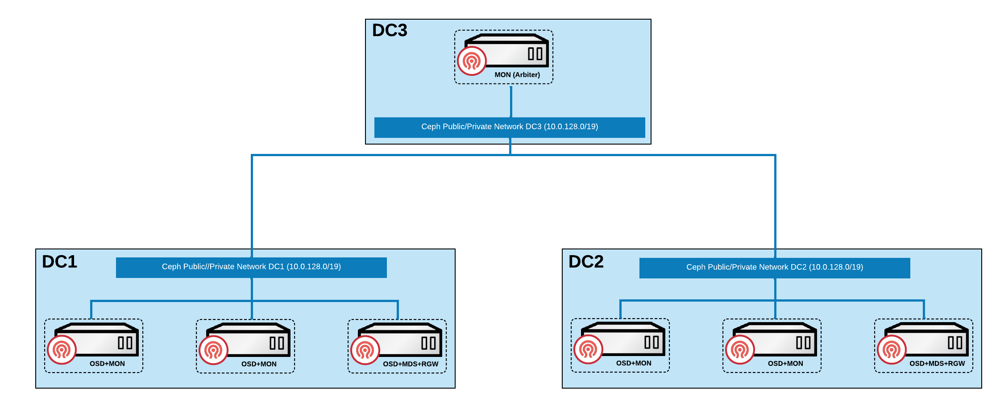

# Создание кластера Stretch Type

Кластер Stretch может охватывать две географически различные локации, обеспечивая возможности аварийного восстановления для инфраструктуры хранения. В случае катастрофы, когда одна зона доступности в двух зонах полностью недоступна, Ceph все равно может сохранить доступность.

## Терминология

| Термин                        | Объяснение                                                                                                                                                                                                                                        |
| ----------------------------- | -------------------------------------------------------------------------------------------------------------------------------------------------------------------------------------------------------------------------------------------------- |
| **Зона доступности кворума**  | Обычно расположена в отдельной зоне, которая не несет основных рабочих нагрузок, сосредоточена на поддержании согласованности кластера и в основном используется для арбитражных решений, когда происходит сбой в основном дата-центре или происходит сетевое разделение. |
| **Зона доступности данных**   | Основная область в кластере Ceph, где данные фактически хранятся и обрабатываются, несущая операционные нагрузки и задачи хранения данных, формируя вместе с зоной кворума полную систему хранения с высокой доступностью.                             |

## Типовая схема развертывания

Следующее содержание предоставляет типовую схему развертывания для кластеров Stretch, а также описания компонентов и принципы аварийного восстановления.

### Описание компонентов

Ноды должны быть распределены по трем зонам доступности, включая две зоны доступности данных и одну зону доступности кворума.

- Обе зоны доступности данных должны полностью развернуть все основные [компоненты Ceph](../concepts/concept.mdx#ceph-module-functions) (MON, OSD, MGR, MDS, RGW), и каждая зона доступности данных должна настроить два экземпляра MON для высокой доступности. Когда оба экземпляра MON в одной и той же зоне доступности данных недоступны, система определит, что зона доступности находится в состоянии сбоя.

- Зона доступности кворума требует развертывания только одного экземпляра MON, который служит в качестве узла для арбитражного решения.

### Объяснение аварийного восстановления

- Когда зона доступности данных полностью выходит из строя, кластер Ceph автоматически переходит в ухудшенное состояние и запускает уведомление об аварии. Система настроит минимальное количество реплик в пуле хранения (min\_size) с 2 до 1. Поскольку другая зона доступности данных по-прежнему поддерживает двойные реплики, кластер остается доступным. Когда вышедшая из строя зона доступности данных восстанавливается, система автоматически выполнит синхронизацию данных и вернется в здоровое состояние; если сбой не может быть исправлен, рекомендуется заменить ее на новую зону доступности данных.

- Когда сетевое соединение между двумя зонами доступности данных прерывается, но они по-прежнему могут нормально подключаться к зоне доступности кворума, зона доступности кворума проведет арбитраж между двумя зонами доступности данных на основе заранее заданных политик, выбирая ту, которая в лучшем состоянии, чтобы продолжать предоставлять услуги в качестве основной зоны данных.

## Ограничения и ограничения

- **Ограничения пула хранения**: Пулы хранения с кодом стирания не поддерживаются, и для защиты данных можно использовать только механизмы репликации.

- **Ограничения классификации устройств**: Функциональность класса устройства не поддерживается, и хранение не может быть стратифицировано на основе характеристик устройства.

- **Ограничения регионального развертывания**: Поддерживаются только две зоны доступности данных; не может существовать более двух зон доступности данных.

- **Требования к балансировке данных**: Вес OSD двух зон доступности данных должен строго оставаться согласованным для обеспечения сбалансированного распределения данных.

- **Требования к носителям хранения**: Разрешены только конфигурации OSD с полным флешем (All-Flash), минимизируя время, необходимое для восстановления после восстановления соединения, и уменьшая потенциальные потери данных как можно больше.

- **Требования к сетевой задержке**: Время RTT (время на обратный путь) между двумя зонами доступности данных не должно превышать 10 мс, а зона доступности кворума должна соответствовать требованиям по задержке спецификации ETCD для обеспечения надежности механизма арбитража.

## Предварительные требования\{#pre}

Пожалуйста, заранее распределите все или часть узлов в кластере по трем зонам доступности, следующим образом:

- Убедитесь, что не менее 5 узлов распределены между одной зоной доступности кворума и двумя зонами доступности данных. Среди них зона доступности кворума должна иметь как минимум один узел, который может быть виртуальной машиной или облачным хостом.

- Убедитесь, что в одной из трех зон доступности есть мастер-узел (контрольный узел).

- Убедитесь, что не менее 4 вычислительных узлов равномерно распределены по 2 зонам доступности данных, с как минимум 2 вычислительными узлами, настроенными в каждой зоне доступности данных.

- Постарайтесь гарантировать, что количество узлов и конфигурации дисков в двух зонах доступности данных согласованы.

## Процедура

<Steps>
  ### Маркировка узлов

  1. Перейдите в **Управление платформой**.

  2. В левой боковой панели нажмите **Управление кластером** > **Кластер**.

  3. Нажмите на соответствующее имя кластера, чтобы войти на страницу обзора кластера.

  4. Переключитесь на вкладку **Узлы**.

  5. Основываясь на планировании в [Предварительных требованиях](#pre), добавьте метку `topology.kubernetes.io/zone=<zone>` к этим узлам, чтобы классифицировать их в указанной зоне доступности. Здесь замените \<zone> на имя зоны доступности.

  ### Создание службы хранения

  В этом документе описаны только параметры, которые отличаются от стандартных типов кластеров; для других параметров, пожалуйста, обратитесь к [Создание стандартного типа кластера](./create_service_stand.mdx).

  **Создание кластера**

  | Параметр                     | Описание                                                       |
  | ----------------------------- | ------------------------------------------------------------- |
  | **Тип кластера**              | Выберите **Stretch**.                                         |
  | **Зона доступности кворума** | Выберите имя зоны доступности кворума.                        |
  | **Зона доступности данных**   | Выберите имена зон доступности и узлы.                      |

  **Создание пула хранения**

  | Параметр              | Описание                                                                                                                   |
  | --------------------- | ------------------------------------------------------------------------------------------------------------------------- |
  | **Количество реплик**  | По умолчанию 4.                                                                                                         |
  | **Количество экземпляров** | Когда тип хранения - **Объектное хранилище**, для обеспечения доступности минимальное количество экземпляров - 2, максимальное - 5. |
</Steps>

## Связанные операции

### Создание стандартного типа кластера

Для подробной информации смотрите [Создание стандартного типа кластера](./create_service_stand.mdx).

### Очистка распределенного хранилища

Для подробной информации смотрите [Очистка распределенного хранилища](../how_to/clean_ceph.mdx).
