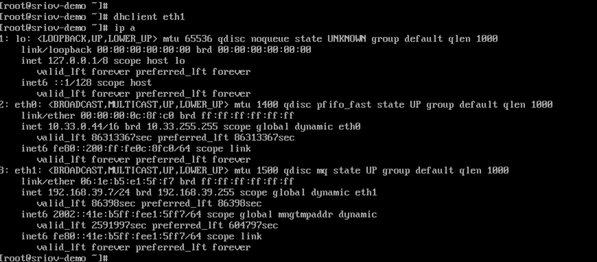

# Настройка SR-IOV

Настройка физических серверных узлов для поддержки создания виртуальных машин с сетевыми картами SR-IOV (Single Root I/O Virtualization) позволяет снизить задержку для виртуальных машин, а также поддерживает автономный IPv6 и функциональность двойного стека IPv4/IPv6.

## Терминология

| Термин           | Определение                                                                                                                                                                                                  |
| :--------------- | :------------------------------------------------------------------------------------------------------------------------------------------------------------------------------------------------------------ |
| Multus CNI       | Является промежуточным ПО для других плагинов CNI, позволяя Kubernetes поддерживать множество сетевых интерфейсов для Подов.                                                                                  |
| SR-IOV           | Позволяет виртуализировать физическую сетевую карту (NIC) на узле, разделяя ее на несколько виртуальных функций (VF) для использования Подами или виртуальными машинами, обеспечивая превосходную сетевую производительность.                                            |
| VF               | Виртуальное устройство, созданное на основе физического устройства PCI; VF могут быть выделены непосредственно виртуальным машинам или контейнерам, напоминают независимые физические устройства PCI, что значительно улучшает производительность ввода/вывода. |

## Ограничения и ограничения

Функция SR-IOV зависит от glibc и поддерживает только версии glibc 2.34 и выше. Однако обе операционных системы Kylin V10 и CentOS 7.x не поддерживают эту версию, и, следовательно, функциональность SR-IOV не может использоваться на этих двух операционных системах.

## Предварительные требования

Получите следующие диаграммы и образы и загрузите их в репозиторий изображений. Этот документ использует адрес репозитория `build-harbor.example.cn` в качестве примера. Для получения конкретных методов получения диаграмм и образов, пожалуйста, свяжитесь с соответствующими специалистами.

### Диаграмма

- `build-harbor.example.cn/example/chart-sriov-network-operator:v3.15.0`

### Образы

- `build-harbor.example.cn/3rdparty/sriov/sriov-network-operator:4.13`
- `build-harbor.example.cn/3rdparty/sriov/sriov-network-operator-config-daemon:4.13`
- `build-harbor.example.cn/3rdparty/sriov/sriov-cni:4.13`
- `build-harbor.example.cn/3rdparty/sriov/ib-sriov-cni:4.13`
- `build-harbor.example.cn/3rdparty/sriov/sriov-network-device-plugin:4.13`
- `build-harbor.example.cn/3rdparty/sriov/network-resources-injector:4.13`
- `build-harbor.example.cn/3rdparty/sriov/sriov-network-operator-webhook:4.13`
- `build-harbor.example.cn/3rdparty/kubectl:v3.15.1`

## Процедуры

**Примечание**: Все команды, упомянутые ниже, выполняются в терминале.

<Steps>
  ### Включение SR-IOV в BIOS физической машины

  Перед настройкой используйте следующую команду для проверки информации о материнской плате.

  ```bash
  $ dmidecode -t 1
  # dmidecode 3.3
  Получение данных SMBIOS из sysfs.
  SMBIOS 2.7 present.

  Handle 0x0100, DMI type 1, 27 bytes
  Информация о системе
      Название продукта: PowerEdge R620
      Версия: Не указана
      Серийный номер: 7SJNF62
      UUID: 4c4c4544-0053-4a10-804e-b7c04f463632
      Тип пробуждения: Кнопка питания
      Номер SKU: SKU=NotProvided;ModelName=PowerEdge R620
      Семейство: Не указано
  ```

  Операция включения SR-IOV в BIOS варьируется в зависимости от производителей серверов. Пожалуйста, обратитесь к документации соответствующего производителя. Обычно шаги следующие:

  1. Перезагрузите сервер.

  2. Когда на экране во время POST BIOS отображается логотип бренда, нажмите клавишу F2 для входа в настройки системы.

  3. Нажмите **Настройки процессора** > **Технология виртуализации**, и измените параметр **Технология виртуализации** на `Enabled`.

  4. Нажмите **Настройки** > **Интегрированные устройства**, и измените параметр **Глобальное включение SR-IOV** на `Enabled`.

  5. Сохраните конфигурацию и перезагрузите сервер.

  ### Включение IOMMU

  Операция включения IOMMU может варьироваться в зависимости от различных операционных систем. Пожалуйста, обратитесь к документации соответствующей операционной системы. Этот документ использует CentOS в качестве примера.

  1. Отредактируйте файл `/etc/default/grub` и добавьте `intel_iommu=on iommu=pt` в конфигурационный параметр `GRUB_CMDLINE_LINUX`.

     ```bash
     GRUB_CMDLINE_LINUX="crashkernel=auto rd.lvm.lv=centos/root rhgb quiet intel_iommu=on iommu=pt"
     ```

  2. Выполните следующую команду для создания файла `grub.cfg`.

     ```bash
     grub2-mkconfig -o /boot/grub2/grub.cfg
     ```

  3. Перезагрузите сервер.

  4. Выполните следующую команду, и если вывод показывает `IOMMU enabled`, это означает, что включение прошло успешно.

     ```bash
     dmesg | grep -i iommu
     ```

  ### Загрузка модуля VFIO в ядро системы

  1. Выполните следующую команду для загрузки модуля vfio-pci.

     ```bash
     $ modprobe vfio-pci
     ```

  2. После загрузки выполните следующую команду. Если информацию о конфигурации можно отобразить нормально, то это означает, что модуль ядра VFIO был успешно загружен.

     ```bash
     $ # Для CentOS выполните следующую команду, чтобы проверить статус загрузки VFIO
     $ lsmod | grep vfio
     vfio_pci               41993  0
     vfio_iommu_type1       22440  0
     vfio                   32657  2 vfio_iommu_type1, vfio_pci
     irqbypass              13503  2 kvm, vfio_pc
     $
     $
     $ # Для Ubuntu выполните следующую команду, чтобы проверить статус загрузки VFIO
     $ cat /lib/modules/$(uname -r)/modules.builtin | grep vfio
     kernel/drivers/vfio/vfio.ko
     kernel/drivers/vfio/vfio_virqfd.ko
     kernel/drivers/vfio/vfio_iommu_type1.ko
     kernel/drivers/vfio/pci/vfio-pci-core.ko
     kernel/drivers/vfio/pci/vfio-pci.ko
     ```

  ### Создание устройств VF

  1. Выполните следующую команду, чтобы увидеть текущие поддерживаемые устройства VF.

     ```bash
     $ find /sys -name *vfs*

     /sys/devices/pci0000:00/0000:00:03.0/0000:05:00.1/sriov_totalvfs
     /sys/devices/pci0000:00/0000:00:03.0/0000:05:00.1/sriov_numvfs
     /sys/devices/pci0000:00/0000:00:03.0/0000:05:00.0/sriov_totalvfs
     /sys/devices/pci0000:00/0000:00:03.0/0000:05:00.0/sriov_numvfs
     ```

     Выходная информация указывает следующее:

     - **0000:05:00.1**: PCI-адрес физической сетевой карты SR-IOV enp5s0f1.

     - **0000:05:00.0**: PCI-адрес физической сетевой карты SR-IOV enp5s0f0.

     - **sriov\_totalvfs**: Количество поддерживаемых VF.

     - **sriov\_numvfs**: Текущее количество VF.

  2. Выполните следующую команду, чтобы получить информацию о сетевой карте физической машины.

     ```bash
     $ ifconfig

     enp5s0f0: flags=4163<UP,BROADCAST,RUNNING,MULTICAST>  mtu 1500
             inet 192.168.66.213  netmask 255.255.255.0  broadcast 192.168.66.255
             inet6 1066::192:168:66:213  prefixlen 112  scopeid 0x0<global>
             inet6 fe80::a236:9fff:fe29:6c00  prefixlen 64  scopeid 0x20<link>
             ether a0:36:9f:29:6c:00  txqueuelen 1000  (Ethernet)
             RX packets 13889  bytes 1075801 (1.0 MB)
             RX errors 0  dropped 1603  overruns 0  frame 0
             TX packets 5057  bytes 440807 (440.8 KB)
             TX errors 0  dropped 0 overruns 0  carrier 0  collisions 0
      
     enp5s0f1: flags=4163<UP,BROADCAST,RUNNING,MULTICAST>  mtu 1500
             inet6 fe80::a236:9fff:fe29:6c02  prefixlen 64  scopeid 0x20<link>
             ether a0:36:9f:29:6c:02  txqueuelen 1000  (Ethernet)
             RX packets 1714  bytes 227506 (227.5 KB)
             RX errors 0  dropped 1604  overruns 0  frame 0
             TX packets 70  bytes 19241 (19.2 KB)
             TX errors 0  dropped 0 overruns 0  carrier 0  collisions 0
     ```

  3. Выполните команду `ethtool -i <имя NIC>`, чтобы получить соответствующий PCI-адрес физической сетевой карты, как показано ниже.

     ```bash
     $ ethtool -i enp5s0f0
     driver: ixgbe
     version: 5.15.0-76-generic
     firmware-version: 0x8000030d, 14.5.8
     expansion-rom-version:
     bus-info: 0000:05:00.0     ## PCI-адрес сетевой карты enp5s0f0
     supports-statistics: yes
     supports-test: yes
     supports-eeprom-access: yes
     supports-register-dump: yes
     supports-priv-flags: yes
     $
     $
     $ ethtool -i enp5s0f1
     driver: ixgbe
     version: 5.15.0-76-generic
     firmware-version: 0x8000030d, 14.5.8
     expansion-rom-version:
     bus-info: 0000:05:00.1    ## PCI-адрес сетевой карты enp5s0f1
     supports-statistics: yes
     supports-test: yes
     supports-eeprom-access: yes
     supports-register-dump: yes
     supports-priv-flags: yes
     ```

  4. Выполните следующую команду для создания VF. Этот документ использует конфигурацию сетевой карты enp5s0f1 в качестве примера. Если несколько сетевых карт необходимо виртуализировать, их необходимо все настроить.

     ```bash
     $ cat /sys/devices/pci0000:00/0000:00:03.0/0000:05:00.1/sriov_totalvfs   ## Проверьте количество поддерживаемых VF
     63
     $
     $ echo 8 > /sys/devices/pci0000:00/0000:00:03.0/0000:05:00.1/sriov_numvfs  ## Установите текущее количество VF
     $
     $ cat /sys/devices/pci0000:00/0000:00:03.0/0000:05:00.1/sriov_numvfs   ## Проверьте текущее количество VF
     8
     ```

  5. Выполните следующую команду, чтобы проверить, были ли VF созданы успешно.

     **Примечание**: Вы можете увидеть 8 настроенных адресов VF, таких как `05:10.1`. Эти адреса VF нуждаются в дополнении **Идентификатором домена**, в результате чего получается окончательный формат: `0000:05:10.1`.

     ```bash
     $ lspci | grep Virtual
     00:11.0 PCI bridge: Intel Corporation C600/X79 series chipset PCI Express Virtual Root Port (rev 05)
     05:10.1 Ethernet controller: Intel Corporation 82599 Ethernet Controller Virtual Function (rev 01)
     05:10.3 Ethernet controller: Intel Corporation 82599 Ethernet Controller Virtual Function (rev 01)
     05:10.5 Ethernet controller: Intel Corporation 82599 Ethernet Controller Virtual Function (rev 01)
     05:10.7 Ethernet controller: Intel Corporation 82599 Ethernet Controller Virtual Function (rev 01)
     05:11.1 Ethernet controller: Intel Corporation 82599 Ethernet Controller Virtual Function (rev 01)
     05:11.3 Ethernet controller: Intel Corporation 82599 Ethernet Controller Virtual Function (rev 01)
     05:11.5 Ethernet controller: Intel Corporation 82599 Ethernet Controller Virtual Function (rev 01)
     05:11.7 Ethernet controller: Intel Corporation 82599 Ethernet Controller Virtual Function (rev 01)
     ```

  ### Привязка драйвера VFIO

  1. Загрузите <a href="/scripts/dpdk-devbind.py" download="dpdk-devbind.py">скрипт привязки</a> и выполните команду `$ python3 dpdk-devbind.py -b vfio-pci <VF адрес с идентификатором домена>`, чтобы привязать 8 VF сетевой карты enp5s0f1 к драйверу vfio-pci, как показано ниже.

     ```bash
     $ python3 dpdk-devbind.py -b vfio-pci 0000:05:10.1
     $ python3 dpdk-devbind.py -b vfio-pci 0000:05:10.3
     $ python3 dpdk-devbind.py -b vfio-pci 0000:05:10.5
     $ python3 dpdk-devbind.py -b vfio-pci 0000:05:10.7
     $ python3 dpdk-devbind.py -b vfio-pci 0000:05:11.1
     $ python3 dpdk-devbind.py -b vfio-pci 0000:05:11.3
     $ python3 dpdk-devbind.py -b vfio-pci 0000:05:11.5
     $ python3 dpdk-devbind.py -b vfio-pci 0000:05:11.7
     ```

  2. После успешной привязки выполните следующую команду для проверки результатов привязки. Ищите уже привязанные VF в области **Сетевые устройства, использующие совместимый с DPDK драйвер** в результате вывода. Среди них идентификатор устройства VF равен `10ed`.<a id="#VF_ID" />

     ```bash
     $ python3 dpdk-devbind.py --status

     Сетевые устройства, использующие совместимый с DPDK драйвер
     ============================================
     0000:05:10.1 '82599 Ethernet Controller Virtual Function 10ed' drv=vfio-pci unused=ixgbevf
     0000:05:10.3 '82599 Ethernet Controller Virtual Function 10ed' drv=vfio-pci unused=ixgbevf
     0000:05:10.5 '82599 Ethernet Controller Virtual Function 10ed' drv=vfio-pci unused=ixgbevf
     0000:05:10.7 '82599 Ethernet Controller Virtual Function 10ed' drv=vfio-pci unused=ixgbevf
     0000:05:11.1 '82599 Ethernet Controller Virtual Function 10ed' drv=vfio-pci unused=ixgbevf
     0000:05:11.3 '82599 Ethernet Controller Virtual Function 10ed' drv=vfio-pci unused=ixgbevf
     0000:05:11.5 '82599 Ethernet Controller Virtual Function 10ed' drv=vfio-pci unused=ixgbevf
     0000:05:11.7 '82599 Ethernet Controller Virtual Function 10ed' drv=vfio-pci unused=ixgbevf

     Сетевые устройства, использующие драйвер ядра
     ===================================
     0000:01:00.0 'NetXtreme BCM5720 Gigabit Ethernet PCIe 165f' if=eno1 drv=tg3 unused=vfio-pci
     0000:01:00.1 'NetXtreme BCM5720 Gigabit Ethernet PCIe 165f' if=eno2 drv=tg3 unused=vfio-pci
     0000:02:00.0 'NetXtreme BCM5720 Gigabit Ethernet PCIe 165f' if=eno3 drv=tg3 unused=vfio-pci
     0000:02:00.1 'NetXtreme BCM5720 Gigabit Ethernet PCIe 165f' if=eno4 drv=tg3 unused=vfio-pci
     0000:05:00.0 'Ethernet 10G 2P X520 Adapter 154d' if=enp5s0f0 drv=ixgbe unused=vfio-pci *Активно*
     0000:05:00.1 'Ethernet 10G 2P X520 Adapter 154d' if=enp5s0f1 drv=ixgbe unused=vfio-pci

     Нет обнаруженных устройств 'Baseband'
     ==============================

     Нет обнаруженных устройств 'Crypto'
     ============================

     Нет обнаруженных устройств 'DMA'
     =========================

     Нет обнаруженных устройств 'Eventdev'
     ==============================

     Нет обнаруженных устройств 'Mempool'
     =============================

     Нет обнаруженных устройств 'Compress'
     ==============================

     Нет обнаруженных устройств 'Misc (rawdev)'
     ===================================

     Нет обнаруженных устройств 'Regex'
     ===========================
     ```

  ### Развертывание плагина Multus CNI\{#deploy\_plugins}

  1. Перейдите в **Управление платформой**.

  2. В левой боковой панели нажмите **Управление кластерами** > **Кластеры**.

  3. Нажмите на имя кластера виртуальных машин и переключитесь на вкладку **Плагины**.

     - Разверните плагин **Multus CNI**.

  ### Развертывание sriov-network-operator

  Выполните следующую команду для развертывания sriov-network-operator.

  ```bash
  REGISTRY=<$registry>  # Замените часть <$registry> адресом репозитория, где находится образ sriov-network-operator, например: REGISTRY=build-harbor.example.cn
  NICSELECTOR=["<nics>"] # Замените часть <nics> именами NIC, например: NICSELECTOR=["ens802f1","ens802f2"], разделяя несколько запятыми
  NUMVFS=<numVfs> # Замените часть <numVfs> количеством VF, например: NUMVFS=8
    
  cat <<EOF | kubectl create -f -
  apiVersion: operator.alauda.io/v1alpha1
  kind: AppRelease
  metadata:
    annotations:
      auto-recycle: "true"
      interval-sync: "true"
    name: sriov-network-operator
    namespace: cpaas-system
  spec:
    destination:
      cluster: ""
      namespace: "kube-system"
    source:
      charts:
      - name: <chartName> # Замените <chartName> на фактический путь к диаграмме, например: name = example/chart-sriov-network-operator
        releaseName: sriov-network-operator
        targetRevision: v3.15.0
      repoURL: $REGISTRY
    timeout: 120
    values:
      global:
        registry:
          address: $REGISTRY
      networkNodePolicy:
        nicSelector: $NICSELECTOR
        numVfs: $NUMVFS
  EOF
  ```

  ### Установка меток идентификаторов ролей узлов для физических узлов

  **Примечание**: Перед выполнением этой операции убедитесь, что Под `sriov-network-operator` работает нормально.

  1. Перейдите в **Управление платформой**.

  2. В левой боковой панели нажмите **Управление кластерами** > **Кластеры**.

  3. Нажмите на имя кластера и переключитесь на вкладку **Узлы**.

  4. Нажмите на физический узел, поддерживающий SR-IOV ⋮ > **Обновить метки узлов**.

  5. Установите метку узла следующим образом:
     - `node-role.kubernetes.io/worker: ""`

  6. Нажмите **Обновить**.

  ### Проверка успешного создания ресурсов\{#checkpod}

  В CLI-инструменте выполните команду `kubectl -n cpaas-system get sriovnetworknodestates`, чтобы проверить, был ли ресурс `sriovnetworknodestates` успешно создан. Если вы увидите вывод, подобный приведенному ниже, это указывает на успешное создание. Если создание ресурса не удается, проверьте, были ли плагины Multus CNI и sriov-network-operator успешно развернуты.

  ```bash
  $  kubectl -n cpaas-system get sriovnetworknodestates
  NAME                      SYNC STATUS           AGE
  192.168.254.88            Успешно             5d22h
  ```

  ### Установка меток функций узлов SR-IOV для физических узлов

  **Примечание**: Перед выполнением этой операции убедитесь, что ресурс `sriovnetworknodestates` был успешно создан.

  1. Перейдите в **Управление платформой**.

  2. В левой боковой панели нажмите **Управление кластерами** > **Кластеры**.

  3. Нажмите на имя кластера и переключитесь на вкладку **Узлы**.

  4. Нажмите на физический узел, поддерживающий SR-IOV ⋮ > **Обновить метки узлов**.

  5. Установите метку узла следующим образом:
     - `feature.node.kubernetes.io/network-sriov.capable: "true"`

  ### Проверка поддержки устройства NIC

  1. Выполните команду `lspci -n -s <VF адрес с идентификатором домена>`, чтобы получить текущий идентификатор производителя устройства NIC и идентификатор устройства, как показано ниже.

     ```bash
     $ lspci -n -s 0000:05:00.1
     05:00.1 0200: 8086:154d (rev 01)
     ```

     Выход указывает:

     - **8086**: Идентификатор производителя.
     - **154d**: Идентификатор устройства.

  2. Выполните команду `lspci -s <VF адрес с идентификатором домена> -vvv | grep Ethernet`, чтобы получить текущее имя NIC, как показано ниже.

     ```bash
     $ lspci -s 0000:05:00.1 -vvv | grep Ethernet
     05:00.1 Ethernet controller: Intel Corporation Ethernet 10G 2P X520 Adapter (rev 01)
     ```

  3. В пространстве имен cpaas-system найдите конфигурационный файл с именем `supported-nic-ids` типа ConfigMap и проверьте, имеется ли информация о конфигурации текущего NIC в списке поддерживаемых в секции его данных.

     **Примечание**: Если текущий NIC не находится в списке поддержки, вам необходимо обратиться к [Шагу 4](#configmap1), чтобы добавить NIC в конфигурационный файл. Если текущий NIC уже находится в списке поддержки, пропустите [Шаг 4](#configmap1).

     ```bash
     kind: ConfigMap
     apiVersion: v1
     metadata:
       name: supported-nic-ids
       namespace: cpaas-system
     data:
       Broadcom_bnxt_BCM57414_2x25G: 14e4 16d7 16dc
       Broadcom_bnxt_BCM75508_2x100G: 14e4 1750 1806
       Intel_i40e_10G_X710_SFP: 8086 1572 154c
       Intel_i40e_25G_SFP28: 8086 158b 154c
       Intel_i40e_40G_XL710_QSFP: 8086 1583 154c
       Intel_i40e_X710_X557_AT_10G: 8086 1589 154c
       Intel_i40e_XXV710: 8086 158a 154c
       Intel_i40e_XXV710_N3000: 8086 0d58 154c
       Intel_ice_Columbiaville_E810: 8086 1591 1889
       Intel_ice_Columbiaville_E810-CQDA2_2CQDA2: 8086 1592 1889
       Intel_ice_Columbiaville_E810-XXVDA2: 8086 159b 1889
       Intel_ice_Columbiaville_E810-XXVDA4: 8086 1593 1889
     ```

  4. Добавьте текущий NIC в секцию данных списка поддержки в формате `<Имя NIC>: <Идентификатор производителя> <Идентификатор устройства> <Идентификатор устройства VF>`, как показано ниже.<a id="configmap1" />

     ```bash
     kind: ConfigMap
     apiVersion: v1
     metadata:
       name: supported-nic-ids
       namespace: cpaas-system
     data:
       Broadcom_bnxt_BCM57414_2x25G: 14e4 16d7 16dc
       Broadcom_bnxt_BCM75508_2x100G: 14e4 1750 1806
       
       Intel_Corporation_X520: 8086 154d 10ed            ## Добавить новую информацию о NIC
       
       Intel_i40e_10G_X710_SFP: 8086 1572 154c
       Intel_i40e_25G_SFP28: 8086 158b 154c
       Intel_i40e_40G_XL710_QSFP: 8086 1583 154c
       Intel_i40e_X710_X557_AT_10G: 8086 1589 154c
       Intel_i40e_XXV710: 8086 158a 154c
       Intel_i40e_XXV710_N3000: 8086 0d58 154c
       Intel_ice_Columbiaville_E810: 8086 1591 1889
       Intel_ice_Columbiaville_E810-CQDA2_2CQDA2: 8086 1592 1889
       Intel_ice_Columbiaville_E810-XXVDA2: 8086 159b 1889
       Intel_ice_Columbiaville_E810-XXVDA4: 8086 1593 1889
     ```

     Пояснение по конфигурации параметров:

     - **Intel\_Corporation\_X520**: Имя NIC, которое можно настроить.
     - **8086**: Идентификатор производителя.
     - **154d**: Идентификатор устройства.
     - **10ed**: Идентификатор устройства VF, который можно найти в [результатах привязки](#VF_ID).

  ### Настройка IP-адреса

  Войдите в коммутатор, чтобы настроить DHCP (Протокол динамической конфигурации хоста).

  **Примечание**: Если невозможно использовать DHCP, пожалуйста, вручную настройте IP-адрес в виртуальной машине.
</Steps>

## Проверка результатов

1. Перейдите в **Платформу контейнеров**.

2. В левой боковой панели нажмите **Виртуализация** > **Виртуальные машины**.

3. Нажмите **Создать виртуальную машину**, и при добавлении вспомогательной сетевой карты выберите **SR-IOV** в качестве **Типа сети**.

4. Завершите создание виртуальной машины.

5. Получите доступ к виртуальной машине через VNC, вы должны увидеть, что eth1 успешно получил IP-адрес, что указывает на успешную конфигурацию.
   

## Связанные заметки

### Настройка параметров ядра для виртуальных машин CentOS

После использования виртуальной машиной CentOS сетевой карты SR-IOV необходимо изменить параметры ядра для соответствующей сетевой карты. Конкретные шаги следующие.

1. Откройте терминал и выполните следующую команду, чтобы изменить параметры ядра для соответствующей сетевой карты. Замените часть `<Имя NIC>` в команде на фактическое имя NIC.

   ```bash
   sysctl -w net.ipv4.conf.<Имя NIC>.rp_filter=2
   echo "net.ipv4.conf.<Имя NIC>.rp_filter=2" >> /etc/sysctl.conf
   ```

2. Выполните следующую команду, чтобы загрузить и применить все команды параметров ядра из файла /etc/sysctl.conf, чтобы настройки ядра вступили в силу. Когда значение в выводимой информации равно 2, это указывает на успешное изменение.

   ```bash
   sysctl -p
   ```

   Выходная информация:

   ```bash
   net.ipv4.conf.<Имя NIC>.rp_filter = 2
   ```
