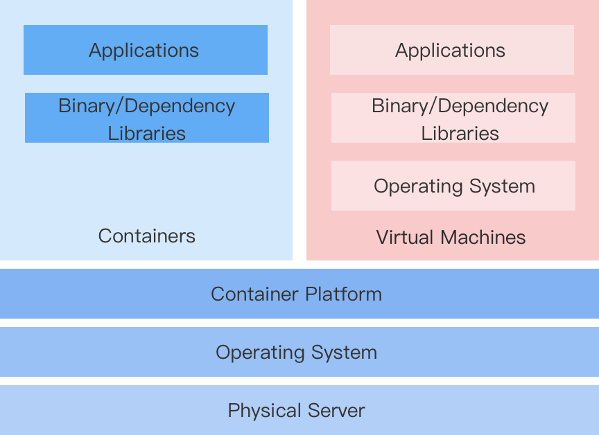

# Введение

Для предприятий, использующих архитектуру на базе виртуальных машин, переход на архитектуру Kubernetes и контейнеров неизбежно требует модернизации приложений. Однако из-за таких ограничений, как необходимость непрерывной работы бизнеса или трудности в изменении привычек разработки, предприятия часто не могут полностью отказаться от архитектуры виртуализации в краткие сроки.

Таким образом, решение, которое может унифицированно конфигурировать, управлять и контролировать ресурсы контейнеров и виртуальных машин на одной платформе, становится особенно важным.

## Решение для виртуальных машин, управляемых контейнерами

Эта платформа реализует решение для виртуальной машины (VMI, VirtualMachineInstance) на основе составной открытую KubeVirt, позволяя более легко и быстро создавать виртуальные машины, управляемые контейнерами, и запускать виртуализированные приложения.

## Особенности

**Быстрая трансформация**

Не требуется переписывать приложения или изменять образы. Достаточно упаковать существующее приложение в образ виртуальной машины формата qcow2 или raw и создать виртуальную машину, используя этот образ на платформе, что позволяет развернуть приложение на контейнерной платформе.

**Сохранение поведенческих привычек**

Контейнеризованные виртуальные машины могут управляться аналогично традиционным виртуальным машинам, не требуя сосредоточения на реализованной в контейнерах основе, включая управление жизненным циклом виртуальных машин, дисками и сетями, а также управление снапшотами.

**Сосуществование виртуализации и контейнеризации**

- Унифицированная платформа поддерживает управление виртуализированными услугами, а также позволяет выполнять планирование и управление контейнерами на основе Kubernetes.

- На основе продолжения использования рабочей нагрузки виртуальных машин, она позволяет поэтапную модернизацию контейнеризированных приложений.

- Разработка новых контейнеризированных приложений, которые должны взаимодействовать с виртуализированными приложениями, остается затронутой.

## Характеристики продукта

- **Виртуальная машина**: Поддерживает создание виртуальных машин с образами, выделенными администраторами, и управление ими, включая запуск и остановку виртуальных машин, управление снапшотами, удаленный вход в виртуальные машины и изменение конфигураций виртуальных машин.

- **Виртуальный диск**: Поддерживает просмотр и управление информацией о дисках, созданных в текущем проекте, включая создание дисков, просмотр имен дисков, классов хранения, емкостей и связанных виртуальных машин.

- **Снапшоты виртуальных машин**: Поддерживает просмотр деталей, таких как состояние снапшотов виртуальных машин, связанная виртуальная машина и время последнего отката.

- **Образы виртуальных машин**: Поддерживает просмотр информации об образах виртуальных машин в рамках текущего проекта, включая метод предоставления образа и операционную систему.

- **Ключевые пары**: Поддерживает просмотр и управление ключевыми парами, созданными в текущем проекте, включая создание ключевых пар и просмотр списка связанных виртуальных машин.

## Ограничения

Он должен быть реализован на основе кластера физических машин, и компоненты KubeVirt должны быть развернуты внутри кластера с включенной виртуализацией. Платформа предоставляет возможность развертывания компонентов KubeVirt через оператора и интерфейс для включения виртуализации, при этом все относящиеся конфигурации выполняются администратором платформы.
