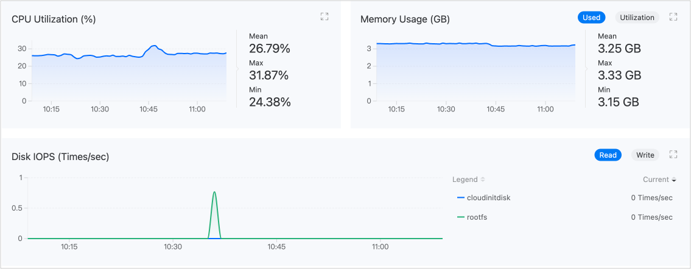

# Мониторинг и Оповещения

Мониторинг и оповещение по виртуальным машинам в отношении ЦП, памяти, хранилища и сети. Для своевременных оповещений также могут быть настроены политики уведомлений.

Интуитивно представленные данные мониторинга могут использоваться для поддержки принятия решений в процессе инспекции операций или настройки производительности, в то время как комплексный механизм оповещения и уведомления будет способствовать обеспечению стабильной работы виртуальных машин.

## Мониторинг

По умолчанию платформа собирает общепринятые показатели мониторинга производительности для виртуальных машин, включая ЦП, память, хранилище и сеть. Перейдите в **Виртуализация** > **Виртуальные машины**, и на вкладке **Мониторинг** в деталях виртуальной машины вы можете просмотреть данные мониторинга в реальном времени по показателям.

## Оповещения

### Настройка Политик Оповещений

Чтобы включить оповещения, сначала необходимо создать политику оповещения. Политика оповещения описывает объекты, которые вы хотите контролировать, условия, при которых вы хотите получать оповещения, и способ уведомления о соответствующих оповещениях. Перейдите в **Платформа Контейнеров** > **Виртуализация** > **Виртуальные машины**, и в деталях виртуальной машины нажмите **Создать Политику Оповещения** на вкладке **Оповещения**, чтобы завершить настройку.

| Параметр                | Описание                                                                                                                                                                                                                                                                                                                                                                                                                                                                                                                                                                                                                                                  |
| :---------------------- | :----------------------------------------------------------------------------------------------------------------------------------------------------------------------------------------------------------------------------------------------------------------------------------------------------------------------------------------------------------------------------------------------------------------------------------------------------------------------------------------------------------------------------------------------------------------------------------------------------------------------------------------------------------- |
| **Тип Оповещения**      | - Метрика Оповещения: Мониторируемый объект - это заранее определенная платформа метрика, такая как *Коэффициент Использования Памяти*.  - Событийное Оповещение: Мониторируемый объект является причиной события, то есть причиной, по которой виртуальная машина перешла в текущее состояние, например, BackOff, Pulling, Failed.                                                                                                                                                                                                                                                                                                                                                                           |
| **Условие Срабатывания** | Состоит из операторов сравнения, пороговых значений оповещения и продолжительности. Сравнивая результаты мониторинга в реальном времени с установленными порогами, определяется, следует ли отправлять оповещение.  Если задана продолжительность, платформа также сравнит продолжительность, в течение которой мониторируемый объект находился в состоянии оповещения.                                                                                                                                                                                                                                                                                                                                                   |
| **Уровень Оповещения**  | - Подсказка: У мониторируемого объекта ожидаются проблемы, которые не влияют на бизнес-операции, но представляют потенциальные риски. Например, если использование ЦП превышает 70% в течение 3 минут.  - Предупреждение: У мониторируемого объекта имеются операционные риски, которые могут повлиять на нормальные бизнес-операции, если их своевременно не устранить. Например, если использование ЦП превышает 80% в течение 3 минут.  - Серьезный: У мониторируемого объекта имеются известные проблемы, которые могут привести к сбоям функциональности платформы, влияя на нормальные бизнес-операции.  - Катастрофа: Мониторируемый объект вышел из строя, что привело к перебоям в обслуживании платформы, потере данных, с серьезными последствиями. |

**Совет**: Функция оповещения виртуальной машины аналогична общей функции оповещения платформы. Для получения более подробных рекомендаций по настройке обратитесь к общей документации по [Оповещениям]().

### Обработка Оповещений

Перейдите на вкладку **Оповещения**, и если указаны стратегии статуса оповещения, пожалуйста, обратите на них внимание незамедлительно.

### Привязка Политик Уведомлений

В дополнение к оповещениям в реальном времени на вкладке **Оповещения**, платформа также поддерживает отправку информации об оповещениях по электронной почте, SMS и другим средствам соответствующему персоналу, уведомляя их о необходимости предпринять необходимые меры для решения проблем или предотвращения сбоев. Политика уведомлений должна быть настроена путем обращения к администратору.
