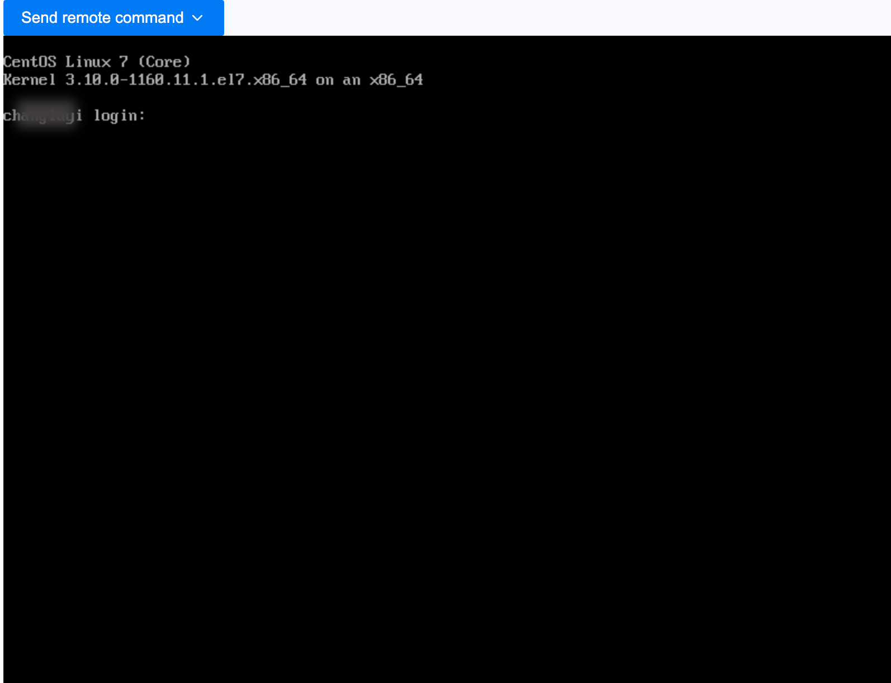

# Вход в виртуальную машину с использованием VNC

Войдите в виртуальную машину через Веб-консоль (VNC) в качестве метода экстренной операции.

## Процедура

1. Перейдите в **Container Platform**.

2. В левой навигационной панели нажмите **Виртуализация** > **Виртуальные машины**.

3. Нажмите ⋮ > **VNC Вход**.

4. Окно консоли откроется автоматически; вам необходимо ввести свое имя пользователя и пароль для входа.

   

   **Примечание**:

   - Поддерживает отправку общих команд клавиатуры.

   - Поддерживает копирование и вставку команд и параметров.
