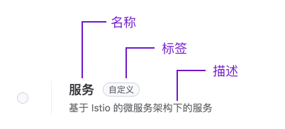

# 定制平台特有组件及运维特征显示样式

结合平台特有的 label 及 annotation，创建一个拥有平台特有样式的组件或运维特征，提高可视性。

## 使用场景

在选择组件或运维特征时，能够明确知道其的名称及描述信息，便于选择合适的组件或运维特征。适用于环境中存在多个自定义组件或运维特征的情况。

## 前提条件

您已经仔细阅读 [自定义组件](https://kubevela.io/zh/docs/platform-engineers/components/custom-component/) 或 [自定义运维特征](https://kubevela.io/zh/docs/platform-engineers/traits/customize-trait/) 中的相关内容。

## 注意事项

* 如果应用中已使用了自定义组件，请勿删除组件相关的 ComponentDefinition，以免引起应用异常。

* 自定义组件或运维特征时，需具备相应的权限。

## 操作步骤

### 规划显示样式

可在 YAML 文件的 annotation 字段中定义名称、标签及描述，自定义组件或运维特征最终的显示样式如下。



**字段说明及示例**：

|界面元素| 示例                                                        |
| ---------------------------- | ------------------------------------------------------------ |
|**名称**| `definition.oam.cpaas.io/name: '{"zh": "服务", "en": "Services"}'` |
|**标签**| `definition.oam.cpaas.io/tag: '{"zh": "自定义", "en": "Custom"}'` |
|**描述**| `definition.oam.cpaas.io/description: '{"zh": "基于 Istio 的微服务架构下的服务", "en": "Istio-based services"}'`|


### 自定义组件

本文档以自定义组件为例进行介绍，自定义运维特征的操作方式和自定义组件类似，此处不再赘述。

1. 进入 **平台管理**。

2. 在左侧导航栏中，单击 **集群管理** > **资源管理**。

3. 单击 **创建资源对象**。

4. 将下述自定义组件的 YAML 文件复制到页面中。其中，本文档的示例 YAML 仅展示了如何使用 annotations 自定义组件的名称、标签及描述的样式，没有具体的功能，YAML 中具体字段说明请参考 [CUE](/application/140_oam_applications/concepts/cue.mdx)。

    ```yaml
    apiVersion: core.oam.dev/v1beta1
    kind: ComponentDefinition
    metadata:
      name: service    # 建议与组件名称相关，需以 a-z、0-9 开头结尾，支持使用 a-z、0-9、-、.
      namespace: kube-public  # 必填，请勿修改
      annotations:
        definition.oam.cpaas.io/name: '{"zh": "服务", "en": "Services"}'
        definition.oam.cpaas.io/tag: '{"zh": "自定义", "en": "Custom"}'    
        definition.oam.cpaas.io/description: '{"zh": "基于 Istio 的微服务架构下的服务", "en": "Istio-based services"}'
      labels:
        definition.oam.cpaas.io/provider: user # 必填，请勿修改
        definition.oam.cpaas.io/tag: Service
    spec:
      workload:  # 指定该组件将创建一个 Kubernetes Deployment 资源
        definition:
          kind: Deployment
          apiVersion: apps/v1
      schematic: # 组件描述，请视情况修改
        cue:
          template: |
            parameter: { # CUE 模板参数定义
                // +usage=Which image would you like to use for your service
                // +short=i
                image: string # 容器镜像地址
         
                // +usage=Commands to run in the container
                cmd?: [...string] # 容器启动命令
         
                cpu?:    string # 容器 CPU 资源请求
                memory?: string # 容器内存资源请求
         
                // +usage=Optional duration in seconds the pod needs to terminate gracefully
                podShutdownGraceSeconds: *30 | int # 容器优雅关闭时间
         
                // If addRevisionLabel is true, the appRevision label will be added to the underlying pods
                addRevisionLabel: *false | bool # 是否添加应用版本标签
         
                // +usage=Define arguments by using environment variables
                env?: [string]: string # 环境变量
            }
            _matchLabels: { # 标签选择器
                "app.oam.dev/name": context.name
                "app.oam.dev/component": context.name
                if parameter.addRevisionLabel {
                    "app.oam.dev/appRevision": "v\(context.appRevisionNum)"
                    version: "v\(context.appRevisionNum)"
                }
            }
            // Deployment
            // output is validated by Deployment.
            // output: apps.#Deployment
            output: { # 定义 Deployment 资源的基本结构
                apiVersion: "apps/v1"
                kind:       "Deployment"
                metadata: {
                    name:      context.name
                    namespace: context.namespace
                    labels:    _matchLabels
                }
                spec: {
                    selector: matchLabels: _matchLabels
                    template: {
                        metadata: labels: _matchLabels
                        spec: {
                            terminationGracePeriodSeconds: parameter.podShutdownGraceSeconds
                            containers: [{
                                name: context.name
                                image: parameter.image
                                if parameter["cmd"] != _|_ {
                                    command: parameter.cmd
                                }
                            }]
                        }
                    }
                }
            }
            // output parameter env
            // output: apps.#Deployment
            output: { # 当提供环境变量时，将其转换为容器的环境变量配置
                if parameter.env != _|_ {
                    // patchKey=name
                    spec: template: spec: containers: [{
                        name: context.name
                        env: [
                            for k, v in parameter.env {
                                name:  "\(k)"
                                value: "\(v)"
                            },
                        ]
                    }]
                }
            }
            // Deployment
            // output parameter cpu and memory
            // output: apps.#Deployment
            output: { # 资源请求配置
                // patchKey=name
                spec: template: spec: containers: [{
                    name: context.name
         
                    resources: requests: {
                        if parameter.cpu != _|_ {
                            cpu: parameter.cpu
                        }
                        if parameter.memory != _|_ {
                            memory: parameter.memory
                        }
                    }
         
                }]
            }
    ```

5. 单击 **创建**。

    **说明**：可在搜索框中查找 **ComponentDefinition**，找到创建的自定义组件。

### 查看自定义组件样式

1. 进入 **Container Platform**。

2. 在左侧导航栏中，单击 **应用管理** > **OAM 应用**。

3. 单击 **创建应用**。

4. 单击 **通过镜像创建**。

5. 输入基本信息后，单击 **添加组件**。

6. 单击 **更多**，即可在列表中看到自定义的组件及样式。