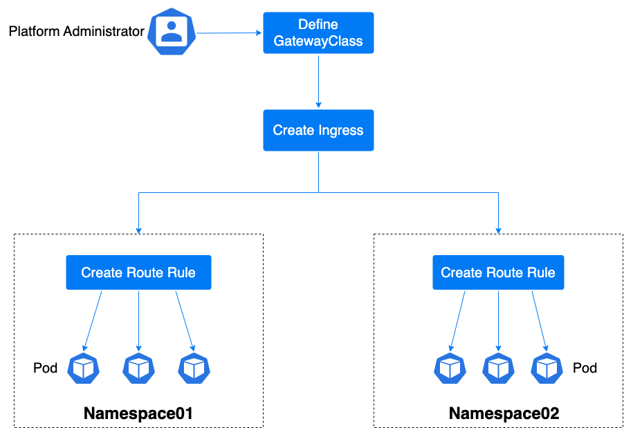

# 深入理解 Gateway

入站网关（Gateway）是网关类（Gateway Class）的部署实例，在入站网关中创建监听可以捕获指定域名和端口的外部流量，配合路由规则可以将指定外部流量路由至相应后端实例中。

## 名词解释

|资源名称|概述|使用说明|
|---|---|---|
|**网关类 Gateway Class**|在标准 Gateway API 文档描述中，网关类被定义为创建网关的模板。通过不同的模板可创建不同业务场景的入站网关，快速进行流量管理。|平台内置了独享型网关类。|
|**入站网关 Gateway**|入站网关会对应具体的资源实例，用户可独享该入站网关的所有监听和计算资源。它是一组关于监听生效路由规则的配置，当监听到的外部流量进入网关后，将会根据路由规则分发至后端实例中。|可将其视为一个负载均衡实例使用。|
|**路由规则 Route**|路由规则定义了流量从网关分发到服务过程中的一系列规则。Gateway API 目前标准支持的路由规则类型有 HTTPRoute、TCPRoute、UDPRoute 等。|平台目前支持监听 HTTP、HTTPS、TCP、UDP 协议。|

## 功能背景

由于 Ingress 资源对象不能很好的满足网络需求，很多场景下的 Ingress 控制器都需要通过定义 annotations 或者 crd 来进行功能扩展，这对于制定标准和数据迁移是非常不利的。

由 SIG-NETWORK 社区管理的开源项目 Gateway API（前身为 Service API）旨在通过可扩展的面向角色的接口来增强服务网络，Gateway API 是 Kubernetes 中的一个 API 资源集合，包括 GatewayClass、Gateway、HTTPRoute、TCPRoute、Service 等，这些资源共同为各种网络场景构建业务模型。

## 使用流程

使用入站网关功能，需要配合监听和路由规则使用，以下将举例说明一般场景下的使用流程：

1. 选择网关类。

1. 创建入站网关，并创建监听，监听来自指定域名下的 HTTP、HTTPS、TCP、UDP 协议流量。

3. 添加路由规则，网关监听到的流量根据路由规则转发至指定后端实例。

