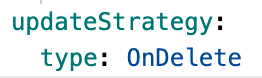

# 创建 StatefulSet

有状态副本集（StatefulSet）是 Kubernetes 的一种控制器（Controllers），您可以通过平台创建一个 StatefulSet 来运行一个程序。也可以在应用中创建多个 StatefulSet 作为应用下的计算组件来为应用提供特定的服务。

## 前提条件

### 获取镜像

镜像来源包括平台管理员通过工具链集成的镜像仓库，或第三方平台的镜像仓库。

* 对于前者，平台管理员通常会将镜像仓库分配给您的项目，然后您可使用其中的镜像。如果是第三方平台的镜像仓库，需确保在当前集群可从中拉取镜像。

* 如果拉取的镜像需要凭据，需要您先在当前命名空间下创建凭据（保密字典）。

## 操作步骤 1 - 配置基本信息

1. 进入 **Container Platform**。

1. 在左侧导航栏中，单击 **计算组件** > **有状态副本集**。

2. 单击 **创建有状态副本集**。

3. 配置镜像，单击 **确认**。

    **说明**：仅当使用本平台集成的镜像仓库中镜像时，可以通过 **选择** 方式筛选镜像。其中，集成项目名称例如 *containers（docker-registry-projectname）* ，包括本平台中的项目名 *projectname* ，以及镜像仓库中项目名 *containers* 。
    
1. 在 **基本信息** 区域，参考以下说明配置相关信息。

    
    |参数| 说明                |
    | ------------- | -------- |
    |**实例数**| 有状态副本集期望运行的 Pod 的个数，默认为 1 个，请依据实际的业务请求量设置。 |
    |**更新策略**| 输入 `partition` 的值用于控制滚动更新时仅更新部分 Pods。 partition 的取值大于实例数量时无效，默认为 `0`。 例如：Pod 实例数量为 5（Pod 序号为连续的 0、1、2、3、4），设置 partition 为 3 后，当更新了 StatefulSet 的 `spec.template` 后，将滚动更新 StatefulSet，且仅更新序号为 3 和 4 的 Pod，其他 Pod 不允许滚动更新。即便序号为 0、1、2 的 Pods 删除后重建，也只能依据更新前的  `spec.template` 重新创建。  **说明**：StatefulSet 还支持 `Ondelete` 更新策略，仅能通过单击页面右上角的 **YAML** 进入 YAML 编排文件设置。设置 StatefulSet 的 `.spec.updateStrategy.type` 为 `OnDelete`，如下图所示。     **注意**：设置 StatefulSet 的更新策略为 `Ondelete` 后，单击页面右上角的 **表单** 进入表单创建页面时，更新策略显示为 `OnDelete` 且不可编辑。|

## 操作步骤 2 - 配置容器组、容器

配置容器组、容器的操作与创建部署时类似，请参考 [创建部署](./deployment_create.mdx)。
