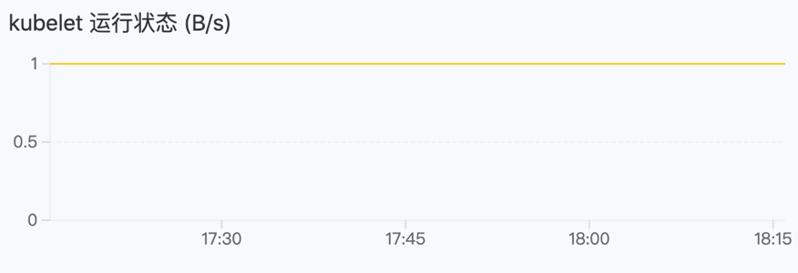

# 深入理解运维特征

运维特征指关乎应用运维，通过附加额外的能力来增强组件的功能，且在不同环境中有不同实现方式的一系列特征：伸缩策略、入站规则，以及环境变量等。只要具备运维特征所需条件，即使在不同的部署环境下（例如 X86 架构集群和 ARM 架构集群），应用也可以遵循统一的规则无差别地运行起来，应用运维人员也无需根据部署环境调整配置。

## 运维特征类型

通过运维特征类型，快速的选择需要的运维特征，不同的组件类型其可选的运维特征也不相同。

|运维特征类型|包含的运维特征|说明|
|---|---|---|
|动态特性类|<ul><li>[自动伸缩](#autosca)</li><li>[手动伸缩](#manual)</li></ul>|必选且互斥，即一个组件必须且只能添加自动伸缩或手动伸缩二者中的一个。|
|附加配置类|<ul><li>[环境变量](#env)</li><li>[补丁](#patch)</li></ul>|可选|
|网络类|<ul><li>[入站规则](#ingress)</li></ul>|可选|
|监控分析类|<ul><li>[健康检查](#check)</li><li>[自定义监控](#custom)</li></ul>|可选|
|KubeVela 社区|<ul><li>[annotations](#anno)</li><li>[hostalias](#hostalias)</li><li>[labels](#label)</li><li>[lifecycle](#lifecycle)</li><li>[pure-ingress](#pure)</li><li>[resource](#resource)</li></ul>|可选|

## 运维特征

### annotations\{#anno}

为组件添加注解，若组件中的工作负载（如 Deployment、StatefulSet 等）创建和管理 Pod，那么在工作负载中添加的注解，会被继承到由该工作负载创建的每个 Pod 上。

注解是以键值对形式附加到对象的元数据，这些额外的信息可以被识别和利用，以增强和简化 Kubernetes 资源的各个方面的管理，注解可以是没有具体功能的解释性文字、可以指定使用云提供商的配置或行为、也可以指定配置参数、工具等，功能十分强大。

**参数说明**

|参数|说明|
|---|---|
|键、值|字符串类型的键值对。|

**配置完成后的 YAML 示例**

```yaml
traits:
  - properties:
      cloud-provider-config: aws-config.yaml
      config-param: debug-mode
      description: This deployment manages the frontend service.
      monitoring-tool: prometheus
      version-info: v1.2.3
    type: annotations
```


### 环境变量\{#env}

环境变量为容器化应用程序提供了灵活、安全和可配置的方式，使其能够在不同的环境中运行，并随时适应配置的变化。通过配置环境变量为该组件的所有运行时容器加入环境变量，若所设键重复，将以运维特征中所引用的值为准，环境变量的主要特征如下。

* 配置灵活： 通过环境变量可以将配置信息传递给应用程序容器，不需要硬编码在应用程序的代码中，使配置的修改更加灵活，不必重新构建容器镜像。

* 敏感信息隔离： 对于包含敏感信息的配置（如数据库密码、API 密钥等），使用环境变量可以更安全地传递这些信息。通过将敏感信息存储在 Kubernetes 的保密字典中，并通过环境变量注入到容器中，可以降低泄露敏感信息的风险。

* 动态适应和配置： 环境变量允许应用程序在运行时动态适应不同的环境。例如，可以通过环境变量切换到不同的数据库连接，以适应开发、测试和生产环境。

**操作说明**

|操作|说明|
|---|---|
|**添加**|添加一个键值对形式的环境变量。|
|**引用**|引用 **配置字典或 Opaque、用户名/密码类型的保密字典** 中的字段作为环境变量，相关配置参数请参考 [配置字典](/application/oam_applications/concepts/component.md) 或 [保密字典](/application/oam_applications/concepts/component.md)。

**配置完成后的 YAML 示例**

```yaml
traits:
  - properties:
      env:
        - name: username
          value: admin
        - name: password
          valueFrom:
            secretKeyRef:
              key: password
              name: password-test
    type: env
```

### 补丁\{#patch}

补丁（JSON Patch）是一种用于描述两个 JSON 文档之间差异的格式，其中包含了一系列操作，例如添加、删除、替换，使得 JSON Patch 成为一种轻量级的、可扩展的方式，用于在两个 JSON 文档之间表示差异。其中，每个操作都由一个 JSON 对象表示，包含 OP（操作类型）和 Path（操作路径）等字段。

在 Kubernetes 中，JSON Patch 被广泛用于通过 kubectl patch 命令更新资源对象，通过在资源上应用一组操作，从而实现对资源的部分更新，这对于在不修改整个资源对象的情况下，仅对特定字段进行修改或添加是非常有用的，具体的参考及说明请参考 [JSON Patch](https://jsonpatch.com/) 。

**操作说明**

|操作|说明|
|---|---|
|**add（添加）**|使用 add 操作可以在 JSON 文档中添加新的元素，字段说明如下：<ul><li>OP: 选择 add，指定操作类型为添加。</li><li>Path：指定要添加元素的路径。</li><li>Value：指定要添加的值。</li></ul>|
|**replace（替换）**|使用 replace 操作可以替换 JSON 文档中的现有元素，字段说明如下：<ul><li>OP: 选择 replace，指定操作类型为替换。</li><li>Path：指定要替换元素的路径。</li><li>Value：指定新的值。</li></ul>|
|**remove（删除）**|使用 remove 操作可以从 JSON 文档中删除元素，字段说明如下：<ul><li>OP：选择 remove，指定操作类型为删除。</li><li>Path：指定要删除元素的路径。</li><li>Value：无需指定。</li></ul>|

**配置完成后的 YAML 示例**

```yaml
traits:
  - properties:
      patches:
        - patch:
            - '{"op":"add","path":"/biscuits/1","value":{"name":"Ginger Nut"}}'
          target:
            name: component
            resource: deployment
        - patch:
            - '{"op":"replace","path":"/biscuits/0/name","value":"Chocolate Digestive"}'
          target:
            name: component
            resource: deployment
        - patch:
            - '{"op":"remove","path":"/biscuits/0"}'
          target:
            name: component
            resource: service
    type: generic-patch
```

### 健康检查\{#check}

对该组件的存活状态及是否能提供服务进行检测，健康检查可以是一个 HTTP 请求、TCP 健康检查或是一个执行命令。

* 存活性健康检查：用于确定组件下的容器组是否仍然在运行、是否处于健康状态，如果检查结果为非正常时，会根据健康检查的配置决定是否重启容器组。

* 可用性健康检查：检查组件下的容器组是否启动完成并处于正常服务状态，如果检测到容器组的健康状态为非正常时，容器状态将被更新。

**参数说明**

健康检查参数说明请参考 [健康检查](/application/oam_applications/concepts/component.md)。

**配置完成后的 YAML 示例**

```yaml
traits:
  - properties:
      livenessProbe:
        failureThreshold: 5
        httpGet:
          path: /
          port: 80
          scheme: HTTP
        initialDelaySeconds: 300
        periodSeconds: 60
        successThreshold: 1
        timeoutSeconds: 30
      readinessProbe:
        failureThreshold: 5
        initialDelaySeconds: 300
        periodSeconds: 60
        successThreshold: 1
        tcpSocket:
          port: 80
        timeoutSeconds: 30
    type: healthcheck
```


### hostalias\{#hostalias}

HostAlias 用于指定 Pod 的主机名和 IP 地址映射关系的字段，在 Pod 上为工作负载添加主机别名。通过使用 HostAlias，可以将额外的主机名和对应的 IP 地址添加到 Pod 中，以便 Pod 内的应用程序使用这些主机名来访问其他服务或资源。

HostAlias 可用场景如下：

* 当 DNS 配置以及其它选项不合理的时候，通过向 Pod 的 /etc/hosts 文件中添加条目， 可以在 Pod 级别覆盖对主机名的解析。

* 访问本地服务： 在一些场景中，Pod 可能需要访问本地主机上的服务。通过 HostAlias，可以将本地服务的主机名和 IP 地址映射到 Pod 中，使得应用程序可以通过这些主机名来访问本地服务。

* 在容器中使用特定的主机名： 有些应用程序可能依赖于特定的主机名。通过 HostAlias，你可以将这些主机名映射到 Pod 中，以便应用程序在容器内使用这些主机名。

**参数说明**

|参数|说明|
|---|---|
|Ip|用于在 Pod 内部进行主机名解析。|

**配置完成后的 YAML 示例**

```yaml
traits:
  - properties:
      hostAliases:
        - ip: 192.168.1.1
        - ip: 192.168.1.2
    type: hostalias
```

### 自动伸缩\{#autosca}

用于自动调整 Pod 的副本数。创建应用后，将运行所设最小值个数的组件副本，后续若满足所设条件，平台将自动扩缩副本数量。常用于业务量频繁变化的应用，在某个已知或未知的业务变化（例如月末的账务结算高峰）来临前，提前设置扩容或缩容触发策略，可更及时地满足业务需要。

**参数说明**

具体参数说明请参考 [配置水平伸缩](/application/oam_applications/concepts/component.md)。

**配置完成后的 YAML 示例**

```yaml
traits:
  - properties:
      maxReplicas: 1
      metrics:
        - name: cpu
          type: resource
          value: "60"
      minReplicas: 1
      scalePolicy:
        down:
          periodSeconds: 15
          stabilizationWindowSeconds: 300
          type: Percent
          value: 100
        up:
          periodSeconds: 15
          stabilizationWindowSeconds: 0
          type: Percent
          value: 100
    type: hpa
```

### 入站规则\{#ingress}

入站规则（Kubernetes Ingress）可将集群外部的 HTTP/HTTPS 路由暴露给集群内部的内部路由（Kubernetes Service），实现计算组件外部访问控制，通过域名向集群外开放组件，以便网络用户访问。

**参数说明**

具体参数说明请参考 [创建入站规则](/application/oam_applications/concepts/component.md)。

**配置完成后的 YAML 示例**

```yaml
traits:
  - properties:
      domain: test-63117.test.com
      http:
        /: 90
      type: http
    type: ingress
```


### labels\{#label}

标签（Labels）是用于标识和组织资源的一种关键元素。标签是键值对的形式，可以附加到 Kubernetes 中的各种资源对象，例如 Pod、Service、Node 等，可以帮助您在集群中更轻松地选择和组织资源。

**参数说明**

|参数|说明|
|---|---|
|键、值|字符串类型的键值对。|

**配置完成后的 YAML 示例**

```yaml
traits:
  - properties:
      app: frontend
      region: us-east-1
      version: v2.0.0
    type: labels
```


### lifecycle\{#lifecycle}

定义了容器在生命周期的不同阶段需要执行的操作，包括在容器启动后和终止前的 HTTP 请求和 TCP Socket 检查。

* **PostStart**: 该生命周期事件在容器创建后立即执行，但无法保证其执行顺序与容器内其他进程启动顺序一致。需要注意的是，由于执行时机可能在容器 ENTRYPOINT 之前，因此不是最佳的应用程序启动前配置解决方案。

* **PreStop**: 该生命周期事件在销毁容器之前执行，是一个阻塞操作，意味着它是同步的，必须在删除容器的调用之前完成。适用于实现容器的优雅退出机制，可以定义一系列行为，释放容器占有的资源，并通过通知和告警实现有序的优雅退出。


**参数说明**

<table>
<thead>
  <tr>
    <th></th>
    <th>类别</th>
    <th>参数</th>
    <th>说明</th>
  </tr>
</thead>
<tbody>
  <tr>
    <td rowSpan={6}>postStart、preStop</td>
    <td rowSpan={4}>httpGet（发送 HTTP GET 请求）</td>
    <td>Host</td>
    <td>请求的主机名。</td>
  </tr>
  <tr>
    <td>Path</td>
    <td>请求的路径。</td>
  </tr>
  <tr>
    <td>Port</td>
    <td>请求的端口号。</td>
  </tr>
  <tr>
    <td>Scheme</td>
    <td>使用的协议（HTTP 或 HTTPS）。</td>
  </tr>
  <tr>
    <td rowSpan={2}>tcpSocket（执行 TCP Socket 检查）</td>
    <td>Host</td>
    <td>TCP Socket 的主机名。</td>
  </tr>
  <tr>
    <td>Port</td>
    <td>TCP Socket 的端口号。</td>
  </tr>
  <tr>
    <td rowSpan={2}>Post Start、Pre Stop</td>
    <td rowSpan={2}>httpGet.httpHeaders（HTTP 请求头）</td>
    <td>Name</td>
    <td>请求头名称。</td>
  </tr>
  <tr>
    <td>Value</td>
    <td>请求头的值。</td>
  </tr>
</tbody>
</table>

**配置完成后的 YAML 示例**

```yaml
traits:
  - properties:
      postStart:
        httpGet:
          host: example-host.com
          httpHeaders:
            - name: poststart
              value: custom-header-value
          path: /api/v1/start
          port: 8080
          scheme: HTTPS
        tcpSocket:
          host: another-host.com
          port: 2222
      preStop:
        httpGet:
          host: example-host.com
          httpHeaders:
            - name: prestop
              value: custom-header-value
          path: /api/v1/stop
          port: 8080
          scheme: HTTP
        tcpSocket:
          host: another-host.com
          port: 2222
    type: lifecycle
```

### 自定义监控\{#custom}

平台内置了许多指标和受监控资源，您也可以自定义要采集的目标及指标，监控信息最终将以图表的形式呈现。

**参数说明**：

<table border={1} cellSpacing={0}>
<thead>
  <tr>
    <th>分类</th>
    <th>参数</th>
    <th>说明</th>
  </tr>
</thead>
<tbody>
  <tr>
    <td rowSpan={4}>采集目标</td>
    <td>协议</td>
    <td>可选择使用 HTTP 或 HTTPS 协议。</td>
  </tr>
  <tr>
    <td>端口</td>
    <td>本组件采集监控数据的 API 的对外暴露端口。<br/><br/><b>说明：</b>若在下拉选项中没有可使用的端口，请单击 <b>上一步</b>，返回 <b>属性</b> 页面，添加 HTTP 或 HTTPS 协议的 <b>网络访问</b>，添加完成后，单击 <b>下一步</b>，即可选择相应端口。</td>
  </tr>
  <tr>
    <td>路径</td>
    <td>该 API 对外提供的访问路径，默认为根目录（/）。</td>
  </tr>
  <tr>
    <td>采集时间间隔</td>
    <td>监控指标目标数据采集的时间间隔，单位为秒（s）。</td>
  </tr>
  <tr>
    <td rowSpan={5}>图表</td>
    <td>图标标题</td>
    <td>自定义图表的标题，图表添加后，将显示在图表左上角。</td>
  </tr>
  <tr>
    <td>描述</td>
    <td>添加描述信息。</td>
  </tr>
  <tr>
    <td>指标名称</td>
    <td rowSpan={4}>具体参数说明请参考 <a href="/zh/cp-u-appmngt/1application/100appmonitoring/#3">自定义指标参数说明</a>。</td>
  </tr>
  <tr>
    <td>指标单位</td>
  </tr>
  <tr>
    <td>表达式</td>
  </tr>
</tbody>
</table>

    
**指标配置示例**


**指标图表效果示例**
    


**配置完成后的 YAML 示例**

```yaml
traits:
  - properties:
      metrics:
        - description: 当曲线值为 1 时，表示 API 能够正常访问；当曲线值为 0 时，表示 API 无法正常访问。
          expression: up{service="kubelet"}
          name: kebelet_status
          title: kubelet 运行状态
          uid: 24c0f195_5fbc_4572_b4ce_2a83cf909405
          unit: B/s
      sources:
        - interval: 3
          path: /
          port: 80
          scheme: http
    type: monitor
```


### pure-ingress\{#pure}

Ingress（入站规则） 是 Kubernetes 集群中用于公开和暴露服务的一种资源类型，定义外部流量如何进入集群，并将其路由到相应的服务，pure-ingress 表示这是一个极简的 Ingress 规则，只定义了最基本的路由规则，相对于 Ingress 复杂的参数，pure-ingress 仅关注域名而没有其他复杂的配置项。

**参数说明**

|参数|说明|
|---|---|
|Domain|指定暴露服务所绑定的域名。|

**配置完成后的 YAML 示例**

```yaml
traits:
  - properties:
      domain: oamweb.test.com
    type: pure-ingress
```


### resource\{#resource}

为 Pod 添加资源请求和限制，具体的请求与限制说明请参考 [资源请求与资源限制](/application/oam_applications/concepts/component.md)。

**参数说明**

<table border={1} cellSpacing={0}>
<thead>
  <tr>
    <th>参数</th>
    <th>类型</th>
    <th>说明</th>
  </tr>
</thead>
<tbody>
  <tr>
    <td>Cpu</td>
    <td>number 类型，例如 8</td>
    <td>指定 CPU 请求和限制值的大小。</td>
  </tr>
  <tr>
    <td>Memory</td>
    <td>字符串类型，例如 2048Mi</td>
    <td>指定内存请求和限制值的大小。</td>
  </tr>
  <tr>
    <td>限制值</td>
    <td>-</td>
    <td rowSpan={2}><ul><li>Cpu：指定 CPU 请求值的大小。</li><li>Memory：指定内存请求值的大小。</li></ul></td>
  </tr>
  <tr>
    <td>请求值</td>
    <td>-</td>
  </tr>
</tbody>
</table>


### 手动伸缩\{#manual}

创建应用后，将运行对应个数的组件副本。后续如需伸缩副本数量，需手动更新此运维特征。

**参数说明**

|参数|说明|
|---|---|
|副本数量|运行的组件副本数。|

**配置完成后的 YAML 示例**

```yaml
traits:
  - properties:
      action: start
      replicas: 1
    type: scaler
```
