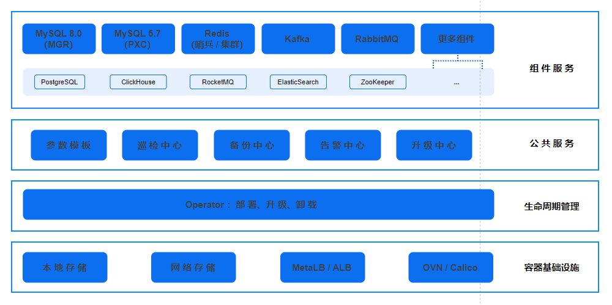

# 架构

应用服务平台是一个构建在 Kubernetes (K8S) 上的全面开放的服务管理解决方案，专为应用服务操作而设计。该平台作为集中管理中心，轻松高效地管理最广泛使用的各类服务组件，包括 MySQL、Redis、Kafka 和 RabbitMQ等，他们之间的关系如下：

- 服务组件：应用服务平台支持多种服务组件，包括 MySQL、Redis、Kafka 和 RabbitMQ 等，均可以稳定的跑在平台上。

- 公共服务：提供了参数模版、巡检中心、告警服务、备份服务等，为用户提供了一站式的服务管理。

- Operator 控制器：Operator 控制器是 Kubernetes 的一个扩展，用于简化应用程序的部署和管理。Operator 控制器通过自定义资源定义 (CRD) 来扩展 Kubernetes API，使其能够管理应用程序的生命周期。

- 容器基础设施：应用服务平台基于 Kubernetes 构建，利用平台提供的基础设施，提供数据持久化、外部访问等基础能力。