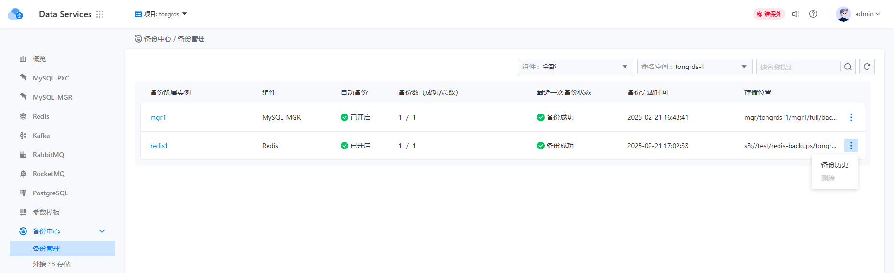
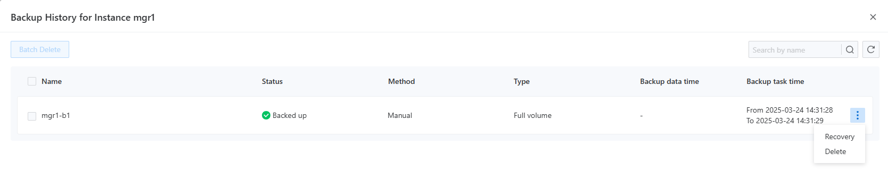
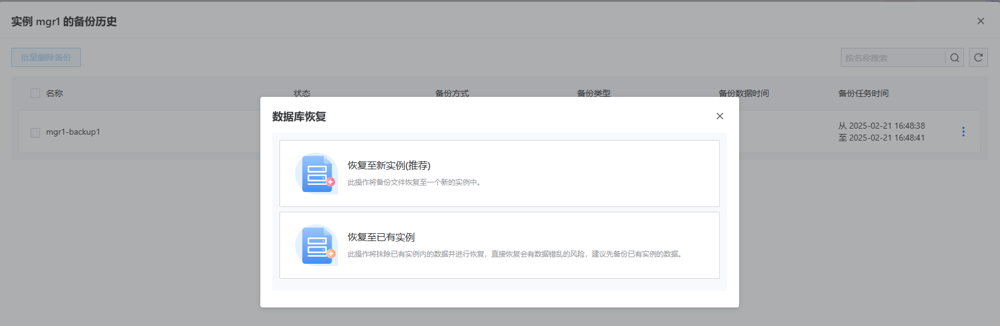

# 备份管理

备份管理功能为您提供了一个直观且实用的界面。通过简单选择一个项目和命名空间，您可以全面查看实例的备份状态，包括自动备份开关、成功和失败备份的数量、最后备份结果以及存储位置。这使您能够快速评估备份情况并及时识别问题。通过实例右侧的菜单，您可以导航到备份历史页面，清晰显示备份时间、结果和存储方式等关键信息。此外，您还可以批量删除多余的备份以释放空间，或准确恢复指定的备份，以应对数据丢失或系统故障，确保业务连续性和稳定性。

- **增强的数据可见性和控制**

备份管理页面全面展示实例的备份状态，使您能够轻松掌握进度、有效性和存储位置，免去繁琐查找，提高管理效率。同时，您可以随时调整策略，以确保数据的安全性和可靠性。

- **方便的历史追溯和问题诊断**

借助备份历史功能，您可以清晰追踪实例的备份历史，快速查看时间和结果等信息，准确定位问题，核实数据完整性，最小化业务中断，确保正常运作。

## 主要功能

### 查看备份列表

用户可以选择备份中心下的备份管理功能，进入备份列表页面，如下图所示。

在此页面，用户可以查看指定项目和命名空间下实例的备份状态，包括自动备份是否启用、成功和失败备份的数量，以及最近一次备份的结果。

### 查看备份历史

通过在指定实例的右侧菜单中选择 `History` 功能，用户将看到一个弹出菜单，显示该实例的所有备份记录，如下图所示。

该页面允许直接查询相应组件的备份资源，详细信息可在各个组件的备份恢复文档中找到。

### 恢复操作

在备份历史页面，选择一个备份记录后，用户可以选择侧边菜单并点击 `Recovery` 按钮。系统将弹出恢复选项的标签。不同组件可能支持不同的恢复方式；然而，默认情况下，所有组件都将支持恢复到新实例，而 MGR 额外支持恢复到现有实例。

- 如果用户选择恢复到新实例，系统将重定向到新实例创建页面。用户输入新实例的相关信息（名称、规格、参数等）后，一旦实例创建完成，系统将自动应用备份数据进行恢复。新实例状态变为准备就绪后，指定的备份数据将成功恢复。

- 如果用户选择恢复到现有实例，系统将提示用户选择一个实例并执行恢复操作。

### 删除备份操作

在备份历史页面，用户可以从右侧菜单删除特定备份记录，或选择多个不同的备份记录进行批量删除。注意：**此操作不可逆，请谨慎操作！**
