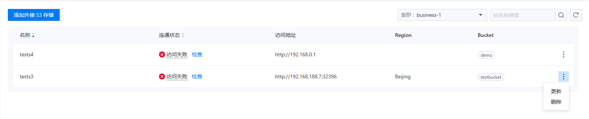

# 外部 S3 存储

## 功能简介

对接外部存储这个功能，旨在为您当前选定的项目提供无缝的外部 S3 存储注册服务。通过简洁直观的操作界面，您只需轻松几步，就能为项目成功注册一个外部 S3 存储。
外部存储列表页面还集成了智能检测机制。系统会自动监测已注册的外部 S3 存储的可用性，一旦发现存储出现异常，如连接中断等情况，会立即通过醒目提示告知您，让您第一时间掌握存储状态。
当您或者其他项目成员需要进行数据备份时，无论是创建自动备份任务，还是手动触发一次即时备份，只需在备份设置中轻松选择一个已注册的外部 S3 存储，系统便会迅速将备份数据安全、高效地保存到该存储中。

- **提升数据安全性**

将备份数据存储在外部 S3 存储中，为您的数据提供了额外的安全保障。外部 S3 存储通常具备专业的数据冗余和灾难恢复机制，能够有效防止因本地硬件故障、自然灾害等原因导致的数据丢失。即使本地环境遭遇意外，您的数据依然可以在外部存储中完好保存，确保业务的连续性。

- **增强灵活性与可扩展性**

支持多存储批量注册和灵活选择备份存储，让您可以根据不同的需求和场景，自由调配备份资源。您可以根据存储的性能、成本、地理位置等因素，选择最适合的外部 S3 存储来保存备份数据。同时，随着业务的发展和数据量的增长，您可以随时添加新的外部 S3 存储，轻松实现存储资源的扩展，满足不断变化的业务需求。


## 主要功能

### 添加外接 S3 存储

在添加外部 S3 存储之前，用户需要首先收集齐该存储的以下信息:
- 访问地址（Endpoint URL）
- Access Key
- Secret Access Key
- 存储桶名称

外部存储不要求部署在当前集群或者当前命名空间下，只要能够网络联通即可，用户可以事先通过网页请求来确定外部存储的可用性。
添加外接 S3 存储主要包括两个步骤，分别是创建 S3 访问秘钥和创建 BackupStorage。

#### 创建 S3 访问秘钥

添加外部 S3 存储的第一步是创建 S3 访问秘钥，用以保存外接 S3 存储的 Key 和 Secret。用户可以通过以下 CLI 方式来创建 S3 访问秘钥:
```bash
kubectl -n <namespace> create secret <secret-name> --from-literal=AWS_ACCESS_KEY_ID=<access-key> --from-literal=AWS_SECRET_ACCESS_KEY=<secret-access-key>
```
::: info

- `<namespace>` 是存储 S3 访问秘钥的命名空间，也是授权使用该存储的项目同名命名空间，例如如果为项目 A 添加外部存储，那么应该在当前集群的命名空间 A 下添加这个访问秘钥。
- `<secret-name>` 是存储 S3 访问秘钥的名称，这个名称可以根据业务使用或者存储性质来命名，方便记忆。
- `<access-key>` 是 S3 访问秘钥的 Access Key。
- `<secret-access-key>` 是 S3 访问秘钥的 Secret Access Key。

:::

#### 创建 BackupStorage （CR）

添加外部 S3 存储的第二步是创建 BackupStorage，用以保存外部 S3 存储的相关信息。用户可以通过以下 CLI 方式来创建 backupstorage :
```bash
kubectl -n <namespace> apply -f - <<EOF
{
  "apiVersion": "middleware.alauda.io/v1",
  "kind": "BackupStorage",
  "metadata": {
    "name": "tests4",
    "namespace": "tongrds",
  },
  "spec": {
    "s3": {
      "bucket": [
        "demo"
      ],
      "credentialsSecret": "tests4",
      "endpointUrl": "http://192.168.0.1",
      "region": ""
    }
  }
}
```
::: info

- `<name>` 是这个新建资源名称，设置一个便于记忆的名称即可
- `<namespace>` 和上面创建秘钥的命名空间相同，是和项目同名的命名空间
- `<spec.s3.backet>` 用来指定保存数据的存储桶名称，这里可以指定多个存储桶，但是在存储数据时，只能选择其中一个存储桶
- `<spec.s3.credentialsSecret>` 是上面创建秘钥的名称
- `<spec.s3.endpointUrl>` 是存储桶的访问地址
- `<spec.s3.region>` 是存储桶的区域，不填则默认为 us-east-1

:::

当BackupStorage创建成功后，您就可以在外部存储列表中看到这个存储了，如下图所示:



