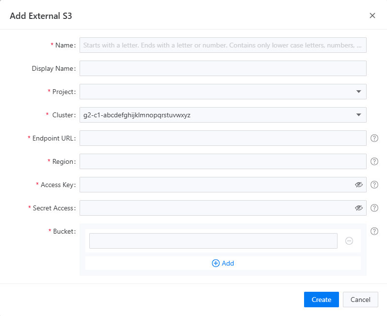
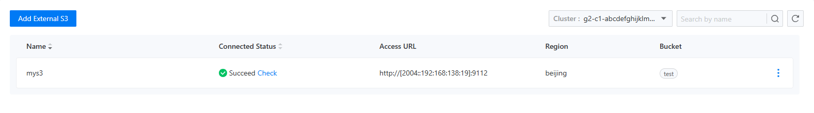

# 外部 S3 存储

## 功能简介

对接外部存储这个功能，旨在为您当前选定的项目提供无缝的外部 S3 存储注册服务。通过简洁直观的操作界面，您只需轻松几步，就能为项目成功注册一个外部 S3 存储。
外部存储列表页面还集成了智能检测机制。系统会自动监测已注册的外部 S3 存储的可用性，一旦发现存储出现异常，如连接中断等情况，会立即通过醒目提示告知您，让您第一时间掌握存储状态。
当您或者其他项目成员需要进行数据备份时，无论是创建自动备份任务，还是手动触发一次即时备份，只需在备份设置中轻松选择一个已注册的外部 S3 存储，系统便会迅速将备份数据安全、高效地保存到该存储中。

- **提升数据安全性**

将备份数据存储在外部 S3 存储中，为您的数据提供了额外的安全保障。外部 S3 存储通常具备专业的数据冗余和灾难恢复机制，能够有效防止因本地硬件故障、自然灾害等原因导致的数据丢失。即使本地环境遭遇意外，您的数据依然可以在外部存储中完好保存，确保业务的连续性。

- **增强灵活性与可扩展性**

支持多存储批量注册和灵活选择备份存储，让您可以根据不同的需求和场景，自由调配备份资源。您可以根据存储的性能、成本、地理位置等因素，选择最适合的外部 S3 存储来保存备份数据。同时，随着业务的发展和数据量的增长，您可以随时添加新的外部 S3 存储，轻松实现存储资源的扩展，满足不断变化的业务需求。

## 主要功能

### 添加外接 S3 存储

在添加外部 S3 存储之前，用户需要首先收集齐该存储的以下信息:
- 访问地址（Endpoint URL）
- Access Key
- Secret Access Key
- 存储桶名称

外部存储不要求部署在当前集群或者当前命名空间下，只要能够网络联通即可，用户可以事先通过网页请求来确定外部存储的可用性。
添加外接 S3 存储只需要在备份中心填写外接 S3 存储注册表单即可，表单如下图所示。

### 查看外部 S3 存储列表

当BackupStorage创建成功后，您就可以在外部存储列表中看到这个存储了。存储列表集成了自动检查存储状态的功能：当有新注册的外部 S3 存储加入其中，会自动触发一次连通状态检查。用户也可以手工点击连通状态后面的`检查`按钮，去手工触发一次检查。连通状态的检查结果会直接显示在列表上，分别如下图所示:

