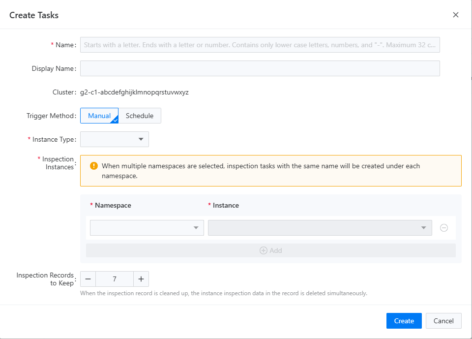

# 创建检查任务

检查任务表示特定组件实例检查的规划和管理。在创建检查任务时，可以指定需要检查的组件实例、检查周期和策略。您还可以指定保留的最大检查记录数量；超过此数量的任何检查结果将被自动覆盖。

## 流程

<Tabs>
  <Tab label="CLI">
    在创建检查任务时，可以使用以下命令进行创建：

    ```bash
    $ kubectl -n <namespace> apply -f - <<EOF
    {
      "apiVersion": "middleware.alauda.io/v1",
      "kind": "Inspection",
      "metadata": {
        "name": "insp-task",
        "namespace": "tongrds-1"
      },
      "spec": {
        "component": "mysqlcluster",
        "instances": [
          {
            "name": "mgr1"
          }
        ],
        "jobsHistoryLimit": 3,
        "trigger": "Manual"
      }
    }
    EOF
    ```

    ::: info

    - `<name>` 是检查任务的资源名称；您可以设置一个容易记住的名称。
    - `<namespace>` 是检查任务所属的命名空间，也是检查的目标命名空间。例如，如果您想检查命名空间 `tongrds-1` 中的组件实例 `mgr1`，则需要将 `<namespace>` 设置为 `tongrds-1`。
    - `<spec.component>` 用于指定检查任务的目标组件类型，例如 `mysqlcluster`。
    - `<spec.instances.name>` 用于指定检查任务的目标实例名称；您可以在同一命名空间内指定多个实例，或者使用通配符 `*` 匹配所有实例。
    - `<spec.jobsHistoryLimit>` 用于指定当前检查任务将保留的最大检查记录数量。超过此值的任何记录将被自动覆盖。
    - `<spec.trigger>` 用于指定当前检查任务的触发方式，目前支持 `Manual` 和 `Schedule`，分别表示手动触发和定时触发。如果设置为 `Schedule`，则必须设置以下参数：
      - `<spec.schedule>` 用于指定当前检查任务的触发时间，例如 `0 0 1 * *` 表示每天的凌晨 1 点触发。有关定时任务的更多信息，请参阅 [检查调度策略](../how_to/inspection_policy.mdx)。

    :::
  </Tab>

  <Tab label="Web Console">
    1. 进入“检查任务”。

    2. 在左上角选择您想要检查的项目。

    3. 点击“创建任务”按钮，并填写弹出表单中所需的信息。

    

    4. 填写完上述表单后，点击“创建”，该检查任务将立即显示在检查任务列表中。
  </Tab>
</Tabs>

一旦检查任务成功创建，后端服务将根据检查任务的设置执行相应的检查操作。有关执行检查的更多信息，请参阅 [执行检查任务](./run_inspection_task.mdx)。
