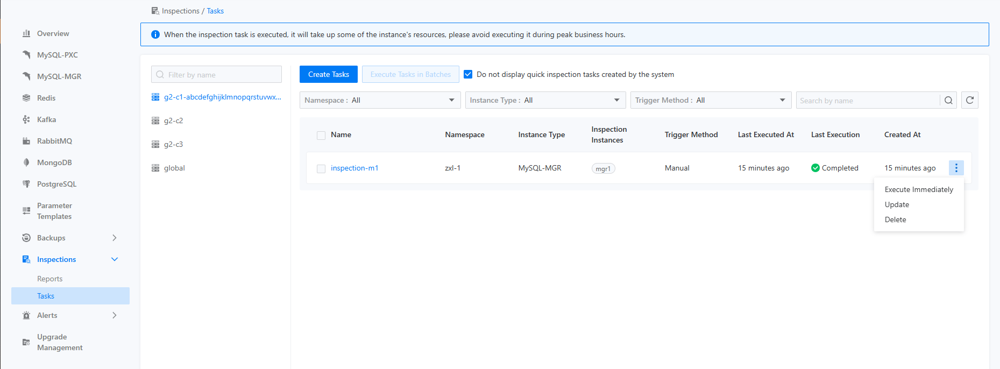

# 执行检查任务

检查任务有两种触发方式：手动触发和定时触发。如果用户选择手动触发检查，则相应的检查操作将立即执行，检查结果将根据触发方式在不同位置展示。

- 如果用户从特定组件实例的详情页面触发检查，检查结果将显示在该组件实例的详情页面上，并且也会出现在检查报告页面上，如下图所示：


- 如果用户在特定检查任务上触发检查，无论是手动触发还是自动触发，检查结果将以检查记录的形式出现在该任务的检查记录中，如下图所示：


## 主要功能

<Tabs>
  <Tab label="CLI">
    可以通过 CLI 查询特定执行的检查任务结果，如下所示：

    ```bash

    $ kubectl get -n namespace inspectionjobs/name -o yaml

    apiVersion: middleware.alauda.io/v1
    kind: InspectionJob
    metadata:
      annotations:
        cpaas.io/creator: admin
        cpaas.io/updated-at: "2025-02-24T06:36:11Z"
      creationTimestamp: "2025-02-24T06:36:11Z"
      generation: 1
      labels:
        inspection.middleware.io/cluster: business-1
        inspection.middleware.io/component: mysqlcluster
        inspection.middleware.io/inspection: insp-task
        inspection.middleware.io/namespace: tongrds-1
        inspection.middleware.io/project: tongrds
        inspection.middleware.io/trigger: Manual
      name: insp-task-8259621030
      namespace: tongrds-1
      ownerReferences:
      - apiVersion: middleware.alauda.io/v1
        blockOwnerDeletion: true
        controller: true
        kind: Inspection
        name: insp-task
        uid: b9252d5a-4f94-4901-8036-e963f0cc0acb
      resourceVersion: "58806102"
      uid: 524ad817-ef5e-4eea-9b06-83782616ca03
    spec:
      component: mysqlcluster
      instances:
      - name: mgr1
    status:
      instanceCount: 1
      message: ""
      results:
      - healthyStatus: HealthyWithWarning
        id: mgr1-2x4eojeu
        instance: mgr1
        message: ""
        startTime: "2025-02-24T06:36:14Z"
        status: done
        stopTime: "2025-02-24T06:36:22Z"
      startTime: "2025-02-24T06:36:11Z"
      status: succeed
      stopTime: "2025-02-24T06:36:22Z"

    ```

    ::: info

    - `<spec.component>` 是本次检查执行的目标实例类型。
    - `<spec.instances>` 是本次检查执行的目标实例列表。
    - `<status.results>` 是本次检查执行的结果列表，其中包含检查的开始和结束时间、检查概述和状态等字段。

    :::
  </Tab>

  <Tab label="Web Console">
    有两种方式可以触发指定资源的检查，第一种是在指定实例详情页面的右上角点击“检查”按钮，如下图所示。

    

    触发检查的第二种方式是在检查管理的“任务”列表中。您可以选择某个检查任务的右侧下拉菜单，其中有一个“立即执行”的选项，如下图所示。

    
  </Tab>
</Tabs>
