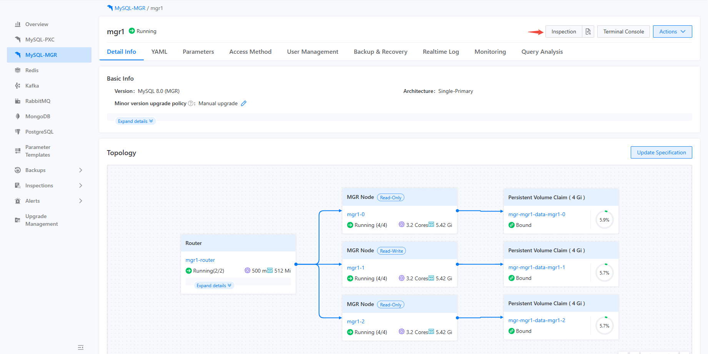
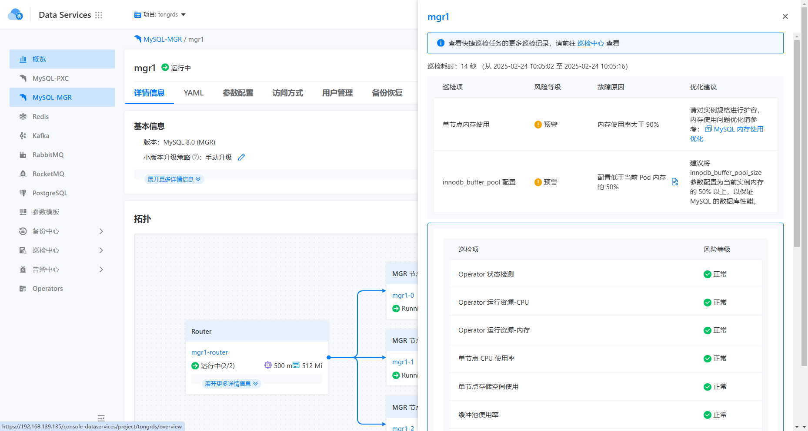
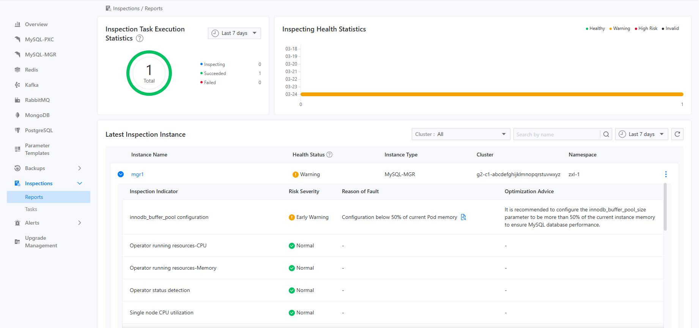
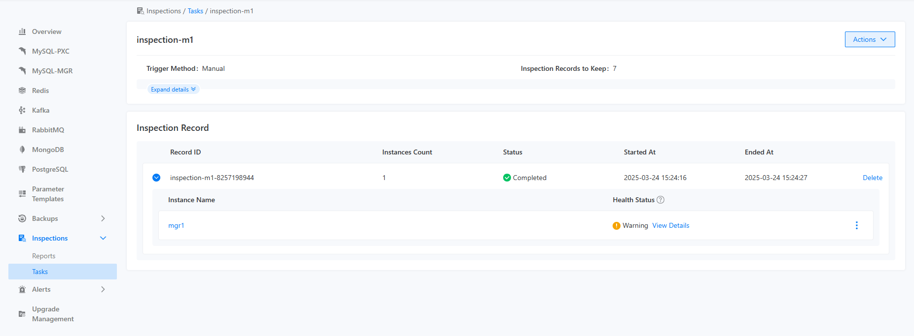

# 巡检任务执行

## 功能简介

巡检任务有两种触发方式：手工触发和定时触发。如果用户选择了手工触发一次巡检，那么对应的巡检动作会立刻执行，并根据触发方式的不同，将巡检结果呈现在不同的地方。

- 如果用户是在某个组件实例的详情页去触发巡检，巡检结果会呈现在该组件实例的详情页，同时也会呈现在巡检报表页面上，如下图所示：







- 如果用户是在某个巡检任务上触发的，不管是手动触发还是自动触发，巡检结果都会以巡检记录的形式呈现在该巡检任务的巡检记录上，如下图所示：



## 主要功能

巡检任务的某一次执行结果，可以通过 CLI 查询，如下图所示：
```bash
kubectl get -n namespace inspectionjobs/name -o yaml

apiVersion: middleware.alauda.io/v1
kind: InspectionJob
metadata:
  annotations:
    cpaas.io/creator: admin
    cpaas.io/updated-at: "2025-02-24T06:36:11Z"
  creationTimestamp: "2025-02-24T06:36:11Z"
  generation: 1
  labels:
    inspection.middleware.io/cluster: business-1
    inspection.middleware.io/component: mysqlcluster
    inspection.middleware.io/inspection: insp-task
    inspection.middleware.io/namespace: tongrds-1
    inspection.middleware.io/project: tongrds
    inspection.middleware.io/trigger: Manual
  name: insp-task-8259621030
  namespace: tongrds-1
  ownerReferences:
  - apiVersion: middleware.alauda.io/v1
    blockOwnerDeletion: true
    controller: true
    kind: Inspection
    name: insp-task
    uid: b9252d5a-4f94-4901-8036-e963f0cc0acb
  resourceVersion: "58806102"
  uid: 524ad817-ef5e-4eea-9b06-83782616ca03
spec:
  component: mysqlcluster
  instances:
  - name: mgr1
status:
  instanceCount: 1
  message: ""
  results:
  - healthyStatus: HealthyWithWarning
    id: mgr1-2x4eojeu
    instance: mgr1
    message: ""
    startTime: "2025-02-24T06:36:14Z"
    status: done
    stopTime: "2025-02-24T06:36:22Z"
  startTime: "2025-02-24T06:36:11Z"
  status: succeed
  stopTime: "2025-02-24T06:36:22Z"

```

::: info

- `<spec.component>` 是这次巡检执行的目标实例类型
- `<spec.instances>` 是这次巡检执行的目标实例列表
- `<status.results>` 是这次巡检执行的结果列表，其下属字段分别包含了这次巡检的起止时间、巡检概述和状态等字段

:::