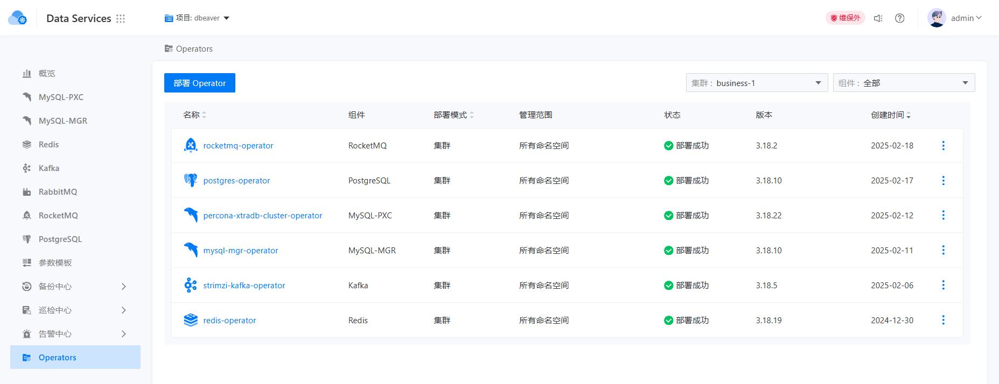
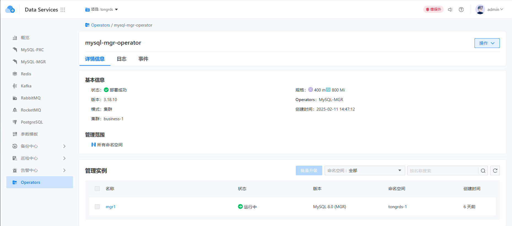

# 示例升级

示例升级控制功能允许用户独立选择升级示例的时间窗口。不同的示例可以在不同的时间窗口中进行升级，以确保业务的连续性。

## 查看Operator列表

用户可以在示例升级控制中心查看当前部署的Operator列表。该列表显示关键信息，例如部署模式、Operator管理范围、Operator状态和Operator版本。需要注意的是，切换当前项目后，右上角的集群选择器也会重置，用户需要重新选择集群，以便Operator列表能够正确显示。此设计是由于多租户模型，其中一个项目可以包含多个不同的集群。

Operator列表如下面的图所示。

## 查看实例列表

点击特定Operator的名称后，用户可以导航到实例列表页面。在实例列表页面，用户可以查看当前项目和集群中该Operator管理的所有实例的名称、状态和版本。需注意，实例列表页面仅会显示当前项目和集群下的实例，并且还会验证查看该项目的相关权限。

实例列表如下面的图所示。

## 升级实例

当用户想要升级实例时，可以从实例列表中选择所需实例，然后点击右上角的批量升级按钮，以触发对应实例的滚动更新。用户会观察到所选实例的状态将依次更改为 `Progressing`。一旦实例更新完成，状态将恢复为 `Running`。

需要注意的是，根据 K8S 特性，多个实例的升级顺序并不固定，但它们最终都会转变为升级就绪状态。
