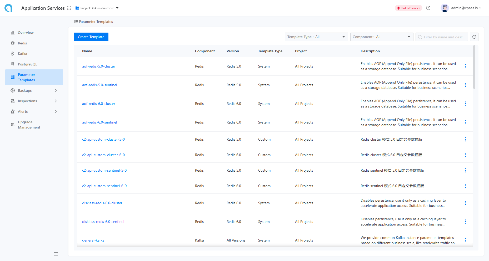
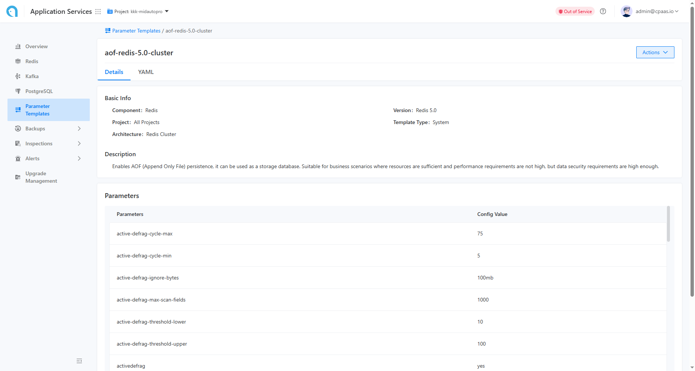
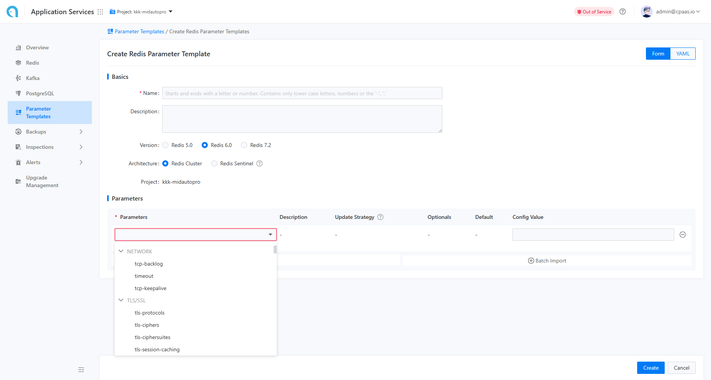

# 参数模板管理

参数模板功能旨在对各种组件的参数集进行统一管理和维护。这包括查看参数模板中包含哪些参数，以及它们的默认值和描述。目前，支持参数模板的组件包括 MySQL（包括 PXC 和 MGR）、Redis 和 Kafka。该平台附带了适用于不同场景和组件规范的预配置参数模板，代表了在这些场景中使用的行业最佳实践，从而允许用户直接使用。此外，用户还可以根据具体的业务需求创建自定义参数模板，以便于实施内部标准。在创建实例时，所有参数模板均可供选择使用。

## 主要功能

### 查看参数模板列表

用户可以点击参数模板以访问列表页面，如下图所示。



在此页面，用户可以根据组件类型和模板类型查看特定项目的参数模板。目前支持的组件类型包括 MySQL、Redis 和 Kafka。可用的模板类型有平台的预配置模板和用户定义模板。平台的预配置模板在整个集群中通用，而用户可以为当前项目创建专门的自定义模板。

::: info
MySQL的参数模板可适用于 PXC 架构和 MGR 架构。
:::

### 查看指定参数模板的详细信息

点击特定模板将引导用户进入模板详情页面，如下图所示。



此页面显示了关于该模板的详细信息，包括模板名称、模板类型、组件类型、模板描述、参数列表和默认参数值。

### 创建参数模板

具备适当权限的用户可以点击左上角的“创建参数模板”按钮，以访问模板创建页面，如下图所示。



在此页面，用户可以填写模板名称、模板类型、组件类型和模板描述等信息，然后逐一指定包含在模板中的参数及其默认值。由于每个实例在创建时只能指定一个参数模板，因此参数模板应尽可能包含全面的参数列表。为了方便用户输入，平台支持批量导入参数和从文档中导入参数。

::: info
批量导入参数的格式：

```
Parameter1 ParameterValue1
Parameter2 ParameterValue2
...
```

:::

### 导出参数模板

用户可以在参数模板列表页面右侧菜单中选择“导出”选项，或在参数模板详情页面的下拉操作菜单中选择导出，以导出参数模板的配置详情。导出文件的格式为与导入格式一致的文本文件。
