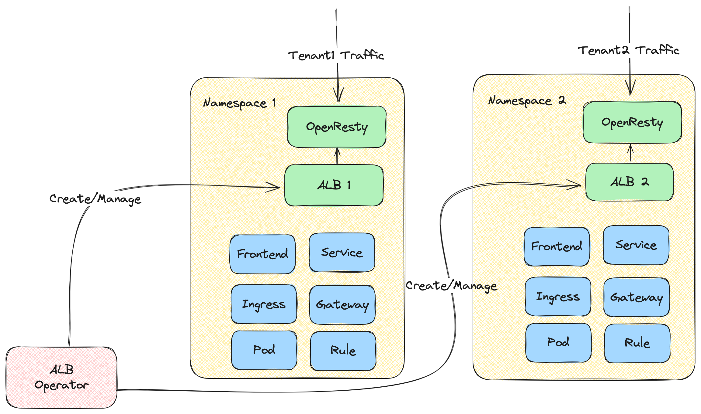
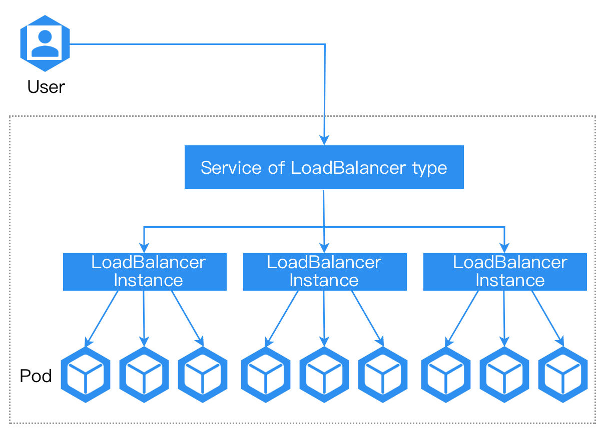
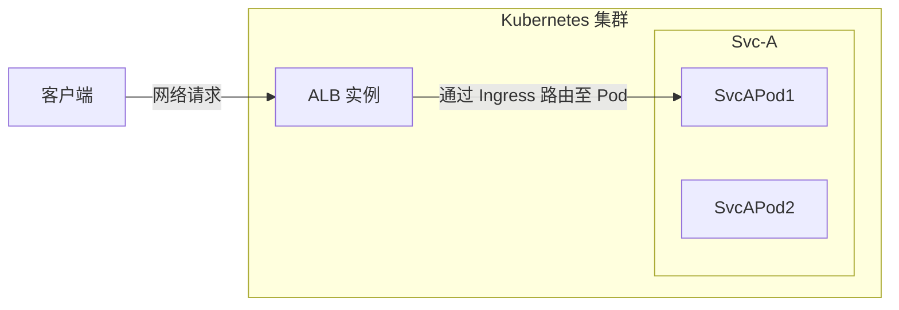

# 理解 ALB

ALB（另一种负载均衡器）是一个由 OpenResty 驱动的 Kubernetes 网关，拥有来自 Alauda 数年的生产经验。

## 核心组件



- **ALB 操作器**：一个管理 ALB 实例生命周期的操作器。它负责监视 ALB CR（Custom Resource）并为不同租户创建和更新 ALB 实例。
- **ALB 实例**：ALB 实例包括作为数据平面的 Openresty 和作为控制平面的 Go 控制器。Go 控制器监视各种 CR（Ingress、Gateway、Rule 等），并将它们转换为 ALB 特定的 DSL 规则。OpenResty 然后使用这些 DSL 规则来匹配和处理传入的请求。

## 快速开始

### 部署 ALB 操作器

1. 创建一个集群。
2. ```shell
    helm repo add alb https://alauda.github.io/alb/;helm repo update;helm search repo|grep alb
   ```
3. ```shell
    helm install alb-operator alb/alauda-alb2
   ```

### 部署一个 ALB 实例

```yaml
cat <<EOF | kubectl apply -f -
apiVersion: crd.alauda.io/v2beta1
kind: ALB2
metadata:
    name: alb-demo
    namespace: kube-system
spec:
    address: "172.20.0.5"  # 部署 ALB 的节点的 IP 地址
    type: "nginx"
    config:
        networkMode: host
        loadbalancerName: alb-demo
        projects:
        - ALL_ALL
        replicas: 1
EOF
```

### 运行一个示例应用

```yaml
cat <<EOF | kubectl apply -f -
apiVersion: apps/v1
kind: Deployment
metadata:
  name: hello-world
  labels:
    k8s-app: hello-world
spec:
  replicas: 1
  selector:
    matchLabels:
      k8s-app: hello-world
  template:
    metadata:
      labels:
        k8s-app: hello-world
    spec:
      terminationGracePeriodSeconds: 60
      containers:
      - name: hello-world
        image: docker.io/crccheck/hello-world:latest
        imagePullPolicy: IfNotPresent
---
apiVersion: v1
kind: Service
metadata:
  name: hello-world
  labels:
    k8s-app: hello-world
spec:
  ports:
  - name: http
    port: 80
    targetPort: 8000
  selector:
    k8s-app: hello-world
---
apiVersion: networking.k8s.io/v1
kind: Ingress
metadata:
  name: hello-world
spec:
  rules:
  - http:
      paths:
      - path: /
        pathType: Prefix
        backend:
          service:
            name: hello-world
            port:
              number: 80
EOF
```

现在可以通过 `curl http://${ip}` 访问应用。

## ALB 通用概念

以下定义了 ALB 中的通用概念。

### Auth

认证是一种机制，用于在请求到达实际服务之前进行身份验证。它允许您在 ALB 层统一处理认证，而无需在每个后端服务中实现认证逻辑。

# <<<<<<< HEAD

了解更多关于 [Auth](../concepts/auth.mdx) 内容。

> > > > > > > 460c0d5 (chore: refactor network docs)

### 网络模式

ALB 实例可以以两种模式部署：主机网络模式和容器网络模式。

#### 主机网络模式

直接使用节点的网络栈，与节点共享 IP 地址和端口。

在此模式下，负载均衡器实例直接绑定到节点的端口，无需端口映射或类似容器网络封装转换。

**注意**：为避免端口冲突，单个节点上只允许部署一个 ALB 实例。


在主机网络模式下，ALB 实例默认将监听节点的所有网络接口卡。

##### 优势：

1. 具有最佳的网络性能。
2. 可通过节点的 IP 地址访问。

##### 劣势：

1. 单个节点上只允许部署一个 ALB 实例。
2. 端口可能与其他进程发生冲突。

#### 容器网络模式

与主机网络模式不同，容器网络模式使用容器网络部署 ALB。

# 


##### 优势：

1. 支持在单个节点上部署多个 ALB 实例。
2. ALB 与 MetalLB 集成，可以为 ALB 提供虚拟 IP 地址（VIP）。
3. 端口不会与其他进程发生冲突。

##### 劣势：

1. 性能略低。
2. 必须通过 LoadBalancer 服务访问 ALB。

### Frontend

我们定义了一种资源，称为前端（简称为 ft），用于声明所有 ALB 应监听的端口。

# 每个前端都对应负载均衡器（LB）上的一个监听端口。Frontend 通过标签与 ALB 关联。

我们定义了一种资源，称为前端（简称为 ft），用于声明所有应用负载均衡器（ALB）应监听的端口。

每个前端都对应负载平衡器 (LB) 上的一个监听端口。Frontend 通过标签与 ALB 关联

```yaml
apiVersion: crd.alauda.io/v1
kind: Frontend
metadata:
  labels:
    alb2.cpaas.io/name: alb-demo # [!code callout]
  name: alb-demo-00080 # [!code callout]
spec:
  backendProtocol: "http"
  certificate_name: "" # [!code callout]
  port: 80
  protocol: http # [!code callout]
  serviceGroup: # [!code callout]
    services:
      - name: hello-world
        namespace: default
        port: 80
        weight: 100 # [!code callout]
```

<Callouts>

1. 必填，指明此 Frontend 所属的 ALB 实例。
2. 格式为 `$alb_name-$port`。
3. 格式为 `$secret_ns/$secret_name`。
4. 该前端本身的协议。
   - `http|https|grpc|grpcs` 用于 L7 代理。
   - `tcp|udp` 用于 L4 代理。
5. 对于 L4 代理，需要使用 `serviceGroup`。对于 L7 代理，`serviceGroup` 是可选的。当请求到达时，ALB 将首先尝试根据与此 Frontend 关联的规则对其进行匹配。只有当请求与任何规则不匹配时，ALB 才会将其转发给前端配置中指定的默认 `serviceGroup`。
6. 适用于循环调度和加权循环调度算法的 `weight` 配置。

</Callouts>

:::note
ALB 监听入口并自动创建 Frontend 或 [Rule](#rules)。`source` 字段定义如下：

1. `spec.source.type` 目前只支持 `ingress`。
2. `spec.source.name` 是入口名称。
3. `spec.source.namespace` 是入口名称空间。

:::

#### 附加资源

- [L4/L7 timeout](../concepts/timeout.mdx)
- [Keepalive](../concepts/keepalive.mdx)

### Rules

我们定义了一种资源，称为规则，用于描述 ALB 实例应如何处理第七层请求。
可通过规则配置复杂的流量匹配和分发模式。当流量到达时，它会根据内部规则对流量进行打击，并做相应的转发，还提供一些附加功能，如 cors、url rewrite 等。

```yaml
apiVersion: crd.alauda.io/v1
kind: Rule
metadata:
  labels:
    alb2.cpaas.io/frontend: alb-demo-00080 # [!code callout]
    alb2.cpaas.io/name: alb-demo #[!code callout]
  name: alb-demo-00080-test
  namespace: kube-system
spec:
  backendProtocol: "" #[!code callout]
  certificate_name: "" #[!code callout]
  dslx:
    - type: METHOD
      values:
        - - EQ
          - POST
    - type: URL
      values:
        - - STARTS_WITH
          - /app-a
        - - STARTS_WITH
          - /app-b
    - type: PARAM
      key: group
      values:
        - - EQ
          - vip
    - type: HOST
      values:
        - - ENDS_WITH
          - .app.com
    - type: HEADER
      key: LOCATION
      values:
        - - IN
          - east-1
          - east-2
    - type: COOKIE
      key: uid
      values:
        - - EXIST
    - type: SRC_IP
      values:
        - - RANGE
          - "1.1.1.1"
          - "1.1.1.100"
  enableCORS: false
  priority: 4 #[!code callout]
  serviceGroup: #[!code callout]
    services:
      - name: hello-world
        namespace: default
        port: 80
        weight: 100
```

<Callouts>

1. 必填，指明此规则所属的前台。
2. 必填，指明此规则所属的 ALB。
3. 与 Frontend 相同。
4. 与 Frontend 相同。
5. 数字越小，优先级越高。
6. 与 Frontend 相同。

</Callouts>

#### dslx

dslx 是一种特定领域语言，用于描述匹配标准。

例如，以下规则匹配满足以下所有条件的请求：

- URL 以 /app-a 或 /app-b 开头
- 方法为 POST
- URL 参数的 group 为 vip
- 主机为 \*.app.com
- 头部的 location 为 east-1 或 east-2
- 具有名为 uid 的 cookie
- 源 IP 范围来自 1.1.1.1-1.1.1.100

```yaml
dslx:
  - type: METHOD
    values:
      - - EQ
        - POST
  - type: URL
    values:
      - - STARTS_WITH
        - /app-a
      - - STARTS_WITH
        - /app-b
  - type: PARAM
    key: group
    values:
      - - EQ
        - vip
  - type: HOST
    values:
      - - ENDS_WITH
        - .app.com
  - type: HEADER
    key: LOCATION
    values:
      - - IN
        - east-1
        - east-2
  - type: COOKIE
    key: uid
    values:
      - - EXIST
  - type: SRC_IP
    values:
      - - RANGE
        - "1.1.1.1"
        - "1.1.1.100"
```

### 项目隔离

关于规则，默认是项目隔离，每个用户只能看到自己项目的规则。

#### 项目模式

ALB 可以被多个项目共享，这些项目可以控制该 ALB。ALB 的所有端口对这些项目可见。

#### 端口项目模式

ALB 的一个端口可以属于不同的项目。这种部署模式称为端口项目模式。管理员需要指定每个项目可以使用的端口段。该项目的用户只能在这个端口段内创建端口，且只能看到这个端口段内的端口。

=======

### Project Isolation

关于规则，默认是项目隔离，每个用户只能看到自己项目的规则。

#### Project Mode

ALB 的一个端口可以属于不同的项目。这种部署模式称为端口项目模式。管理员需要指定每个项目可以使用的端口段。该项目的用户只能在这个端口段内创建端口，且只能看到这个端口段内的端口。

#### Port Project Mode

关于规则，默认是项目隔离，每个用户只能看到自己项目的规则。

> > > > > > > 460c0d5 (chore: refactor network docs)

## ALB、ALB 实例、Frontend/FT、规则、Ingress 和项目之间的关系

负载均衡器是现代云原生架构中的关键组件，充当智能流量路由器和负载均衡器。

为了理解 ALB 在 Kubernetes 集群中的工作原理，我们需要了解几个核心概念及其相互关系：

- ALB 本身
- Frontend（FT）
- 规则
- Ingress 资源
- 项目

这些组件共同协作，以实现灵活而强大的流量管理能力。

接下来介绍这些概念是如何协同工作的，以及它们在请求调用链中所扮演的角色。每个概念的详细介绍将会在其他文章中进行。



在请求调用链中：

1. 客户端发送一个 HTTP/HTTPS/其他协议的请求，最终该请求将 **抵达 ALB 的某个 Pod**，此 Pod（ALB 实例）将开始处理该请求。
2. 该 ALB 实例找到一个可以匹配该请求的规则。
3. 如有必要，基于规则修改、重定向或重写请求。
4. 从规则配置的服务中查找并选择一个 Pod IP，并将请求转发至该 Pod。

### Ingress

Ingress 是 Kubernetes 中的资源，用于描述应该将请求发送到哪个服务。

### Ingress 控制器

Ingress 控制器是一个理解 Ingress 资源并将请求代理到服务的程序。

### ALB

ALB 是一种 Ingress 控制器。

在 Kubernetes 集群中，我们使用 `alb2` 资源来操作 ALB。你可以使用 `kubectl get alb2 -A` 查看集群中所有的 ALB。

ALB 是由用户手动创建的。每个 ALB 都有自己独特的 IngressClass，当你创建一个 Ingress 时，可以使用 `.spec.ingressClassName` 字段指示哪个 Ingress 控制器应处理该 Ingress。

### ALB 实例

ALB 也是在集群中运行的部署（一组 Pods）。每个 Pod 被称为一个 ALB 实例。

每个 ALB 实例独立处理请求，但所有实例共享属于同一 ALB 的 Frontend（FT）、规则和其他配置。

### ALB 操作器

ALB 操作器是集群中部署的默认组件，是 ALB 的操作器。它将根据 ALB 资源为每个 ALB 创建、更新或删除部署及其他相关资源。

### Frontend（缩写：FT）

FT 是 ALB 本身定义的一种资源。它表示 ALB 实例监听的端口。

FT 可以由 ALB 领导者或用户手动创建。

由 ALB 领导者创建 FT 的情况：

1. 如果 Ingress 有证书，我们将创建 FT 443（HTTPS）。
2. # 如果 Ingress 没有证书，我们将创建 FT 80（HTTP）。
3. 如果 Ingress 有证书，我们将创建 FT 443（HTTPS）
4. 如果 Ingress 没有证书，我们将创建 FT 80（HTTP）

### 规则

规则是 ALB 本身定义的一种资源。它的作用与 Ingress 相同，但更加具体。规则与 FT 唯一关联。

规则可以由 ALB 领导者或用户手动创建。

由 ALB 领导者创建规则的情况：

1. 将 Ingress 同步到规则。

### ALB 领导者

在多个 ALB 实例中，将选举其中一个作为领导者。领导者的责任是：

1. 将 Ingress 转换为规则。
   我们将为 Ingress 中的每个路径创建规则。
2. 创建 Ingress 需要的 FT。
   例如，如果 Ingress 有证书，我们将创建 FT 443（HTTPS）；如果 Ingress 没有证书，我们将创建 FT 80（HTTP）。

### 项目

从 ALB 的角度来看，项目是一组命名空间。

你可以在 ALB 中配置一个或多个项目。当 ALB 领导者将 Ingress 转换为规则时，它将忽略不属于项目的命名空间中的 Ingress。

## 附加资源：

- [创建负载均衡器](../how_to/create_loadbalancer.mdx)
