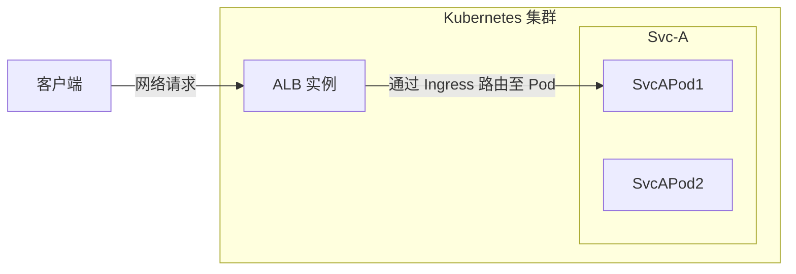

# ALB、ALB实例、Frontend/FT、规则、Ingress 和项目之间的关系

负载均衡器是现代云原生架构中的关键组件，充当智能流量路由器和负载均衡器。

为了了解 ALB 在 Kubernetes 集群中的工作原理，我们需要理解几个核心概念及其关系：

- ALB 本身
- Frontend (ft)
- 规则
- Ingress 资源
- 项目

这些组件共同协作，以实现灵活而强大的流量管理能力。

本文主要介绍这些概念是如何协同工作的，以及它们在请求调用链中所扮演的角色。每个概念的详细介绍将会在其他文章中进行。

在请求调用链中：

1. 客户端发送一个 http/https/其他协议的请求，最终该请求将 **抵达 ALB 的某个 Pod**，这个 Pod（ALB 实例）将开始处理该请求。
2. 该 ALB 实例找到一个可以匹配该请求的规则。
3. 如有必要，基于规则修改/重定向/重写请求。
4. 从服务中查找并选择一个 Pod IP，并将请求转发到该 Pod。

## Ingress

Ingress 是 Kubernetes 中的资源，用于描述应该将请求发送到哪个服务。

## Ingress 控制器

Ingress 控制器是一个理解 Ingress 资源并将请求代理到服务的程序。

## ALB

ALB 是一种 Ingress 控制器。

在 Kubernetes 集群中，我们使用 `alb2` 资源来操作 ALB。你可以使用 `kubectl get alb2 -A` 查看集群中所有的 ALB。

ALB 是由用户手动创建的。每个 ALB 都有自己独特的 ingressClass，当你创建一个 Ingress 时，可以使用 `.spec.ingressClassName` 字段指示哪个 Ingress 控制器应该处理该 Ingress。

## ALB 实例

ALB 也是在集群中运行的部署（一组 Pod）。每个 Pod 被称为一个 ALB 实例。

每个 ALB 实例独立处理请求，但所有实例共享属于同一 ALB 的 Frontend (ft)、规则和其他配置。

## ALB 操作器

ALB 操作器是集群中部署的默认组件，是 ALB 的操作器。它将根据 ALB 资源为每个 ALB 创建/更新/删除部署和其他相关资源。

## Frontend（缩写：ft）

ft 是 ALB 本身定义的一种资源。它表示 ALB 实例监听的端口。

ft 可以由 ALB 领导者或用户手动创建。

如果 ft 是由 ALB 领导者创建：

1. 如果 Ingress 有证书，我们将创建 ft 443（https）
2. 如果 Ingress 没有证书，我们将创建 ft 80（http）。

## 规则

规则是 ALB 本身定义的一种资源。它的作用与 Ingress 相同，但更为具体。规则与 ft 唯一关联。

规则可以由 ALB 领导者或用户手动创建。

如果规则是由 ALB 领导者创建：

1. 将 Ingress 同步到规则。

## ALB 领导者

在多个 ALB 实例中，将选举其中一个作为领导者。领导者的责任是：

1. 将 Ingress 转换为规则。
   我们将为 Ingress 中的每个路径创建规则。
2. 创建 Ingress 需要的 ft。
   例如，如果 Ingress 有证书，我们将创建 ft 443（https）；如果 Ingress 没有证书，我们将创建 ft 80（http）。

## 项目

从 ALB 的角度来看，项目是一组命名空间（ns）。

你可以在 ALB 中配置一个或多个项目。当 ALB 领导者将 Ingress 转换为规则时，它将忽略不属于项目的命名空间中的 Ingress。
