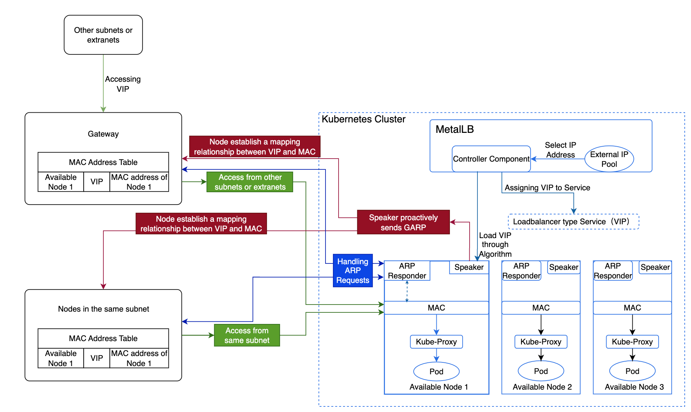

# MetalLB 高可用性原则

## 术语

| 术语               | 描述                                                                                                                                                                                                                                                                                                                                                     |
| ----------------- | ----------------------------------------------------------------------------------------------------------------------------------------------------------------------------------------------------------------------------------------------------------------------------------------------------------------------------------------------------------- |
| **VIP**           | 虚拟 IP 地址（VIP）是 MetalLB 为 LoadBalancer 类型的内部路由分配的 IP 地址，提供一个统一的访问点，使外部流量能够访问集群内的服务。                                                                                                                                                                                                                       |
| **ARP**           | 地址解析协议（ARP）用于将网络层 IP 地址映射到数据链路层 MAC 地址。                                                                                                                                                                                                                                                                                          |
| **GARP**          | 自我宣布 ARP（GARP）是一种特殊的 ARP 请求，用于通知网络中的其他节点 IP 地址与 MAC 地址的绑定情况。与正常的 ARP 请求不同，GARP 不等待响应，而是主动在网络中发送信息。                                                                                                                                                                          |
| **ARP 响应器**    | MetalLB 的一个组件，负责通过将 VIP 映射到节点的 MAC 地址来响应 ARP 请求。当节点需要与 VIP 通信时，它会发送 ARP 请求以检索与 VIP 对应的 MAC 地址。每个可用节点都有一个 ARP 响应器，能够响应这些请求，将 VIP 映射到节点的 MAC 地址。                                               |
| **Controller**    | MetalLB 的一个组件，动态地从外部地址池中分配 VIP 用于 LoadBalancer 类型的内部路由。Controller 监听集群中内部路由的创建和删除事件，以便根据需要分配或释放 VIP。                                                                                                                                                                           |
| **Speaker**       | MetalLB 的一个组件，根据策略或算法判断节点是否应承载 VIP 并发送 GARP。它确保节点之间的负载平衡，当某个节点不可用时，其他节点可以接管 VIP 并发送 GARP，从而实现高可用性。                                                                                                                                    |

## MetalLB 高可用性原则

平台默认使用 MetalLB 的 ARP 模式，具体实施过程及原理如下：

- MetalLB 的 Controller 组件从外部地址池中选择一个 IP 地址并分配给 LoadBalancer 类型的内部路由作为 VIP。

- MetalLB 根据 [算法](#vip) 选择一个可用节点来承载 VIP，并转发流量。

- 该节点上的 Speaker 组件主动发送 GARP，在所有节点之间建立 VIP 和 MAC 地址之间的映射关系。

  - 同一子网内的节点在得知 VIP 与可用节点 MAC 地址的映射后，将直接与该节点进行通信以访问 VIP。

  - 不同子网的节点将首先将流量路由到其子网的网关，然后网关将流量转发到承载 VIP 的节点。

- 当该节点发生故障时，MetalLB 会选择另一个可用节点来承载 VIP，从而确保高可用性。

- 到达节点后，Kube-Proxy 会将流量转发到相应的 Pod。

## MetalLB 选择 VIP 承载节点的算法\{#vip}

MetalLB 会将所有与外部地址池对应的可用节点与 VIP 进行 hash 运算，并根据特定的算法排序，选择第一个可用节点作为 VIP 的承载节点。

## 外部地址池与节点数量

创建一个外部地址池并添加可用节点。所有可用节点保持 **备份** 关系，这意味着只有承载 VIP 的节点可以转发流量，要求它处理外部地址池中 VIP 的所有流量。

### 计算公式

公式为：**外部地址池的数量 = ceil(n-vip / n-node)**，其中 ceil 向上取整。

**注**：如果使用虚拟机，则虚拟机数量 = 外部地址池数量 \* n。这里，n 必须大于 2，并允许最多一个节点故障。

- n-vip：表示 VIP 的数量。

- n-node：表示单个节点可以处理的 VIP 数量。

### 应用实例

如果某公司有 10 个 VIP，每个可用节点可以处理 5 个 VIP，并允许一个节点故障，公司的外部地址池和可用节点数量应该如何规划？

**分析**：

需要总共两个外部地址池和四个可用节点。

- 每个可用节点最多可以处理 5 个 VIP，这意味着一个外部地址池可以容纳 5 个 VIP，因此处理 10 个 VIP 需要两个外部地址池。

- 允许一个节点故障意味着每个地址池必须包括一个承载 VIP 的节点和一个备份节点，因此每个外部地址池需要两个可用节点。
