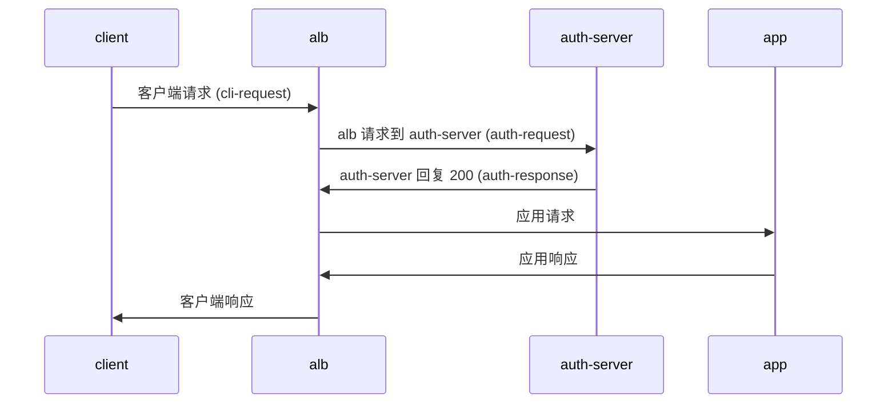
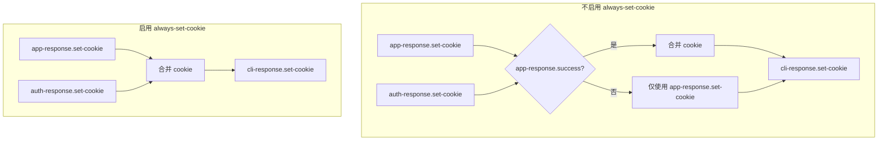
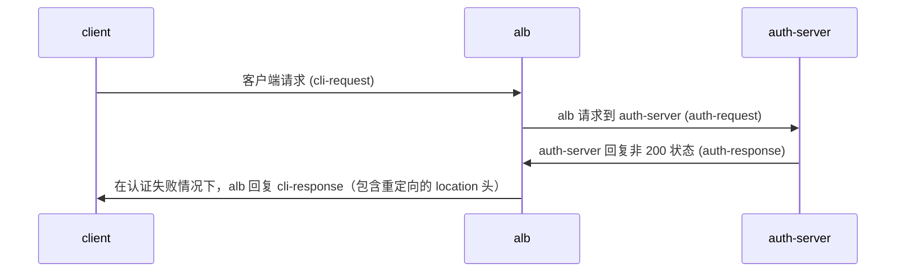
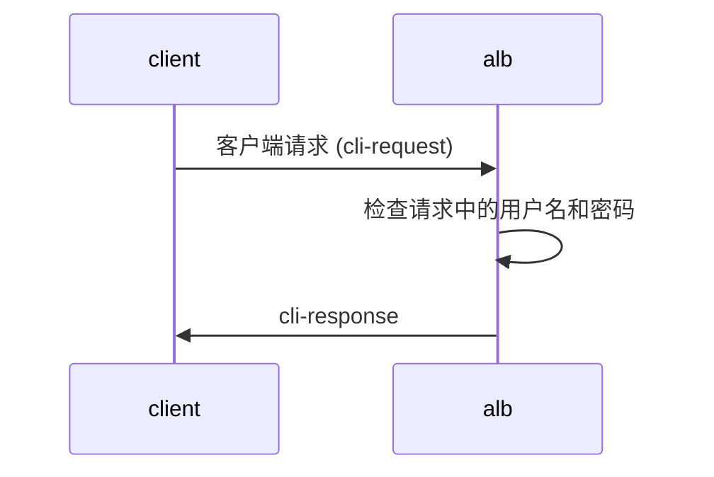

## 存在的问题
1. 第一段的标题“身份验证”与原文的“Auth”对应不准确，应该翻译为“认证”。
2. 在"什么是身份验证"的描述中，"身份验证"一词的使用重复，应该使用"认证"和"验证"的区分。
3. "支持的身份验证方法"小节中，"转发身份验证（外部身份验证）"和"基本身份验证（基本身份验证）"的翻译不够准确，第二个“基本身份验证”的翻译应该直接用“基本认证”。
4. "工作流程“部分在中文表达上不够简洁，某些动词遗漏，造成理解上的障碍。
5. “全局身份验证”、“路径级别身份验证”和“禁用身份验证”三部分内容表述的用词应更加专业，并与后续内容体系保持一致。
6. 表格中“是否支持”的表头翻译不统一，应该使用统一的表达方式。
7. 代码部分的注释缺少合适解读，应该添加一些额外的解释，比如`# echo "Zm9vOiRhcHIxJHFJQ05aNjFRJDJpb29pSlZVQU1tcHJxMjU4L0NoUDE=" | base64 -d`等。
8. “cookie 处理”部分图示的汉字表达不规范，“合并 cookie”应保持一致性。

## 重新意译
---
weight: 10
sourceSHA: 22b540818be2ab3ee251a768c2113e92c94d96fd6ae495937b60da2d3c01b6a8
---

# 认证

## 基本概念

### 什么是认证

认证是一种机制，用于在请求到达实际服务之前进行身份验证。它允许您在 ALB 层统一处理认证，而无需在每个后端服务中实现认证逻辑。

### 支持的认证方法

ALB 支持两种主要的认证方法：

1. **转发认证（外部认证）**
   - 向外部认证服务发送请求以验证用户身份。
   - 适用场景：需要复杂的认证逻辑，例如 OAuth、SSO 等。
   - 工作流程：
     1. 用户请求到达 ALB
     2. ALB 将认证信息转发至认证服务
     3. 认证服务返回验证结果
     4. 根据认证结果决定是否允许访问后端服务

2. **基本认证（Basic Authentication）**
   - 基于用户名和密码的简单认证机制。
   - 适用场景：简单的访问控制、开发环境保护。
   - 工作流程：
     1. 用户请求到达 ALB
     2. ALB 检查请求中的用户名和密码
     3. 与配置的认证信息进行比对
     4. 如果验证通过，则转发请求至后端服务

### 认证配置方法

1. **全局认证**
   - 在 ALB 层进行配置，适用于所有服务
   - 在 ALB 或 FT CR 中进行配置

2. **路径级别认证**
   - 在特定 Ingress 路径进行配置
   - 在特定规则上进行配置
   - 可以覆盖全局认证配置

3. **禁用认证**
   - 针对特定路径禁用认证
   - 通过注释进行配置： `alb.ingress.cpaas.io/auth-enable: "false"`
   - 在规则中使用结合 CR 进行配置

### 认证结果处理

- 认证成功：请求将被转发至后端服务。
- 认证失败：返回 401 未授权错误。
- 可以配置认证失败后的重定向行为（适用于转发认证）。

## 快速入门

使用 ALB 配置基本认证

### 部署 ALB

```bash
cat <<EOF | kubectl apply -f -
apiVersion: crd.alauda.io/v2
kind: ALB2
metadata:
  name: auth
  namespace: cpaas-system
spec:
  config:
    networkMode: container
    projects:
    - ALL_ALL
    replicas: 1
    vip: 
      enableLbSvc: false
  type: nginx
EOF
export ALB_IP=$(kubectl get pods -n cpaas-system -l service_name=alb2-auth -o jsonpath='{.items[*].status.podIP}');echo $ALB_IP
```

### 配置密钥和 Ingress

```bash
# echo "Zm9vOiRhcHIxJHFJQ05aNjFRJDJpb29pSlZVQU1tcHJxMjU4L0NoUDE=" | base64 -d #  foo:$apr1$qICNZ61Q$2iooiJVUAMmprq258/ChP1
# openssl passwd -apr1 -salt qICNZ61Q bar # $apr1$qICNZ61Q$2iooiJVUAMmprq258/ChP1

kubectl apply -f - <<'END'
apiVersion: v1
kind: Secret
metadata:
  name: auth-file
type: Opaque
data:
  auth: Zm9vOiRhcHIxJHFJQ05aNjFRJDJpb29pSlZVQU1tcHJxMjU4L0NoUDE=
---
apiVersion: networking.k8s.io/v1
kind: Ingress
metadata:
  name: auth-file
  annotations:
    "nginx.ingress.kubernetes.io/auth-type":  "basic"
    "nginx.ingress.kubernetes.io/auth-secret":  "default/auth-file"
    "nginx.ingress.kubernetes.io/auth-secret-type": "auth-file"
spec:
  rules:
  - http:
      paths:
      - path: /app-file
        pathType: Prefix
        backend:
          service:
            name: app-server
            port:
              number: 80
END
```

### 验证

```bash
# echo "Zm9vOiJhYXIi" | base64 -d # foo:bar
curl -v -X GET -H "Authorization: Basic Zm9vOmJhcg=="  http://$ALB_IP:80/app-file # 应该返回 200
# 错误的密码
curl -v -X GET -H "Authorization: Basic XXXXOmJhcg=="  http://$ALB_IP:80/app-file # 应该返回 401
```

## 相关 Ingress 注释

Ingress-nginx 定义了一系列注释以配置认证过程的具体细节。以下是 ALB 支持的注释列表，其中"v"表示支持，"x"表示不支持。

| 注释                                                                                                                       | 支持    | 类型                | 备注                               |
|--------------------------------------------------------------------------------------------------------------------------|---------|---------------------|------------------------------------|
| forward-auth                                                                                                            |         |                     | 通过发送 http 请求进行转发认证        |
| nginx.ingress.kubernetes.io/auth-url                                                                                       | v       | string              |                                    |
| nginx.ingress.kubernetes.io/auth-method                                                                                    | v       | string              |                                    |
| nginx.ingress.kubernetes.io/auth-signin                                                                                    | v       | string              |                                    |
| nginx.ingress.kubernetes.io/auth-signin-redirect-param                                                                     | v       | string              |                                    |
| nginx.ingress.kubernetes.io/auth-response-headers                                                                          | v       | string              |                                    |
| nginx.ingress.kubernetes.io/auth-proxy-set-headers                                                                         | v       | string              |                                    |
| nginx.ingress.kubernetes.io/auth-request-redirect                                                                          | v       | string              |                                    |
| nginx.ingress.kubernetes.io/auth-always-set-cookie                                                                         | v       | boolean             |                                    |
| nginx.ingress.kubernetes.io/auth-snippet                                                                                   | x       | string              |                                    |
| basic-auth                                                                                                               |         |                     | 通过用户名和密码的秘密进行认证        |
| nginx.ingress.kubernetes.io/auth-realm                                                                                     | v       | string              |                                    |
| nginx.ingress.kubernetes.io/auth-secret                                                                                    | v       | string              |                                    |
| nginx.ingress.kubernetes.io/auth-secret-type                                                                               | v       | string              |                                    |
| nginx.ingress.kubernetes.io/auth-type                                                                                      | -       | "basic" or "digest" | basic: 支持 apr1 **digest: 不支持** |
| auth-cache                                                                                                               |         |                     |                                    |
| nginx.ingress.kubernetes.io/auth-cache-key                                                                                | x       | string              |                                    |
| nginx.ingress.kubernetes.io/auth-cache-duration                                                                           | x       | string              |                                    |
| auth-keepalive                                                                                                       |         |                     | 在发送请求时保持活跃，通过一系列注释指定保持活跃的行为 |
| nginx.ingress.kubernetes.io/auth-keepalive                                                                                | x       | number              |                                    |
| nginx.ingress.kubernetes.io/auth-keepalive-share-vars                                                                     | x       | "true" or "false"   |                                    |
| nginx.ingress.kubernetes.io/auth-keepalive-requests                                                                      | x       | number              |                                    |
| nginx.ingress.kubernetes.io/auth-keepalive-timeout                                                                       | x       | number              |                                    |
| [auth-tls](https://github.com/kubernetes/ingress-nginx/blob/main/docs/user-guide/nginx-configuration/annotations.md#client-certificate-authentication) |         |                     | 当请求为 https 时，额外验证证书。               |
| nginx.ingress.kubernetes.io/auth-tls-secret                                                                               | x       | string              |                                    |
| nginx.ingress.kubernetes.io/auth-tls-verify-depth                                                                         | x       | number              |                                    |
| nginx.ingress.kubernetes.io/auth-tls-verify-client                                                                        | x       | string              |                                    |
| nginx.ingress.kubernetes.io/auth-tls-error-page                                                                           | x       | string              |                                    |
| nginx.ingress.kubernetes.io/auth-tls-pass-certificate-to-upstream                                                          | x       | "true" or "false"   |                                    |
| nginx.ingress.kubernetes.io/auth-tls-match-cn                                                                            | x       | string              |                                    |

## 转发认证



相关注释：

- nginx.ingress.kubernetes.io/auth-url
- nginx.ingress.kubernetes.io/auth-method
- nginx.ingress.kubernetes.io/auth-signin
- nginx.ingress.kubernetes.io/auth-signin-redirect-param
- nginx.ingress.kubernetes.io/auth-response-headers
- nginx.ingress.kubernetes.io/auth-proxy-set-headers
- nginx.ingress.kubernetes.io/auth-request-redirect
- nginx.ingress.kubernetes.io/auth-always-set-cookie

这些注释描述了在上述图中对 auth-request、app-request 和 cli-response 所做的修改。

### 构建相关注释

#### auth-url

auth-request 的 URL，值可以是变量。

#### auth-method

auth-request 的方法。

#### auth-proxy-set-headers

值为格式为 `ns/name` 的 ConfigMap 引用。
默认情况下，所有来自 cli-request 的头部将发送到 auth-server，可通过 proxy_set_header 配置附加头部。以下头部默认会被发送：

```
X-Original-URI          $request_uri;
X-Scheme                $pass_access_scheme;
X-Original-URL          $scheme://$http_host$request_uri;
X-Original-Method       $request_method;
X-Sent-From             "alb";
X-Real-IP               $remote_addr;
X-Forwarded-For         $proxy_add_x_forwarded_for;
X-Auth-Request-Redirect $request_uri;	
```

### 构建应用请求相关注释

#### auth-response-headers

值为以逗号分隔的字符串，允许我们将特定头部从 auth-response 带入 app-request。
示例：

```
nginx.ingress.kubernetes.io/auth-response-headers: Remote-User,Remote-Name
```

当 ALB 发起 app-request 时，Remote-User 和 Remote-Name 会包含在 auth-response 的头部中。

### cookie 处理

auth-response 和 app-response 都可以设置 cookie。默认情况下，只有当 app-response.success 为真时，auth-response.set-cookie 才会合并至 cli-response.set-cookie。



### 重定向签到相关配置

当 auth-server 返回 401 时，我们可以在 cli-response 中设置重定向头，以指示浏览器重定向到 auth-signin 指定的 URL 进行验证。



#### auth-signin

值是一个 URL，指定 cli-response 中的 location 头。

#### auth-signin-redirect-param

签名 URL 中查询参数的名称，默认为 rd。
如果签名 URL 不包含指定参数名的 `auth-signin-redirect-param`，alb 将自动添加该参数。参数值将设置为 `$pass_access_scheme://$http_host$escaped_request_uri`，用于记录原始请求 URL。

#### auth-request-redirect

在 auth-request 中设置 `x-auth-request-redirect` 头。

## 基本认证

基本认证是 [RFC 7617](https://datatracker.ietf.org/doc/html/rfc7617) 中描述的认证过程。
交互过程如下：



### auth-realm

[受保护区域的描述](https://developer.mozilla.org/zh-CN/docs/Web/HTTP/Headers/WWW-Authenticate#realm)
即 cli-response 的 `WWW-Authenticate` 头中的 realm 值。
WWW-Authenticate: Basic realm="$realm"

### auth-type

认证方案的类型，目前仅支持基本认证。

### auth-secret

用户名和密码的秘密引用，格式为 ns/name。

### auth-secret-type

密钥支持两种类型：

1. auth-file：密钥的数据仅包含一个键 "auth"，其值为 Apache htpasswd 格式的字符串。例如：
   ```
   data:
     auth: "user1:$apr1$xyz..."
   ```

2. auth-map：密钥的数据中的每个键代表一个用户名，且相应的值是密码哈希（不含用户名的 htpasswd 格式）。例如：
   ```
   data:
     user1: "$apr1$xyz...."
     user2: "$apr1$abc...."
   ```

注意：目前仅支持使用 apr1 算法生成的 htpasswd 格式密码哈希。

## CR

ALB CR 已添加与认证相关的配置项，可以在 ALB/Frontend/Rule CR 上配置。
在运行时，ALB 会将 Ingress 上的注释转换为规则。

```yaml
auth:
  # 基本认证配置
  basic:
    #  字符串；对应 nginx.ingress.kubernetes.io/auth-type: basic
    auth_type: "basic"
    #  字符串；对应 nginx.ingress.kubernetes.io/auth-realm
    realm: "受限访问"  
    #  字符串；对应 nginx.ingress.kubernetes.io/auth-secret
    secret: "ns/name"
    #  字符串；对应 nginx.ingress.kubernetes.io/auth-secret-type
    secret_type: "auth-map|auth-file"
  # 转发认证配置
  forward:
    #  布尔值；对应 nginx.ingress.kubernetes.io/auth-always-set-cookie
    always_set_cookie: true
    #  字符串；对应 nginx.ingress.kubernetes.io/auth-proxy-set-headers
    auth_headers_cm_ref: "ns/name"
    #  字符串；对应 nginx.ingress.kubernetes.io/auth-request-redirect
    auth_request_redirect: "/login"
    #  字符串；对应 nginx.ingress.kubernetes.io/auth-method
    method: "GET"
    #  字符串；对应 nginx.ingress.kubernetes.io/auth-signin
    signin: "/signin"
    #  字符串；对应 nginx.ingress.kubernetes.io/auth-signin-redirect-param
    signin_redirect_param: "redirect_to"
    #  []字符串；对应 nginx.ingress.kubernetes.io/auth-response-headers
    upstream_headers:
      - "X-User-ID" 
      - "X-User-Name"
      - "X-User-Email"
    #  字符串；对应 nginx.ingress.kubernetes.io/auth-url
    url: "http://auth-service/validate"
```

认证可针对以下进行配置：

- Alb CR 的 `.spec.config.auth`
- Frontend CR 的 `.spec.config.auth`
- Rule CR 的 `.spec.config.auth`

继承顺序为 Alb > Frontend > Rule。如果子 CR 未配置，则使用父 CR 的配置。

## ALB 特殊的 Ingress 注释

在处理 Ingress 的过程中，ALB 根据注释的前缀确定优先级。
优先级从高到低为：

- `index.$rule_index-$path_index.alb.ingress.cpaas.io`
- `alb.ingress.cpaas.io`
- `nginx.ingress.kubernetes.io`

这可以解决与 Ingress-nginx 的兼容性问题，并在特定的 Ingress 路径上指定认证配置。

### auth-enable

```yaml
alb.ingress.cpaas.io/auth-enable: "false"
```

ALB 添加的新注释，用于指定是否为 Ingress 启用认证功能。

## Ingress-Nginx 认证相关的其他功能

### global-auth

在 Ingress-nginx 中，您可以通过 ConfigMap 设置全局认证。这相当于为所有 Ingress 配置认证。在 ALB 中，您可以在 ALB2 和 FT CRs 上配置认证。它们下面的规则将继承这些配置。

### no-auth-locations

在 ALB 中，您可以通过在 Ingress 上配置注释： `alb.ingress.cpaas.io/auth-enable: "false"` 来禁用该 Ingress 的认证功能。

## 注意：与 Ingress-Nginx 不兼容的部分

1. 不支持 auth-keepalive
2. 不支持 auth-snippet
3. 不支持 auth-cache
4. 不支持 auth-tls
5. 基本认证仅支持 basic，不支持 digest
6. 基本认证仅支持 apr1 算法，不支持 bcrypt sha256 等。

## 故障排除

1. 检查 ALB pod 的 Nginx 容器日志
2. 检查返回中的 X-ALB-ERR-REASON 头部
