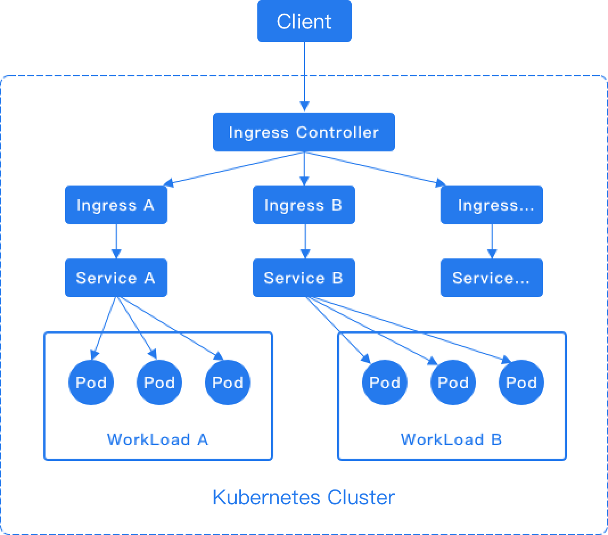

# 创建 Ingress

Ingress 规则（Kubernetes Ingress）将 HTTP/HTTPS 路由从集群外部暴露到内部路由（Kubernetes Service），从而实现对计算组件外部访问的控制。

创建一个 Ingress 以管理对 Service 的外部 HTTP/HTTPS 访问。

:::warning
在同一命名空间内创建多个 Ingress 时，不同的 Ingress **必须不**具有相同的 **域名**、**协议**和 **路径**（即，不允许重复的访问点）。
:::

## 实现方法

Ingress 规则依赖于 Ingress Controller 的实现，该控制器负责监听 Ingress 和 Service 的变化。在创建新的 Ingress 规则后，Ingress Controller 内部会自动生成与该 Ingress 规则匹配的转发规则。当 Ingress Controller 接收到请求时，它会根据 Ingress 规则匹配转发规则，并将流量分配到指定的内部路由，如下图所示。



:::note
对于 HTTP 协议，Ingress 仅支持 80 端口作为外部端口。对于 HTTPS 协议，Ingress 仅支持 443 端口作为外部端口。平台的负载均衡器将自动添加 80 和 443 监听端口。
:::

### 快速开始 \{#ingress\_nginx\_controller}

接下来，我们将使用社区版的 Ingress-NGINX 演示如何使用 NGINX 控制器访问您自己的应用程序。

1. 部署 `Ingress-NGINX` 控制器。

```shell
kubectl apply -f https://raw.githubusercontent.com/kubernetes/ingress-nginx/controller-v1.12.2/deploy/static/provider/cloud/deploy.yaml
```

使用此命令后，自动创建以下资源：

| 类型                      | 名称                             | 描述                                                               |
| ------------------------- | -------------------------------- | ------------------------------------------------------------------------- |
| `Namespace`               | `ingress-nginx`                  | 隔离控制器的资源                                       |
| `ServiceAccount`          | `ingress-nginx`                  | 控制器的服务账户                                        |
| `ClusterRole`             | `ingress-nginx`                  | 集群级别的权限                                                  |
| `ClusterRoleBinding`      | `ingress-nginx`                  | 将 ClusterRole 绑定到服务账户                                                    |
| `ConfigMap`               | `ingress-nginx-controller`       | 配置控制器行为（例如，日志级别、代理超时等） |
| `ValidatingWebhookConfig` | `ingress-nginx-admission`        | 用于验证 Ingress 配置合法性的 Webhook（可选）             |
| `Service` (TCP/UDP)       | `ingress-nginx-controller`       | 类型默认为 `LoadBalancer`，可以更改为 `NodePort`。     |
| `Deployment`              | `ingress-nginx-controller`       |                                                                           |
| `Pod`                     | `ingress-nginx-controller-xxx`   |                                                                           |
| `Role`/`RoleBinding`      | admission 相关                     | 支持 webhook                                                       |
| `Job`                     | `ingress-nginx-admission-create` | webhook 注册                                                      |

如果您想更改默认的注册表地址，可以使用 `curl` 下载 YAML 文件，进行更改，然后应用该 YAML 文件。

```shell
curl -O https://raw.githubusercontent.com/kubernetes/ingress-nginx/controller-v1.12.2/deploy/static/provider/cloud/deploy.yaml
```

等待 `ingress-nginx-controller-xxx` Pod 运行

2. 本地测试

   - 创建一个简单的 Web 服务器及其相关服务：

     ```shell
     kubectl create deployment demo --image=nginx --port=80
     kubectl expose deployment demo
     ```

   - 创建一个 Ingress 资源。此示例使用映射到 `localhost` 的主机：

     ```shell
     kubectl create ingress demo-localhost --class=nginx \
       --rule="demo.local/*=demo:80"
     ```

   - 将本地端口转发到 Ingress 控制器：

     ```shell
     kubectl port-forward --namespace=ingress-nginx service/ingress-nginx-controller 8080:80
     ```

   - 使用 curl 访问您的部署：

     ```shell
     curl --resolve demo.local:8080:127.0.0.1 http://demo.local:8080
     ```

     **注意**：此参数暂时将域名 demo.local 解析为 IP 127.0.0.1，并用于端口 8080。当您访问 [http://demo.local:8080](http://demo.local:8080) 时，实际上是在访问 [http://127.0.0.1:8080](http://127.0.0.1:8080)。
     另一方面，您应该配置 `hosts`：

     ```shell
     echo "127.0.0.1 demo.local" | sudo tee -a /etc/hosts
     ```

     最后，您应该看到包含 "Welcome to nginx!" 的 HTML 响应。

     然后，您可以访问网站 `http://demo.local:8080/`。

:::info
`ingress-nginx-controller` 的默认类型是 `LoadBalancer`，如果 `EXTERNAL-IP` 字段显示为 `pending`，这意味着您的 Kubernetes 集群无法配置负载均衡器。

如果您正在与支持通过（特定于提供商的）[注释](./configure_service.mdx#loadbalancer_type_service_annotation)为服务指定负载均衡器 IP 地址的提供商集成，您应该切换到这样做。
:::

3. 在线测试

当您的 `ingress-nginx-controller`（LoadBalancer 类型的 Service）存在 `EXTERNAL-IP` 时，您可以创建一个 Ingress 资源。以下示例假设您已为 `www.developer.io` 设置了 DNS 记录：

```shell
kubectl create ingress demo --class=nginx \
  --rule="www.developer.io/*=demo:80"
```

您可以访问 `http://www.developer.io` 以查看相同的输出。

## 先决条件

- 当前命名空间中必须有可用的 **Service**。

- 请与管理员确认已为当前命名空间关联的项目分配了可用的域名。

- 要通过 HTTPS 访问该域，您需要首先将 HTTPS 证书保存为 TLS 秘密。

## 示例 Ingress：

```yaml
# nginx-ingress.yaml
apiVersion: networking.k8s.io/v1
kind: Ingress
metadata:
  name: nginx-ingress
  namespace: k-1
  annotations:
    nginx.ingress.kubernetes.io/rewrite-target: / #[!code callout]
spec:
  ingressClassName: nginx #[!code callout]
  rules:
    - host: demo.local #[!code callout]
      http:
        paths:
          - path: /
            pathType: Prefix
            backend:
              service:
                name: nginx-service
                port:
                  number: 80
```

<Callouts>
  1. 要查看更多配置，请参考
     [nginx-configuration](https://kubernetes.github.io/ingress-nginx/user-guide/nginx-configuration/annotations/).
  2. 使用 `ingress-nginx` 控制器。
  3. 如果您只想在本地运行 Ingress，请提前配置 `hosts`。
</Callouts>

## 通过 Web 控制台创建 Ingress

1. 访问 **容器平台**。

2. 在左侧导航栏中，单击 **网络** > **Ingress**。

3. 单击 **创建 Ingress**。

4. 参考以下说明配置某些参数。

   | 参数                       | 描述                                                                                                                                                                                                                                                                                                               |
   | --------------------------- | ------------------------------------------------------------------------------------------------------------------------------------------------------------------------------------------------------------------------------------------------------------------------------------------------------------------------- |
   | **Ingress 类**             | Ingress 可以由不同的控制器实现，具有不同的 `IngressClass` 名称。如果平台上有多个 Ingress 控制器，用户可以使用此选项选择要使用的控制器。                                                                                                           |
   | **域名**                   | 主机可以是精确匹配（例如 `foo.bar.com`）或通配符（例如 `*.foo.com`）。可用的域名由平台管理员分配。                                                                                                                                                     |
   | **证书**                   | 由平台管理员分配的 TLS 秘密或证书。                                                                                                                                                                                                                                                           |
   | **匹配类型**和 **路径**   | <ul><li>**前缀**：匹配路径前缀，例如 `/abcd` 可以匹配 `/abcd/efg` 或 `/abcde`。</li><li>**精确**：匹配精确路径，例如 `/abcd`。</li><li>**实现特定**：如果您使用自定义 Ingress 控制器来管理 Ingress 规则，您可以选择让控制器决定。</li></ul> |
   | **服务**                   | 外部流量将转发到此服务。                                                                                                                                                                                                                                                                       |
   | **服务端口**               | 指定流量将转发到哪个服务端口。                                                                                                                                                                                                                                                              |

5. 单击 **创建**。

## 通过 CLI 创建 Ingress

```shell
kubectl apply -f nginx-ingress.yaml
```

:::note
如果 Ingress 没有 Ingress 类，则分配给该项目的所有 ALB 实例将处理此 Ingress。
:::
