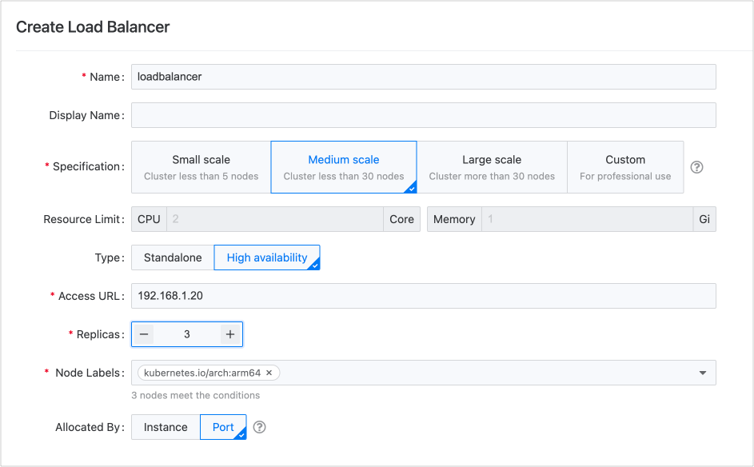
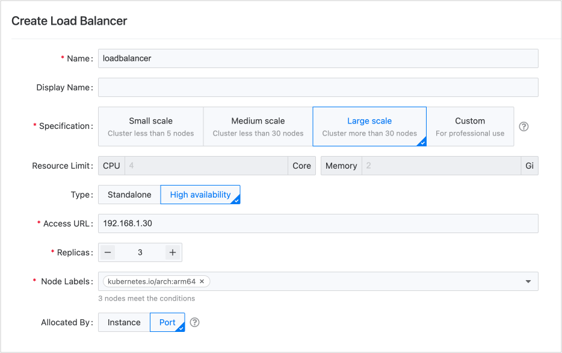

# 负载均衡器选择与规划

针对平台提出的 **小型**、**中型**、**大型** 和 **定制** 生产环境的规格，以及 **实例** 和 **端口** 的资源分配方式，以下建议可供部署参考。

### 小型生产环境

对于较小的业务规模，举例来说，集群中的节点不超过 5 个，仅用于运行标准应用，**单个**负载均衡器即可满足需求。建议以 **高可用性** 模式使用，至少保留 2 个副本，以确保环境的稳定性。

可以通过 **端口** 隔离来隔离负载均衡器，允许多个项目共享该负载均衡器。

实验环境中针对该规格测得的峰值 QPS 约为每秒 300 次请求。

### 中型生产环境

当业务量达到一定规模时，例如，集群中节点不超过 30 个，并且需要处理高并发业务同时运行标准应用，**单个**负载均衡器仍然足够。建议采用 **高可用性** 模式，至少保留 3 个副本，以维持环境的稳定性。

可以使用 **端口** 隔离或 **实例** 分配方式在多个项目之间共享负载均衡器。当然，您也可以为核心项目创建新的负载均衡器供其专用。

实验环境中针对该规格测得的峰值 QPS 约为每秒 10,000 次请求。

### 大型生产环境

对于更大的业务量，例如，集群中节点超过 30 个，同时需要处理高并发业务和长时间连接的数据，建议使用 **多个**负载均衡器，每个负载均衡器采用 **高可用性** 类型，至少保留 3 个副本，以确保环境的稳定性。

可以通过 **端口** 隔离或 **实例** 分配方式让多个项目共享负载均衡器。您也可以为核心项目创建新的专用负载均衡器。

实验环境中针对该规格测得的峰值 QPS 约为每秒 20,000 次请求。

### 特殊场景部署建议

| 场景                          | 部署建议                                                                                                                                                                                                                                                                                                                                                                                                                                                                                                                                                                     |
| ----------------------------- | ---------------------------------------------------------------------------------------------------------------------------------------------------------------------------------------------------------------------------------------------------------------------------------------------------------------------------------------------------------------------------------------------------------------------------------------------------------------------------------------------------------------------------------------------------------------------------- |
| **功能测试**                  | 建议部署 **单个实例** 的负载均衡器。                                                                                                                                                                                                                                                                                                                                                                                                                                                                                                                          |
| **测试环境**                  | 如果测试环境符合上述 **小型** 或 **中型** 的定义，使用 **单点** 负载均衡器即可满足需求。负载均衡器 **实例** 可以在 **多个项目** 之间共享。                                                                                                                                                                                                                                                                                                                                                                                                                                   |
| **核心应用**                  | 建议为核心应用使用专用的负载均衡器。                                                                                                                                                                                                                                                                                                                                                                                                                                                                                                            |
| **大规模数据传输**            | 由于负载均衡器本身造成的内存消耗微乎其微，即使是 **大型** 规格，也只需保留 2Gi 的内存。但是，如果业务需要传输大规模数据，导致内存消耗显著增加，则应相应地增加负载均衡器的内存分配。   建议在 **定制** 规格场景中逐渐扩展负载均衡器的内存，密切监视内存使用情况，以最终确定合理使用率所需的可接受内存大小。 |

### 负载均衡器使用模式选择

| 使用模式                                                                                              | 优势                                                                                                                                                                | 劣势                                                                                                                                                                                                                                                                                                                                                                                         |
| ----------------------------------------------------------------------------------------------------- | ------------------------------------------------------------------------------------------------------------------------------------------------------------------- | ------------------------------------------------------------------------------------------------------------------------------------------------------------------------------------------------------------------------------------------------------------------------------------------------------------------------------------------------------------------------------------------------------------------------------------------------ |
| **（推荐）将负载均衡器作为实例资源分配给单个项目**                                                  | <ul><li>管理相对简单。</li><li>每个项目拥有自己的负载均衡器，确保规则隔离和资源分离，不会相互干扰。</li></ul> | 在主机网络模式下，集群必须具有较多可用于负载均衡器的节点，从而导致资源消耗要求较高。                                                                                                                                                                                                                                                                                                                                                |
| **将负载均衡器作为实例资源分配给多个项目**                                                         | 管理相对简单。                                                                                                                                                     | 由于所有分配的项目对负载均衡器实例拥有完全权限，当某个项目配置负载均衡器的端口和规则时，可能会出现以下情况： <ul><li>那个项目配置的规则可能会影响其他项目。</li><li>负载均衡器配置过程中的误操作可能会更改其他项目的设置。</li><li>某个业务的流量请求可能影响负载均衡器实例的整体可用性。</li></ul>                                                                                                                              |
| **按端口动态分配负载均衡器资源，不同项目使用不同端口**                                             | 项目之间的规则隔离，确保不相互干扰。                                                                                                                                 | <ul><li>管理复杂度增加。平台管理员必须主动规划并为项目分配端口并配置外部服务映射。</li><li>基于端口的分配成熟度较低。目前使用的客户较少，且需要进一步优化功能。</li><li>资源冲突。所有使用相同负载均衡器的服务可能会面临单个服务影响整个负载均衡器的情况。</li></ul>                                                                                                                                              |
