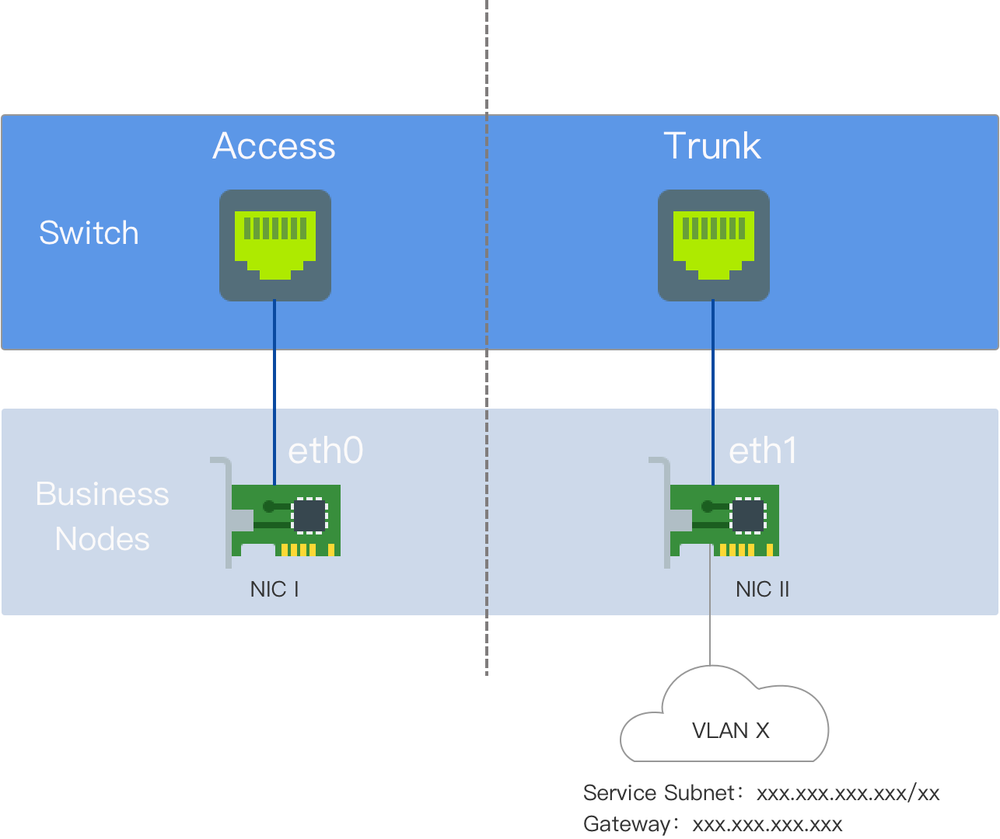

# 准备 Kube-OVN Underlay 物理网络

Kube-OVN Underlay 传输模式的容器网络依赖于物理网络支持。在部署 Kube-OVN Underlay 网络之前，请与网络管理员协作，提前规划并完成物理网络的相关配置，以确保网络连通性。

## 使用说明

Kube-OVN Underlay 需要多网卡 (NIC) 的部署，Underlay 子网必须专用一个 NIC。该 NIC 上不得有其他类型流量，如 SSH；其他流量应使用其他 NIC。

在使用之前，请确保节点服务器至少具备 **双 NIC** 环境，并建议 NIC 速度 **至少为 10 Gbps 或更高**（例如，10 Gbps、25 Gbps、40 Gbps）。

- NIC 一：具有默认路由的 NIC，配置有 IP 地址，与外部交换机接口互连，设置为访问模式。

- NIC 二：没有默认路由且未配置 IP 地址的 NIC，与外部交换机接口互连，设置为干道模式。Underlay 子网专用 NIC 二。



## 术语解释

VLAN（虚拟局域网）是一种技术，它逻辑上将局域网划分为多个段（或较小的 LAN），以便利虚拟工作组的数据交换。

VLAN 技术的出现使管理员能够根据实际应用需求，逻辑上将同一物理局域网中的不同用户划分为不同的广播域。每个 VLAN 由一组拥有相似需求的计算机工作站组成，并具有与物理形成的 LAN 相同的特性。由于 VLAN 是逻辑划分而非物理划分，因此同一 VLAN 内的工作站并不局限于相同的物理区域；它们可以存在于不同的物理 LAN 段中。

VLAN 的主要优点包括：

- 端口分段。即使在同一交换机上，不同 VLAN 的端口之间也无法相互通信。物理交换机能够作为多个逻辑交换机工作。这通常用于控制不同部门和站点之间的相互访问。

- 网络安全。不同的 VLAN 之间无法直接通信，消除了广播信息的安全隐患。VLAN 内的广播和单播流量不会转发到其他 VLAN，助于控制流量、减少设备投资、简化网络管理并提高网络安全性。

- 灵活管理。当更改用户的网络隶属关系时，无需更换端口或电缆；只需进行软件配置更改。

## 环境要求

在 Underlay 模式下，Kube-OVN 将物理 NIC 桥接到 OVS，并通过该物理 NIC 直接发送数据包到外部。L2/L3 转发能力依赖于底层网络设备。相应的网关、VLAN 和安全策略需要在底层网络设备上提前配置。

- **网络配置要求**

  - Kube-OVN 在启动容器时通过 ICMP 协议检查网关的连通性；底层网关必须响应 ICMP 请求。

  - 对于服务访问流量，Pods 将首先向网关发送数据包，网关必须具备将数据包转发回本地子网的能力。

  - 当交换机或桥接启用了 Hairpin 功能时，**必须禁用 Hairpin**。如果使用 VMware 虚拟机环境，将 VMware 主机上的 **Net.ReversePathFwdCheckPromisc** 设置为 **1**，Hairpin 不需要禁用。

  - 桥接 NIC **不能** 是 **Linux 桥**。

  - NIC 绑定模式支持模式 0（balance-rr）、模式 1（active-backup）、模式 4（802.3ad）、模式 6（balance-alb），推荐使用 0 或 1。其他绑定模式未经过测试，请谨慎使用。

- **IaaS（虚拟化）层配置要求**

  - 对于 OpenStack 虚拟机环境，相应网络端口的 **PortSecurity** 需要禁用。

  - 对于 VMware 的 vSwitch 网络，**MAC 地址更改**、**伪造发送**和 **混杂模式操作**必须全部设置为 **接受**。

  - 对于 AWS、GCE 和阿里云等公共云，由于缺乏用户定义的 MAC 地址能力，无法支持 Underlay 模式网络。

## 配置示例

本示例中的节点是双 NIC 物理机器。NIC 一是具有默认路由的 NIC；NIC 二是没有默认路由且未配置 IP 地址的 NIC，专用于 Underlay 子网。NIC 二与外部交换机互连。

- 在交换机端，连接到 NIC 二 的接口应配置为干道模式，以允许相应的 VLAN 通过。

- 在相应的 vlan-interface 接口上配置集群子网的网关地址。如果需要双栈，还可以同时配置 IPv6 网关地址。

- 如果网关位于防火墙后，则必须允许节点到 cluster-cidr 网络的访问。

- 服务器 NIC 不需要配置。

### 交换机配置

配置 VLAN 接口：

```
#
interface Vlan-interface74
  ip address 192.168.74.254 255.255.255.0   //IPv4 网关地址
  ipv6 address 2074::192:168:74:254/64  //IPv6 网关地址
#
```

配置连接到 NIC 二 的接口：

```
#
interface Ten-GigabitEthernet1/0/19
  port link mode bridge
  port link-type trunk  // 配置接口为干道模式
  undo port trunk permit vlan 1
  port trunk permit vlan 74  // 允许相应 VLAN 通过
#
```

### 检查网络连通性

测试 NIC 二 是否能够与网关地址通信：

```
ip link add ens224.74 link ens224 type vlan id 74  // NIC 名称为 ens224，VLAN ID 为 74
ip link set ens224.74 up
ip addr add 192.168.74.200/24 dev ens224.74  // 在 Underlay 子网内选择一个测试地址，这里为 192.168.74.200/24
ping 192.168.74.254  // 如果能够 ping 通网关，确认物理环境符合部署要求
ip addr del 192.168.74.200/24 dev ens224.74  // 测试后删除测试地址
ip link del ens224.74  // 测试后删除子接口
```

### 平台配置

在左侧导航栏中，点击 **集群管理 > 集群**，然后点击 **创建集群**。有关具体配置步骤，请参阅 [创建集群]() 文档，容器网络配置见下图所示。

**注意**：加入子网在 Underlay 环境中没有实际意义，主要用于后续创建 Overlay 子网，提供节点和容器组之间通信所需的 IP 地址范围。


