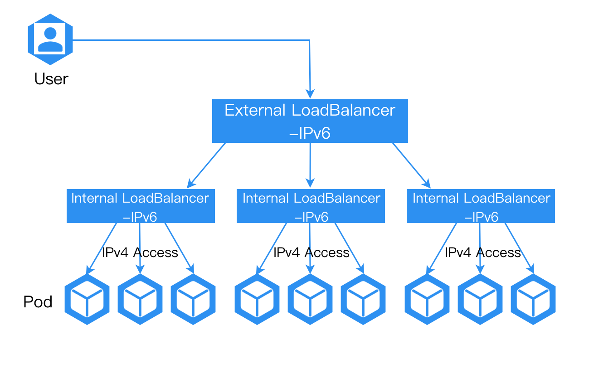
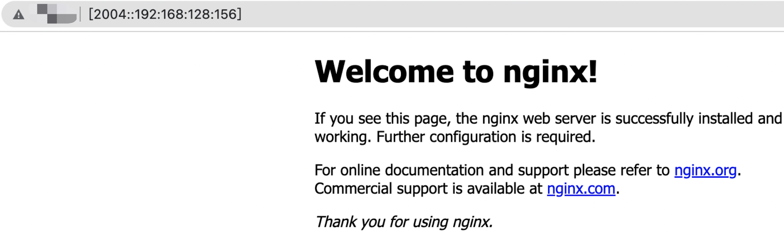

# 在集群内将 IPv6 流量转发到 IPv4 地址

通过为集群配置外部负载均衡器，我们可以将 IPv6 流量转发到集群内的 IPv4 地址。这使我们能够在现有的 IPv4 网络上引入 IPv6 功能，为我们的系统架构提供更大的灵活性和可扩展性，并更好地满足多样化的网络需求。

### 配置方法

1. 为负载均衡器所在的节点配置 IPv6 地址。

2. 确保外部负载均衡器具有 IPv6 地址，并确保访问负载均衡器的 IPv6 地址的流量能够转发到负载均衡器所在节点的 IPv6 地址。

一旦上述配置完成，托管在负载均衡器上的 IPv4 服务就可以通过负载均衡器提供外部 IPv6 访问能力。

### 结果验证

配置完成后，访问外部负载均衡器的 IPv6 地址应能够正常访问应用程序。

