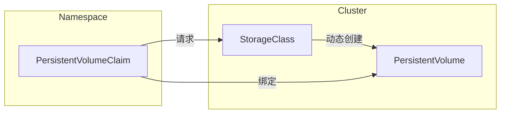

# 关键概念

在 Kubernetes 中，存储主要围绕三个关键概念：**PersistentVolume（PV）**、**PersistentVolumeClaim（PVC）** 和 **StorageClass**。它们共同定义了存储资源在集群中的请求、分配与配置方式。而在底层提供存储驱动时，越来越多的集群会依赖 **CSI**（Container Storage Interface）来完成自动化的存储创建和挂载。下面让我们分别了解这些组件及 CSI 驱动的作用。

## PersistentVolume（PV）

**PersistentVolume**（PV）代表着在集群中已经被管理员静态预先配置或通过 StorageClass 动态创建的一块实际存储资源。例如，这可能是一块云盘，或者是一台网络文件系统（NFS）。PV 在 Kubernetes 中被看作是类似节点（Node）一样的独立资源，与具体的 Pod 分离。

## PersistentVolumeClaim（PVC）

**PersistentVolumeClaim**（PVC）是用户或应用在 Kubernetes 中发起的对存储的请求。它定义了所需存储的容量以及访问模式（例如读写）。一旦有合适的 PV（或借助 StorageClass 动态生成的 PV）满足了 PVC 的需求，PVC 就会“绑定（Bound）”到这个 PV，之后 Pod 就可以通过 PVC 来访问底层存储。

## StorageClass

**StorageClass** 定义了 *如何* 动态地提供存储。它指定了一个具体的存储插件（通常是某个 CSI 驱动），并包含一些参数（如存储性能、空间限制等）来配置所要创建的存储卷。我们可以在集群中创建多个 StorageClass，从而为不同类型或不同级别的存储服务提供统一的管理方式。

*图示：PVC、PV 以及 StorageClass 之间的关系。*

## Container Storage Interface（CSI）

**Container Storage Interface（CSI）** 是 Kubernetes 与外部存储驱动集成所遵循的一套标准接口，让第三方存储厂商可以开发“树外（out-of-tree）”的插件，从而无需改动 Kubernetes 自身的核心代码即可与 Kubernetes 进行对接。

一个 CSI **驱动**通常包含两个主要部分：

1. **Controller 组件**：通常以 Deployment 方式在集群中运行，负责 **创建或删除** 卷等与底层存储相关的高层操作。如果是网络存储，它还可能负责将卷附加到节点或从节点分离。

2. **Node 组件**：通常以 DaemonSet 方式在每个节点上运行，负责在节点本地 **挂载或卸载** 卷，使 Pod 能够正常访问对应存储资源。它与 kubelet 协作，以确保应用能够使用所请求的存储。

当用户创建了引用某个 StorageClass（且对应 CSI 驱动）的 PVC 时，如果需要动态创建存储卷，CSI 驱动就会探知这一需求并与底层存储系统进行交互。完成创建后，驱动会在 Kubernetes 中注册相应的 PV，并将其与 PVC 绑定。当 Pod 使用该 PVC 时，Node 组件会将卷挂载到正确的节点上，让容器可以直接访问该持久化存储。

---

通过 **PV**、**PVC**、**StorageClass** 以及 **CSI**，Kubernetes 提供了一种声明式的方式来管理存储。管理员只需为不同级别或类型的存储定义好不同的 StorageClass，开发者只要在应用中提出对存储的请求（PVC），就可以轻松使用后台的物理存储资源，而无需了解具体的存储细节。