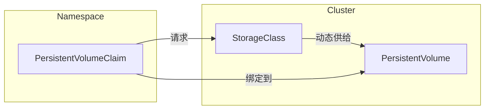

# 核心概念

Kubernetes 存储围绕三个关键概念展开：**PersistentVolume（PV）**、**PersistentVolumeClaim（PVC）** 和 **StorageClass**。它们定义了存储在集群中的请求、分配和配置方式。在底层，**CSI**（Container Storage Interface）驱动程序通常负责实际的存储供给和挂载。让我们简要了解每个组件，然后强调 CSI 驱动的作用。

## Persistent Volume（PV）

**PersistentVolume（PV）** 是集群中一块已经被预配置（无论是由管理员静态配置还是通过 StorageClass 动态创建）的存储。它代表了底层存储——例如云服务提供商的磁盘或网络附加文件系统——并被视为集群中的一种资源，类似于节点。

## Persistent Volume Claim（PVC）

**PersistentVolumeClaim（PVC）** 是对存储的请求。用户定义所需的存储量和访问模式（例如，读写）。如果有合适的 PV 可用，或者可以通过 StorageClass 动态供给，PVC 将与该 PV “绑定”。一旦绑定，Pods 可以引用该 PVC 来持久化或共享数据。

## StorageClass

**StorageClass** 描述了 *如何* 动态供给存储卷。它映射到特定的供给程序（通常是一个 CSI 驱动），并可以包含参数，如存储层级、性能特征或其他后端配置。通过创建多个 StorageClass，可以向开发者提供各种类型的存储。

*图示：PVC、PV 和 StorageClass 之间的关系。*

## Container Storage Interface（CSI）

**Container Storage Interface（CSI）** 是 Kubernetes 用于与存储驱动集成的标准 API。它允许第三方存储提供商构建树外插件，这意味着可以在不修改 Kubernetes 本身的情况下安装或更新存储驱动。

一个 CSI **驱动**通常有两个组件：

1. **控制器组件**：在集群中运行（通常作为 Deployment），处理高层操作，如 **创建** 或 **删除** 卷。对于网络存储，它还可能负责将卷附加到节点或从节点分离。

2. **节点组件**：在每个节点上运行（通常作为 DaemonSet），负责在该特定节点上 **挂载** 和 **卸载** 卷。它与 kubelet 通信，以确保卷可供 Pods 访问。

当用户创建一个引用某个使用 CSI 驱动的 StorageClass 的 PVC 时，CSI 驱动监视到该请求并据此进行存储供给（如果需要动态供给）。一旦存储创建完成，驱动会通知 Kubernetes，后者创建相应的 PV 并将其与 PVC 绑定。每当 Pod 使用该 PVC 时，驱动的节点组件会处理卷的挂载，使存储在容器内部可用。

---

通过利用 **PV**、**PVC**、**StorageClass** 和 **CSI**，Kubernetes 实现了一种强大的声明式存储管理方式。管理员可以定义一个或多个 StorageClass 以表示不同的存储后端或性能层级，而开发者仅需使用 PVC 请求存储，而无需担心底层基础设施。
