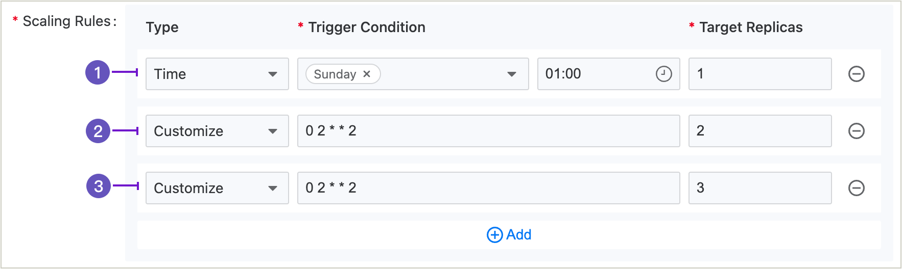

# 配置 CronHPA

对于具有周期性业务波动的无状态应用程序，CronHPA（Cron 水平 Pod 自动扩展器）支持根据您设置的时间策略调整 Pods 的数量。

## 先决条件

请确保当前集群已部署监控组件，且监控组件正常运行。您可以通过单击平台右上角的   > **平台健康状态**，以查看监控组件的部署和健康状态。来检查监控组件的部署和健康状态。

## 步骤

1. 进入 **容器平台**。

2. 在左侧导航栏中，单击 **工作负载** -> **部署**。

3. 单击 ***部署名称***。

4. 向下滚动到 **弹性扩展** 部分，然后在右侧单击 **更新**。

5. 选择 **计划扩展**，并配置扩展规则。当类型为 **自定义** 时，您必须提供触发条件的 Crontab 表达式，格式为 `分钟 小时 日 月 星期`。有关详细介绍，请参见 [编写 Crontab 表达式](../../../building_application/how_to/cronjob_rules.mdx)。

6. 单击 **更新**。

## 计算规则说明

1. 表示从每周一的01:00 AM开始，仅保留1个 Pod。
2. 表示从每周二的02:00 AM开始，仅保留2个 Pods。
3. 表示从每周二的02:00 AM开始，仅保留3个 Pods。

**注意**：当多个规则具有相同的触发时间（示例 2 和示例 3）时，平台仅会根据优先级较高的规则（示例 2）执行自动扩展。
