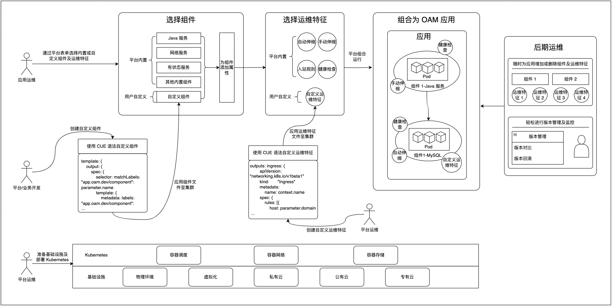

# 架构

OAM 应用极大减少了部署及运维的流程和工作量，增加了复用和可扩展能力，即使无法像示意图中划分多个角色团队，也可以使用同一个团队进行开发、管理和交付。因此，拥有声明式的方式描述应用交付全流程、轻量、可定制化、可扩展需求的用户均可使用 OAM 应用。其应用架构和场景架构如下。

## OAM 应用架构

该架构设计使得 OAM 应用能够更好地支持各类企业业务，包括传统行业、电商、大数据、互联网和金融等不同场景的需求，同时可以运行在从物理环境到各类云平台的基础设施之上，其组成成分如下：

- **组件**：包含多个组件单元，每个组件都具有其特定的运维特征（Traits），组件是应用的基本构建块。

- **运维特征**：附加在组件上的运维策略和配置，可以为不同组件定制不同的运维特征，用于定义组件的运维行为和策略。

- **应用资源**：作为底层支撑的资源层，统一管理应用所需的各类资源。

根据其组成成分，OAM 应用具有以下特点：

- **模块化设计**：将应用拆分为独立的组件，每个组件可以独立管理和维护。

- **运维特征分离**：将运维配置与应用逻辑分离，支持灵活的运维策略配置。

- **资源统一管理**：统一的资源管理层，确保应用资源的有效分配和使用。

## OAM 场景架构

该架构设计实现了应用开发、部署和运维的完整生命周期管理，具有良好的扩展性和维护性，能够满足现代云原生应用的需求。适用于跨不同团队共同管理一个微服务应用程序的场景，其中每个团队负责一个或多个服务，每个团队可以使用 OAM 定义其负责的服务，通过 OAM，其他团队能够理解每个服务的需求和依赖关系，以更好地协作和集成。

- **组件选择阶段**：平台提供了多种内置组件供用户使用，同时用户也可以通过 CUE 语法自定义组件。

- **运维特征配置阶段**：平台提供了多种内置运维特征供用户使用，同时用户也可以通过 CUE 语法自定义运维特征。

- **应用组合阶段**：用户可以通过 OAM 应用组合多个组件和运维特征，形成一个完整的应用。

- **后期运维管理阶段**：用户可以通过 OAM 应用的后期运维管理功能，对应用进行监控、调整和维护。

- **多种部署环境支持**：物理环境、虚拟化环境、私有云、公有云、专有云。

- **角色分工**：
  - 平台业务开发人员：选择组件和运维特征。
  - 平台运维人员：负责基础设施和 Kubernetes 环境维护。
  - 应用运维人员：负责后期运维管理。
