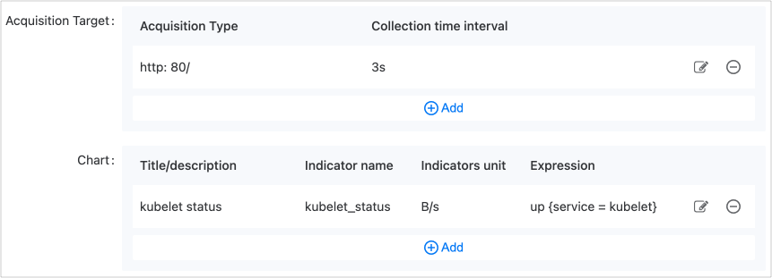
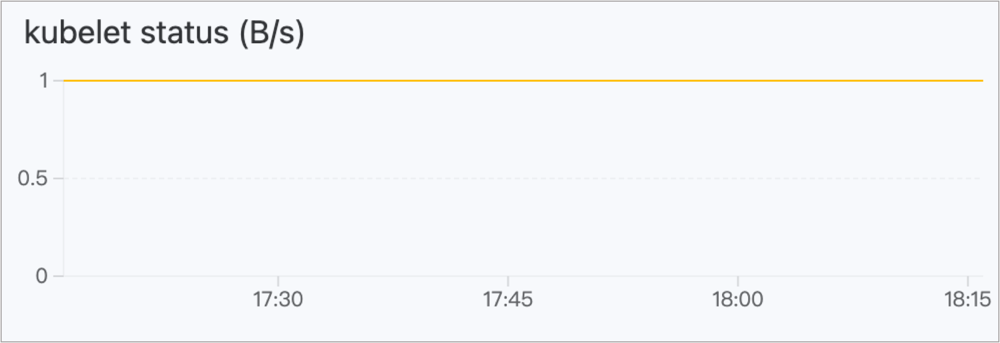

# 运维特征

运维特征是指与应用运维相关的一系列特征，通过附加额外的能力来增强组件的功能，并在不同的环境中有不同的实现方式，包括伸缩策略、入站规则和环境变量等。只要满足运维特征的必要条件，应用可以在不同的部署环境（例如 X86 架构集群和 ARM 架构集群）中遵循相同的规则均匀运行，运维人员无需根据部署环境进行调整。

## 运维特征类型

通过选择运维特征类型，可以快速选择所需的运维特征。不同类型的组件可选的运维特征各不相同。

| 运维特征类型 | 包含的运维特征                                                                                                                                                       | 说明                                                                                             |
|--------------|--------------------------------------------------------------------------------------------------------------------------------------------------------------------|--------------------------------------------------------------------------------------------------|
| 动态特性类   | <ul><li>[自动伸缩](#autosca)</li><li>[手动伸缩](#manual)</li></ul>                                                                                                  | 必选且互斥，即一个组件必须且只能添加自动伸缩或手动伸缩二者中的一个。                                        |
| 附加配置类   | <ul><li>[环境变量](#env)</li><li>[补丁](#patch)</li></ul>                                                                                                          | 可选                                                                                             |
| 网络类       | <ul><li>[入站规则](#ingress)</li></ul>                                                                                                                              | 可选                                                                                             |
| 监控分析类   | <ul><li>[健康检查](#check)</li><li>[自定义监控](#custom)</li></ul>                                                                                                 | 可选                                                                                             |
| KubeVela 社区 | <ul><li>[注解](#anno)</li><li>[主机别名](#hostalias)</li><li>[标签](#label)</li><li>[生命周期](#lifecycle)</li><li>[极简入站规则](#pure)</li><li>[资源](#resource)</li></ul> | 可选                                                                                             |

## 运维特征

### 注解 \{#anno}

注解用于为组件添加元数据。如果组件中的工作负载（如 Deployment、StatefulSet 等）创建和管理 Pods，添加到工作负载中的注解将被继承到该工作负载创建的每个 Pod 中。

注解是附加到对象元数据的键值对。这些额外信息可以被识别并用来增强和简化 Kubernetes 资源的各个方面的管理。注解可以是非功能性解释文本，指定云提供商用的配置或行为，也可以设置配置参数和工具，功能极为强大。

**参数说明**

| 参数       | 说明                           |
|------------|--------------------------------|
| 键、值    | 字符串类型的键值对。              |

**配置完成后的 YAML 示例**

```yaml
traits:
  - properties:
      cloud-provider-config: aws-config.yaml
      config-param: debug-mode
      description: 此部署管理前端服务。
      monitoring-tool: prometheus
      version-info: v1.2.3
    type: annotations
```

### 环境变量 \{#env}

环境变量为容器化应用提供灵活、安全和可配置的方式，使其能够在不同环境中运行，并动态适应配置变化。通过配置环境变量，可以为该组件的所有运行时容器添加环境变量。如果键重复，将以运维特征中引用的值为准。环境变量的主要特点如下：

- **灵活配置**：环境变量允许将配置信息传递给应用容器，而无需硬编码到应用代码中，使得配置变更更加灵活，无需重建容器镜像。

- **敏感信息隔离**：对于包含敏感信息的配置（如数据库密码、API 密钥等），使用环境变量可以更安全地传递这些信息。通过在 Kubernetes 的 Secrets 中存储敏感信息并通过环境变量注入到容器中，可降低敏感信息外泄的风险。

- **动态适应和配置**：环境变量允许应用在运行时动态适应不同环境。例如，可以使用环境变量切换到不同的数据库连接，以适应开发、测试和生产环境。

**操作说明**

| 操作        | 说明                                                                                                                                  |
|-------------|---------------------------------------------------------------------------------------------------------------------------------------|
| **添加**    | 添加一个键值对形式的环境变量。                                                                                                      |
| **引用**    | 引用 **配置字典（Config Map）或 Opaque、用户名/密码类型的 Secrets** 中的字段作为环境变量，相关配置参数请参考 [配置字典](/developer/building_application/functions/preparation_before_creating/add_configmap.mdx) 或 [Secrets](/developer/building_application/functions/preparation_before_creating/add_secret.mdx)。 |

**配置完成后的 YAML 示例**

```yaml
traits:
  - properties:
      env:
        - name: username
          value: admin
        - name: password
          valueFrom:
            secretKeyRef:
              key: password
              name: password-test
    type: env
```

### 补丁 \{#patch}

补丁（JSON Patch）是一种描述两个 JSON 文档之间差异的格式，包括一系列操作，如增加、删除和替换。这使得 JSON Patch 成为一种轻量级且可扩展的方式来表示两个 JSON 文档之间的差异，每个操作用一个 JSON 对象表示，包含操作类型（OP）和操作路径（Path）等字段。

在 Kubernetes 中，JSON Patch 被广泛用于通过 kubectl patch 命令更新资源对象，适用于在不修改整个资源对象的情况下，仅对特定字段进行部分更新。有关更多详细信息，请参考 [JSON Patch](https://jsonpatch.com/)。

**操作说明**

| 操作       | 说明                                                                                                                                                                                                                                                |
|------------|-----------------------------------------------------------------------------------------------------------------------------------------------------------------------------------------------------------------------------------------------------|
| **添加**   | 使用 add 操作可以在 JSON 文档中添加新元素，字段说明如下： <ul><li>OP: 选择 add，指定操作类型为添加。</li><li>Path: 指定要添加元素的路径。</li><li>Value: 指定要添加的值。</li></ul>                                                       |
| **替换**   | 使用 replace 操作可以替换 JSON 文档中的现有元素，字段说明如下： <ul><li>OP: 选择 replace，指定操作类型为替换。</li><li>Path: 指定要替换元素的路径。</li><li>Value: 指定新的值。</li></ul>                                           |
| **删除**   | 使用 remove 操作可以从 JSON 文档中删除元素，字段说明如下： <ul><li>OP: 选择 remove，指定操作类型为删除。</li><li>Path: 指定要删除元素的路径。</li><li>Value: 不需要指定。</li></ul>                                                  |

**配置完成后的 YAML 示例**

```yaml
traits:
  - properties:
      patches:
        - patch:
            - '{"op":"add","path":"/biscuits/1","value":{"name":"Ginger Nut"}}'
          target:
            name: component
            resource: deployment
        - patch:
            - '{"op":"replace","path":"/biscuits/0/name","value":"Chocolate Digestive"}'
          target:
            name: component
            resource: deployment
        - patch:
            - '{"op":"remove","path":"/biscuits/0"}'
          target:
            name: component
            resource: service
    type: generic-patch
```

### 健康检查 \{#check}

健康检查用于评估组件的存活状态和是否能够提供服务。健康检查可以是一个 HTTP 请求、TCP 健康检查或执行命令。

- **存活性检查**：用于判断组件下的容器组是否仍在运行且健康。如果检查结果异常，将依据健康检查配置决定是否重启容器组。

- **可用性检查**：检查组件下的容器组是否已完成启动并处于正常的服务状态。如果检测到容器组的健康状态异常，容器状态将被更新。

**参数说明**

健康检查的参数说明请参考 [健康检查](/developer/building_application/functions/application_workloads/deployment_create.mdx)。

**配置完成后的 YAML 示例**

```yaml
traits:
  - properties:
      livenessProbe:
        failureThreshold: 5
        httpGet:
          path: /
          port: 80
          scheme: HTTP
        initialDelaySeconds: 300
        periodSeconds: 60
        successThreshold: 1
        timeoutSeconds: 30
      readinessProbe:
        failureThreshold: 5
        initialDelaySeconds: 300
        periodSeconds: 60
        successThreshold: 1
        tcpSocket:
          port: 80
        timeoutSeconds: 30
    type: healthcheck
```

### 主机别名 \{#hostalias}

HostAlias 用于指定 Pod 的主机名与 IP 地址之间的映射关系，为 Pod 上的工作负载添加主机别名。使用 HostAlias 可以为 Pod 添加额外的主机名及对应 IP 地址，以方便 Pod 内的应用程序通过这些主机名访问其他服务或资源。

HostAlias 的可能使用场景包括：

- 当 DNS 配置和其他选项不合理时，通过在 Pod 的 /etc/hosts 文件中添加条目，可以覆盖 Pod 级别的主机名解析。

- 访问本地服务：在一些场景中，Pod 可能需要访问本地主机上的服务。通过 HostAlias，可以将本地服务的主机名和 IP 地址映射到 Pod，使得应用程序能够通过这些主机名访问本地服务。

- 在容器内使用特定的主机名：某些应用程序可能依赖特定的主机名，使用 HostAlias 可以将这些主机名映射到 Pod，以便应用程序在容器内使用这些名称。

**参数说明**

| 参数 | 说明                               |
|------|------------------------------------|
| IP   | 用于在 Pod 内部进行主机名解析。       |

**配置完成后的 YAML 示例**

```yaml
traits:
  - properties:
      hostAliases:
        - ip: 192.168.1.1
        - ip: 192.168.1.2
    type: hostalias
```

### 自动伸缩 \{#autosca}

自动伸缩用于自动调整 Pod 的副本数量。创建应用后，将运行指定的最小副本数。如果后续条件满足，平台将自动对副本数量进行增减。此功能常用于业务量频繁变化的应用，例如在已知或未知的业务变化（如月末的账务结算高峰）到来之前，提前设定扩容或缩容触发策略可以更及时地满足业务需求。

**参数说明**

具体参数说明请参考 [配置水平伸缩](/developer/building_application/functions/operation_after_creating/add_hpa.mdx)。

**配置完成后的 YAML 示例**

```yaml
traits:
  - properties:
      maxReplicas: 1
      metrics:
        - name: cpu
          type: resource
          value: "60"
      minReplicas: 1
      scalePolicy:
        down:
          periodSeconds: 15
          stabilizationWindowSeconds: 300
          type: Percent
          value: 100
        up:
          periodSeconds: 15
          stabilizationWindowSeconds: 0
          type: Percent
          value: 100
    type: hpa
```

### 入站规则 \{#ingress}

入站规则（Kubernetes Ingress）用于将外部的 HTTP/HTTPS 路由暴露给集群内部路由（Kubernetes Service），通过域名实现对计算组件的外部访问控制，便于网络用户访问。

**参数说明**

具体参数说明请参考 [创建入站规则](/developer/building_application/functions/operation_after_creating/network_communications/ingress/create_ingress.mdx)。

**配置完成后的 YAML 示例**

```yaml
traits:
  - properties:
      domain: test-63117.test.com
      http:
        /: 90
      type: http
    type: ingress
```

### 标签 \{#label}

标签是用于标识和组织资源的关键元素。标签以键值对的形式附加到 Kubernetes 的各种资源对象中，如 Pod、Service、Node 等，帮助更轻松地选择和组织集群中的资源。

**参数说明**

| 参数 | 说明                             |
|------|----------------------------------|
| 键、值 | 字符串类型的键值对。               |

**配置完成后的 YAML 示例**

```yaml
traits:
  - properties:
      app: frontend
      region: us-east-1
      version: v2.0.0
    type: labels
```

### 生命周期 \{#lifecycle}

生命周期定义了容器在不同阶段所需执行的操作，包括在容器启动后和终止前的 HTTP 请求和 TCP Socket 检查。

- **PostStart**：该生命周期事件在容器创建后立即执行，但无法保证其执行顺序与容器内其他进程启动的顺序一致。请注意，由于该操作在容器的 ENTRYPOINT 之前执行，因此不一定是最佳解决方案。

- **PreStop**：该生命周期事件在容器销毁之前执行，并且是一个阻塞操作，意味着该操作是同步的，必须在删除容器调用之前完成。这适合实现容器的优雅退出机制，定义一系列行为以释放容器占用的资源，并通过通知和警报实现有序的优雅退出。

**参数说明**

<table>
<thead>
  <tr>
    <th></th>
    <th>类别</th>
    <th>参数</th>
    <th>说明</th>
  </tr>
</thead>
<tbody>
  <tr>
    <td rowSpan={6}>postStart、preStop</td>
    <td rowSpan={4}>httpGet（发送 HTTP GET 请求）</td>
    <td>Host</td>
    <td>请求的主机名。</td>
  </tr>
  <tr>
    <td>Path</td>
    <td>请求的路径。</td>
  </tr>
  <tr>
    <td>Port</td>
    <td>请求的端口号。</td>
  </tr>
  <tr>
    <td>Scheme</td>
    <td>使用的协议（HTTP 或 HTTPS）。</td>
  </tr>
  <tr>
    <td rowSpan={2}>tcpSocket（执行 TCP Socket 检查）</td>
    <td>Host</td>
    <td>TCP Socket 的主机名。</td>
  </tr>
  <tr>
    <td>Port</td>
    <td>TCP Socket 的端口号。</td>
  </tr>
  <tr>
    <td rowSpan={2}>Post Start、Pre Stop</td>
    <td rowSpan={2}>httpGet.httpHeaders（HTTP 请求头）</td>
    <td>Name</td>
    <td>请求头名称。</td>
  </tr>
  <tr>
    <td>Value</td>
    <td>请求头的值。</td>
  </tr>
</tbody>
</table>

**配置完成后的 YAML 示例**

```yaml
traits:
  - properties:
      postStart:
        httpGet:
          host: example-host.com
          httpHeaders:
            - name: poststart
              value: custom-header-value
          path: /api/v1/start
          port: 8080
          scheme: HTTPS
        tcpSocket:
          host: another-host.com
          port: 2222
      preStop:
        httpGet:
          host: example-host.com
          httpHeaders:
            - name: prestop
              value: custom-header-value
          path: /api/v1/stop
          port: 8080
          scheme: HTTP
        tcpSocket:
          host: another-host.com
          port: 2222
    type: lifecycle
```

### 自定义监控 \{#custom}

该平台内置了多种指标和监控资源。您也可以定义自己的目标和需收集的指标。最终监控信息将以图表的形式呈现。

**参数说明：**

<table border={1} cellSpacing={0}>
<thead>
  <tr>
    <th>分类</th>
    <th>参数</th>
    <th>说明</th>
  </tr>
</thead>
<tbody>
  <tr>
    <td rowSpan={4}>采集目标</td>
    <td>协议</td>
    <td>可以选择使用 HTTP 或 HTTPS 协议。</td>
  </tr>
  <tr>
    <td>端口</td>
    <td>本组件采集监控数据的 API 对外暴露端口。<br/><br/><b>说明：</b>如果下拉选项中没有可使用的端口，请单击 <b>上一步</b> 返回 <b>属性</b> 页面，添加 HTTP 或 HTTPS 协议的 <b>网络访问</b>，完成后单击 <b>下一步</b> 选择相应端口。</td>
  </tr>
  <tr>
    <td>路径</td>
    <td>该 API 对外提供的访问路径，默认为根目录（/）。</td>
  </tr>
  <tr>
    <td>采集时间间隔</td>
    <td>监控指标目标数据采集的时间间隔，单位为秒（s）。</td>
  </tr>
  <tr>
    <td rowSpan={5}>图表</td>
    <td>图表标题</td>
    <td>自定义图表的标题，添加后将显示在图表左上角。</td>
  </tr>
  <tr>
    <td>描述</td>
    <td>添加描述信息。</td>
  </tr>
  <tr>
    <td>指标名称</td>
    <td rowSpan={4}>具体参数说明请参考 <a href="">自定义指标参数说明</a>。</td>
  </tr>
  <tr>
    <td>指标单位</td>
  </tr>
  <tr>
    <td>表达式</td>
  </tr>
</tbody>
</table>

**指标配置示例**



**指标图表效果示例**



**配置完成后的 YAML 示例**

```yaml
traits:
  - properties:
      metrics:
        - description: 当曲线值为 1 时，表示 API 能够正常访问；当曲线值为 0 时，表示 API 无法正常访问。
          expression: up{service="kubelet"}
          name: kubelet_status
          title: Kubelet 运行状态
          uid: 24c0f195_5fbc_4572_b4ce_2a83cf909405
          unit: B/s
      sources:
        - interval: 3
          path: /
          port: 80
          scheme: http
    type: monitor
```

### 极简入站规则 \{#pure}

Ingress（入站规则）是 Kubernetes 集群中用于暴露和发布服务的一种资源类型，定义外部流量如何进入集群并路由到相应服务。极简入站规则表示这是一个仅定义最基本路由规则的规则，相对于复杂的入站参数，极简入站规则仅关注域名而没有其他复杂配置。

**参数说明**

| 参数   | 说明                                          |
|--------|-----------------------------------------------|
| Domain | 指定暴露服务所绑定的域名。                    |

**配置完成后的 YAML 示例**

```yaml
traits:
  - properties:
      domain: oamweb.test.com
    type: pure-ingress
```

### 资源 \{#resource}

为 Pods 添加资源请求和限制。具体请求与限制的说明请参考 [资源请求与限制](/developer/building_application/functions/application_workloads/deployment_create.mdx)。

**参数说明**

<table border={1} cellSpacing={0}>
<thead>
  <tr>
    <th>参数</th>
    <th>类型</th>
    <th>说明</th>
  </tr>
</thead>
<tbody>
  <tr>
    <td>CPU</td>
    <td>number 类型，例如 8</td>
    <td>指定 CPU 请求和限制值的大小。</td>
  </tr>
  <tr>
    <td>Memory</td>
    <td>string 类型，例如 2048Mi</td>
    <td>指定内存请求和限制值的大小。</td>
  </tr>
  <tr>
    <td>限制值</td>
    <td>-</td>
    <td rowSpan={2}><ul><li>CPU：指定 CPU 请求值的大小。</li><li>Memory：指定内存请求值的大小。</li></ul></td>
  </tr>
  <tr>
    <td>请求值</td>
    <td>-</td>
  </tr>
</tbody>
</table>

### 手动伸缩 \{#manual}

创建应用后，将运行对应数量的组件副本。如需调整副本数量，需手动更新此运维特征。

**参数说明**

| 参数       | 说明                              |
|------------|-----------------------------------|
| 副本数量   | 运行的组件副本数。                |

**配置完成后的 YAML 示例**

```yaml
traits:
  - properties:
      action: start
      replicas: 1
    type: scaler
```
