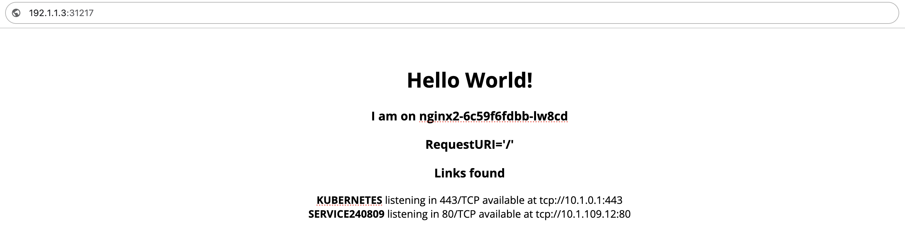

# 使用内置组件及运维特征创建 OAM 应用

创建 OAM 应用的方式有 **使用内置组件及运维特征创建应用**、**使用自定义组件及运维特征创建应用** 及 **使用 YAML 文件创建应用** 三种，本文档用于指导您快速了解并使用内置组件及运维特征创建一个简单 OAM 应用。

## 介绍

### 适用场景

您是一位刚接触 OAM 的新用户，对于 OAM 应用比较感兴趣，希望快速了解 OAM 应用的配置流程和使用方式。

### 预计阅读时间

预计完成本文档的阅读和操作时间，例如：5-10 分钟。

## 注意事项

本文档不会对配置过程中的参数进行详细说明和配置，仅作为快速入门参考，具体说明及配置步骤请参考相关文档。

## 前提条件

* 已经仔细阅读核心概念文档，对于 OAM 相关概念有了初步了解。

* 已经开启 OAM 相关功能。

## 流程概述

|序号|操作步骤|描述|
|---|---|---|
|1|[配置基本信息](#basic-info)|配置应用的基本信息，包括应用名称、描述、标签、注解等信息。|
|2|[添加组件](#add-component)|选择组件并配置组件属性。|
|3|[添加运维特征](#add-trait)|为组件添加适当的运维特征。|

## 操作步骤

### 配置基本信息\{#basic-info}

1. 进入 **Container Platform**。

1. 在左侧导航栏中，单击 **应用管理** > **OAM 应用**。

3. 单击 **创建应用**。

2. 选择 **通过镜像创建** 方式。

3. 填写应用名称，设置标签或注解。

    |参数| 说明                                                         |
    | ------------ | ------------------------------------------------------------ |
    |**标签**| 用来选择对象和查找满足某些条件的对象集合。需为键值对，例如 *app.kubernetes.io/name: hello-app* 。 |
    |**注解**| 用于向开发和运维团队提供任何信息。需为键值对，例如：*cpaas.io/maintainer: kim* 。**说明**：如果注解值为可跳转链接，将键设置为 **app.\{显示文本}.url** 后，在界面点击显示文本可完成跳转，例如 *app.Docs.url: https://example.com/docs/* 。|

4. 单击 **添加组件**。

### 添加组件\{#add-component}

1. 选择 **网络服务** 组件。默认情况下，平台提供了 **网络服务** 和 **有状态服务** 两种预置组件，本文档以 **网络服务** 为例进行介绍。
    
2. 单击 **下一步**。
    
3. 使用如下参数配置组件属性：

    |参数| 说明                                                         |
    | ------------ | ------------------------------------------------------------ |
    |**方式及镜像地址**| 本文档使用输入的方式，输入镜像地址。本文档以开源镜像 HelloWorld 为例进行介绍。 |
    |**网络访问**| 用于配置组件的网络访问方式。本文档以 **TCP**、端口为 **80**、类型为 **支持内部访问及外部访问** 为例进行介绍。 |
    |**其他参数**| 按需填写或保持默认。 |
    
4. 单击 **下一步**。

### 添加运维特征\{#add-trait}

1. 选择预置运维特征。本文档中保持默认，不进行任何配置。
    
2. 单击 **添加**。

## 预期结果

上述配置完成后，在 OAM 的详情信息页面可以看到类似 `tcp://<节点 IP 地址>:<主机端口>` 形式的 **外部访问地址**，通过浏览器访问该地址即可成功访问应用。本文档中外部访问地址为 192.1.1.3:31217，访问结果如下图所示。

   
