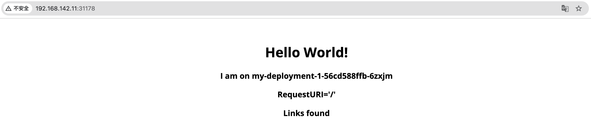

# 使用自定义组件及运维特征创建 OAM 应用

创建 OAM 应用的方式有 **使用内置组件及运维特征创建应用**、**使用自定义组件及运维特征创建应用** 及 **使用 YAML 文件创建应用** 三种，本文档用于指导您快速了解并使用自定义组件及运维特征创建一个简单 OAM 应用。

## 介绍

### 适用场景

本指南适用于已熟练配置 OAM 应用，并对内置组件及运维特征具备良好理解的用户，但发现内置功能已无法满足其使用需求。

### 预计阅读时间

预计完成本文档的阅读和操作时间为 15-20 分钟。

## 注意事项

本文档不会对配置过程中的参数进行详细说明，仅作为快速入门参考，具体说明及配置步骤请参考相关文档。

## 前提条件

- 熟练掌握预置组件及运维特征的配置方式。

- 已开启 OAM 相关功能。

## 流程概述

|序号|操作步骤|描述|
|---|---|---|
|1|[创建自定义组件](#comp)|通过 YAML 创建自定义组件。|
|2|[创建自定义运维特征](#traits)|通过 YAML 创建自定义运维特征。|
|3|[创建 OAM 应用](#app)|使用创建的自定义组件及运维特征创建 OAM 应用。|
|4|[添加内部路由](#service)|为应用添加内部路由，实现网络访问。|

## 操作步骤

通过自定义组件及运维特征的方式创建一个简单的 OAM 应用，操作步骤如下。

### 创建自定义组件\{#comp}

1. 进入 **平台管理**。

2. 在左侧导航栏中，单击 **集群管理** > **资源管理**。

3. 单击 **创建资源对象**。

4. 将自定义组件的 YAML 文件复制到页面中。在本文中，我们定义了一个允许指定原始 Kubernetes 对象的组件，YAML 文件如下：

   ```yaml
   apiVersion: core.oam.dev/v1beta1
   kind: ComponentDefinition
   metadata:
     annotations:
       definition.oam.cpaas.io/name: '{"zh": "Kubernetes 对象", "en": "Kubernetes Object"}'
       definition.oam.cpaas.io/tag: '{"zh": "自定义", "en": "Custom"}'    
       definition.oam.cpaas.io/description: '{"zh": "Kubernetes 对象允许用户在属性中指定原始 Kubernetes 对象", "en": "K8s-objects allow users to specify raw K8s objects in properties"}'
     labels:
       definition.oam.cpaas.io/provider: user # 必填，请勿修改
       definition.oam.cpaas.io/tag: k8s-objects
     name: k8s-objects-test
     namespace: kube-public
   spec:
     schematic:
       cue:
         template: |
           output: parameter.objects[0]

           outputs: {
           	for i, v in parameter.objects {
           		if i > 0 {
           			"objects-\(i)": v
           		}
           	}
           }
           parameter: objects: [...{}]
   ```

5. 单击 **创建**。

### 创建自定义运维特征\{#traits}

1. 进入 **平台管理**。

2. 在左侧导航栏中，单击 **集群管理** > **资源管理**。

3. 单击 **创建资源对象**。

4. 将自定义运维特征的 YAML 文件复制到页面中。在本文中，我们定义了一个生成标签的运维特征，YAML 文件如下：

   ```yaml
   apiVersion: core.oam.dev/v1beta1
   kind: TraitDefinition
   metadata:
     annotations:
       definition.oam.cpaas.io/description: '{"zh": "生成标签的表述信息", "en": "Generate description information for labels."}'
       definition.oam.cpaas.io/name: '{"zh": "生成标签", "en": "Generate Labels"}'
     name: labels-test
     namespace: kube-public
     labels:
       definition.oam.cpaas.io/provider: user # 必填，请勿修改
       definition.oam.cpaas.io/tags: config 
   spec:
     appliesToWorkloads:
       - '*'
     podDisruptive: true
     schematic:
       cue:
         template: |
           // +patchStrategy=jsonMergePatch
           patch: {
           	metadata: labels: {
           		for k, v in parameter {
           			(k): v
           		}
           	}
           	if context.output.spec != _|_ && context.output.spec.template != _|_ {
           		spec: template: metadata: labels: {
           			for k, v in parameter {
           				(k): v
           			}
           		}
           	}
           }
           parameter: [string]: string | null
   ```

5. 单击 **创建**。

### 创建 OAM 应用\{#app}

1. 进入 **Container Platform**。

2. 在左侧导航栏中，单击 **应用管理** > **OAM 应用**。

3. 单击 **创建应用**。

4. 选择 **通过镜像创建**。

5. 输入必要的基本信息，单击 **添加组件**。

6. 单击 **更多** 以展开更多组件，选择创建的[自定义组件](#comp)。

7. 单击 **下一步**。

8. 输入 *名称*，切换到 YAML，并用以下内容替换 `properties: {}` 部分：

   **注意**：在自定义组件中，开发团队可以抽象出参数，仅暴露少量可以通过表单填写的属性。由于该组件允许指定 Kubernetes 对象并使用基础的 Deployment 和 ConfigMap，因此直接通过 YAML 填写会更方便。

   ```yaml
   properties:
     objects:
       - apiVersion: apps/v1
         kind: Deployment
         metadata:
           name: my-deployment-1
         spec:
           replicas: 3
           selector:
             matchLabels:
               app: my-app
           template:
             metadata:
               labels:
                 app: my-app
             spec:
               containers:
                 - name: my-container
                   image: nginx:latest
                   ports:
                     - containerPort: 80
                   env:
                     - name: MY_CONFIG_MAP_KEY
                       valueFrom:
                         configMapKeyRef:
                           name: my-configmap-1
                           key: key1
                           
       - apiVersion: v1
         kind: ConfigMap
         metadata:
           name: my-configmap-1
         data:
           key1: value1
           key2: value2
   ```

9. 切换至 **表单**。

10. 单击 **下一步**。

11. 添加之前创建的 [自定义运维特征](#traits)，并填写参数。

12. 添加 **手动伸缩**。

    **注意**：自动伸缩与手动伸缩为平台内置运维特征，两者互斥且均为必选，用户可根据自身情况填写。

13. 单击 **添加**。至此，一个包含 Deployment 和 ConfigMap 的组件，且带有 **手动伸缩** 和 **标签指定** 运维特征的简单 OAM 应用已成功创建。您可以随时为应用添加新的组件和运维特征，以方便管理和运维。

### 添加内部路由\{#service}

由于组件中未添加网络访问，因此我们通过添加内部路由实现应用的网络访问。

1. 进入 **Container Platform**。

2. 在左侧导航栏中，单击 **网络** > **内部路由**。

3. 单击 **创建内部路由**。

4. 根据以下参数配置 **基本信息**，其余参数保持默认。

   | 参数         | 说明                                                                                                                        |
   | ------------ | --------------------------------------------------------------------------------------------------------------------------- |
   | 名称         | 输入该 Service 的名称。                                                                                                     |
   | 类型         | 选择 NodePort。                                                                                                           |
   | 组件名称     | 选择之前创建的 deployment。                                                                                                 |
   | 端口         | <ul><li>服务端口：内部路由在集群内部暴露的服务端口号，即 Port，例如 8080。</li><li>容器端口：服务端口映射的目标端口号（或名称），即 targetPort，例如 80。</li></ul> |

5. 单击 **创建**。至此，内部路由已成功创建。

## 预期结果

1. 进入内部路由详情页面。

2. 复制容器组区域的 **节点 IP 地址**。

3. 复制端口区域的 **主机端口**。

4. 在浏览器中输入 `<节点 IP 地址>:<主机端口>`，即可成功访问应用。本文档中节点 IP 地址为 192.168.142.11，主机端口为 31178，访问结果如图所示。

   
