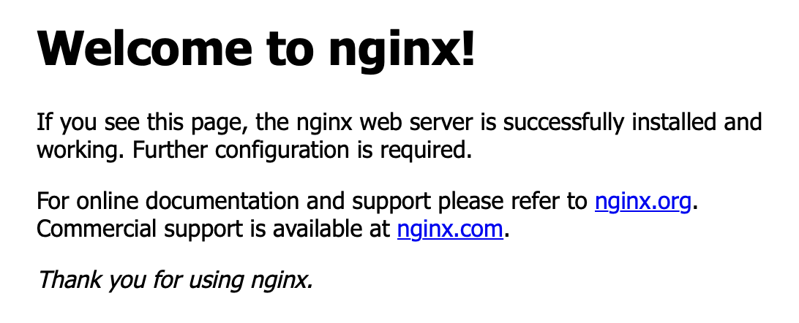

# 快速创建一个应用

> 本技术指南演示了如何使用 Kubernetes 原生方法高效地创建、管理和访问容器化应用程序，适用于 <Term name="product" textCase="capitalize" />。

## 介绍

### 适用场景

- 新用户希望了解 Kubernetes 平台上基本的应用创建工作流程
- 实践练习，演示核心平台功能，包括：
  - 项目/命名空间编排
  - 部署创建
  - 服务暴露模式
  - 应用可访问性验证

### 预计时间

预计完成时间：10-15 分钟

## 注意事项

- 本技术指南专注于基本参数，详细配置请参考综合文档
- 所需权限：
  - 创建项目/命名空间
  - 镜像仓库集成
  - 工作负载部署

## 前提条件

- 对 Kubernetes 架构和 <Term name="product" textCase="capitalize" /> 平台概念有基本了解
- 按照平台建立程序预先配置的项目

## 工作流程概述

| 序号 | 操作步骤                                          | 描述                                   |
| :-- | :------------------------------------------------- | :-------------------------------------- |
| 1   | [创建命名空间](#namespace)                          | 建立资源隔离边界                       |
| 2   | [配置镜像仓库](#image)                              | 设置容器镜像来源                       |
| 3   | [通过部署创建应用程序](#deployment)                 | 创建部署工作负载                       |
| 4   | [通过 NodePort 暴露服务](#service)                  | 配置 NodePort 服务                     |
| 5   | [验证应用可访问性](#application)                   | 测试端点连接                           |

## 操作步骤

### 创建命名空间 \{#namespace}

> 命名空间为资源分组和配额管理提供逻辑隔离。

**前提条件**

- 拥有创建、更新和删除命名空间的权限（例如，管理员或项目管理员角色）
- kubectl 已配置与集群的访问

**创建过程**

1. 登录并导航到 **项目管理** > **命名空间**

2. 选择 **创建命名空间**

3. 配置基本参数：

   | **参数**     | **描述**                                     |
   | :----------- | :-------------------------------------------- |
   | 集群         | 从项目关联的集群中选择目标集群             |
   | 命名空间     | 唯一标识符（自动以项目名称为前缀）         |

4. 使用默认资源限制完成创建

### 配置镜像仓库 \{#image}

<Term name="product" textCase="capitalize" /> 支持多种镜像获取策略：

#### 方法 1：通过工具链集成注册表

1. 访问 **平台管理** > **工具链** > **集成**

2. 启动新的集成：

   | 参数          | 要求                                      |
   | -------------- | ------------------------------------------ |
   | 名称           | 唯一的集成标识符                          |
   | API 端点      | 注册表服务 URL（HTTP/HTTPS）              |
   | 密钥           | 预先存在或新创建的凭证                    |

3. 将注册表分配给目标平台项目

#### 方法 2：外部注册表服务

- 使用公共可访问的注册表 URL（例如，Docker Hub）
- 示例：`index.docker.io/library/nginx:latest`

**验证要求**

- 集群网络必须能够访问注册表端点

### 通过部署创建应用程序 \{#deployment}

> 部署提供 Pod 副本集的声明式更新。

**创建过程**

1. 从 **容器平台** 视图：
   - 使用命名空间选择器选择目标隔离边界
2. 导航到 **工作负载** > **部署**
3. 点击 **创建部署**
4. 指定镜像来源：
   - 选择集成注册表 *或*
   - 输入外部镜像 URL（例如，`index.docker.io/library/nginx:latest`）
5. 配置工作负载身份并启动

**管理操作**

- 监控副本状态
- 查看事件和日志
- 检查 YAML 清单
- 分析资源指标、告警

### 通过 NodePort 暴露服务 \{#service}

服务使 Pod 组的网络可访问性得以实现。

**创建过程**

1. 导航到 **网络** > **服务**

2. 点击 **创建服务**，并配置参数：

   | 参数          | 值                                          |
   | :------------ | :------------------------------------------- |
   | 类型          | NodePort                                    |
   | 选择器        | 目标部署名称                               |
   | 端口映射      | 服务端口：容器端口（例如，8080:80）       |

3. 确认创建。

**关键**

- 集群可见的虚拟 IP
- NodePort 分配范围（30000-32767）

内部路由通过提供统一的 IP 地址或主机端口来启用工作负载的服务发现。

1. 点击 **网络** > **服务**。

2. 点击 **创建服务**。

3. 根据下列参数配置 **详细信息**，保持其他参数为默认。

   | 参数          | 描述                                                                                                                                                                                                                       |
   | -------------- | ------------------------------------------------------------------------------------------------------------------------------------------------------------------------------------------------------------------------- |
   | 名称           | 输入服务名称。                                                                                                                                                                                                           |
   | 类型           | `NodePort`                                                                                                                                                                                                                |
   | 工作负载名称   | 选择之前创建的 `Deployment`。                                                                                                                                                                                          |
   | 端口           | **服务端口**：集群中由服务暴露的端口号，即端口，如 `8080`。 **容器端口**：服务端口映射的目标端口号（或名称），即 targetPort，如 `80`。                                                                 |

4. 点击 **创建**。此时，服务成功创建。

### 验证应用可访问性 \{#application}

**验证方法**

1. 获取暴露的端点组件：
   - **节点 IP**：工作节点的公共地址
   - **NodePort**：分配的外部端口
2. 构建访问 URL：`http://<Node_IP>:<NodePort>`
3. 预期结果：Nginx 欢迎页面

