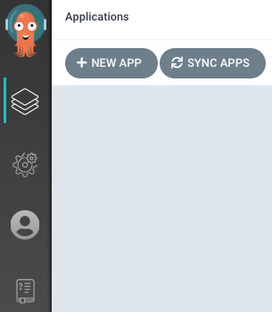

# 通过 Argo CD Dashboard 创建 Argo CD Application

## 前提条件

- 安装（选择一种方法）：
  - [安装 Alauda Container Platform GitOps](../install_gitops/install_gitops_plugin.mdx)
  - [安装 Alauda Build of Argo CD](../install_gitops/install_argocd_operator.mdx)
- 已获取 **Argo CD Dashboard** 的访问凭证（URL、用户名、密码），具体可参考 [如何获取 Argo CD 访问信息](./argocd_info.mdx)

## 操作步骤

> 按以下步骤使用功能：

1. 在浏览器中输入 Argo CD dashboard 访问 URL，打开界面。

> 管理员可以通过 `global` 集群插件详情直接访问 **Argo CD 原生 UI**：定位到 GitOps 集群插件并点击访问地址。

2. 输入 Argo CD 凭证进行身份验证并登录。

3. 点击如下所示的 **+ NEW APP** 按钮：

> 按照以下步骤配置应用：

**基本信息配置**

- **Application Name**：输入 `guestbook`
- **Project**：选择 `default`
- **Sync Policy**：保持为 `Manual`（建议用于初始配置）

**源代码配置**

- **Repository URL**：设置为 `https://github.com/argoproj/argocd-example-apps.git`
- **Revision**：使用默认的 `HEAD`
- **Path**：指定 `guestbook`（包含 Kubernetes manifests 的目录）

**目标集群配置**

- **Cluster**：设置为 `https://kubernetes.default.svc`（集群内访问）或选择具体的集群名称
- **Namespace**：设置为 `default`（或指定目标命名空间）

4. 创建 **Application**
   完成配置后，点击右上角的 **Create** 按钮以初始化创建 guestbook 应用程序。
