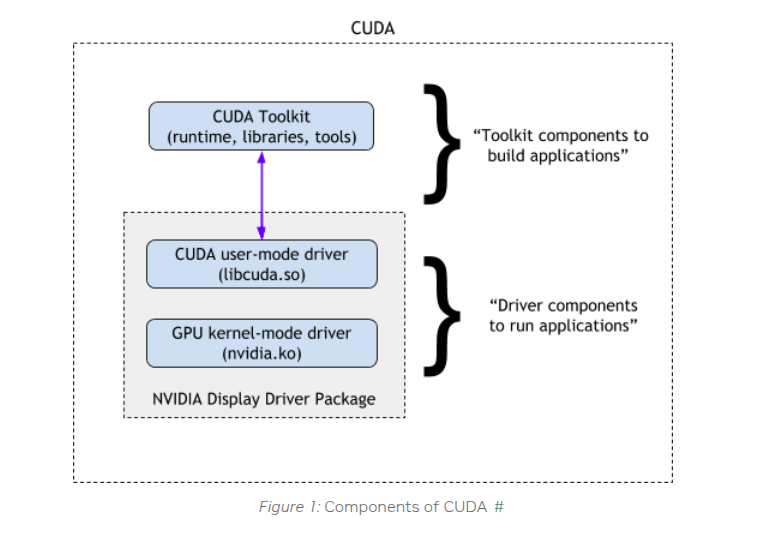
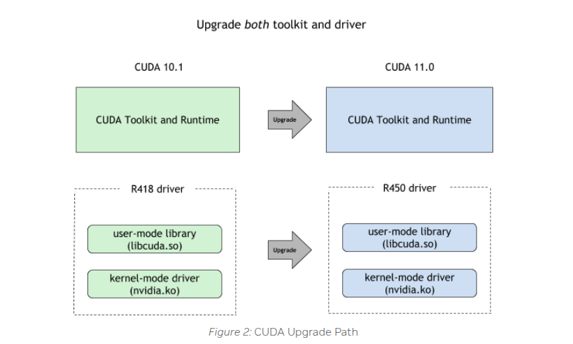

# CUDA 编程兼容性指南：驱动版本与运行时版本管理规范

## 分层架构与核心概念



### 1. CUDA 运行时 API 层

#### 技术定位

1. **功能范围**：为开发人员提供高层抽象接口，封装核心 GPU 操作（内存分配、流管理、内核启动等）。
2. **版本绑定**：由构建时使用的 CUDA Toolkit 版本决定（例如，CUDA 12.0.1）。

#### 版本检测方法

```bash
# Python 环境检测（推荐优先方法）
pip list | grep cuda
conda list | grep cuda 
# 示例输出：cu121  # cu121 表示 CUDA 12.1 环境

# 系统级运行时库检测
find / -name "libcudart*"
# cudart 表示 CUDA 运行时
# 示例输出：
/usr/local/cuda-12.4/targets/x86_64-linux/lib/libcudart.so.12
/usr/local/cuda-12.4/targets/x86_64-linux/lib/libcudart.so.12.4.127
表示 CUDA 12.4
```

如果您发现多个库版本，应检查您的程序使用了哪个版本，例如 PATH、LD_LIBRARY_PATH或其他程序设置。

```bash
env | grep PATH
# 示例输出：
LIBRARY_PATH=/usr/local/cuda/lib64/stubs
LD_LIBRARY_PATH=/usr/local/nvidia/lib:/usr/local/nvidia/lib64
PATH=/go/bin:/usr/local/go/bin:/usr/local/nvidia/bin:/usr/local/cuda/bin:/usr/local/sbin:/usr/local/bin:/usr/sbin:/usr/bin:/sbin:/bin
# 这意味着您的 CUDA 程序使用的是按照库路径顺序排列的第一个库
```

### 2. CUDA 驱动 API 层

#### 技术定位

1. **功能范围**：与 GPU 硬件直接互动的低级接口，处理指令翻译和硬件资源调度。
2. **版本绑定**：由 NVIDIA 驱动版本决定，遵循 SemVer 规范。

#### 版本检测方法

```bash
nvidia-smi
# 示例输出：
+-----------------------------------------------------------------------------------------+
| NVIDIA-SMI 550.144.03             Driver Version: 550.144.03     CUDA Version: 12.4     |
|-----------------------------------------+------------------------+----------------------+
| GPU  名称                 Persistence-M | Bus-Id          Disp.A | Volatile Uncorr. ECC |
| 风扇  温度   性能          功耗:使用/容量 |           内存使用 | GPU 使用率  计算模式 |
|                                         |                        |               MIG 模式 |
|=========================================+========================+======================|
|   0  NVIDIA A30                     Off |   00000000:00:0B.0 Off |                    0 |
| N/A   31C    P0             28W /  165W |   10195MiB /  24576MiB |      0%      默认 |
|                                         |                        |             禁用 |
+-----------------------------------------+------------------------+----------------------+
```

## 版本兼容性矩阵及约束

### 物理 GPU 部署 - 核心兼容性原则

首先参考 NVIDIA 的官方声明：

1. **驱动版本必须始终 ≥ 运行时版本**
2. NVIDIA 官方保证 **支持 1 个主要版本向后兼容**（例如，CUDA 驱动 12.x 支持运行时 11.x）
3. 跨两个主要版本的兼容性（例如，驱动 12.x 与运行时 10.x）既不受官方支持也不推荐

#### 正式规则

```diff
+ 强制：驱动版本 ≥ 运行时版本
+ 推荐：驱动主要版本 - 运行时主要版本 ≤ 1
- 拒绝：驱动版本 < 运行时版本 → 可能触发 CUDA_ERROR_UNKNOWN(999)
- 不稳定：驱动主要版本 - 运行时主要版本 > 1 → 应用程序可能发生故障
```

### 虚拟化场景增强（HAMI/vGPU）

当使用 vGPU 解决方案，如 GPU-Manager 或 HAMI 时，还有额外的约束：

#### 版本要求

```text
1. vGPU 基准版本 ≥ 运行时版本
2. 运行时主要版本 = 驱动主要版本 = 基准主要版本
```

**GPU-Manager 特殊说明**：
我们实现了部分跨 1 个主要版本的兼容性（例如，基准 12.4 支持vLLM 11.8）。但是，这需要针对每个应用程序的钩子调整，必须逐个案例进行分析。

## 部署最佳实践

### 推荐策略

• 在新的 GPU 集群规划中，采用较新的 CUDA 版本（例如，CUDA 12.x）作为驱动和运行时。

### 遗留系统的替代解决方案

#### 1. 物理 GPU 调度或 GPU-Manager 整卡分配

整卡调度提供相当于物理 GPU 访问的本地兼容性。
GPU-Manager 可以在将 tencent.com/vcuda-core 设置为 100 的正整数（如 100、200、300）时使用整卡模式。

```yaml
resources:
  limits:
    tencent.com/vcuda-core: "100"
```

#### 2. 节点标记策略

根据支持的 CUDA 版本标记节点：

```yaml
node_labels:
  cuda-major-version: "12"
  cuda-minor-version: "4"
```

在部署中配置调度亲和性：

```yaml
apiVersion: apps/v1
kind: Deployment
metadata:
  name: cuda-app
spec:
  template:
    spec:
      affinity:
        nodeAffinity:
          requiredDuringSchedulingIgnoredDuringExecution:
            nodeSelectorTerms:
            - matchExpressions:
              - key: cuda-major-version
                operator: In
                values: ["12"]
              - key: cuda-minor-version
                operator: Gt
                values: ["2"]
```

#### 3. 运行时版本升级

遗留的 CUDA 运行时可能存在安全漏洞（CVE）并且缺乏对新 GPU 功能的支持。优先将其升级到 CUDA 12.x。

NVIDIA 推荐同时升级。


## 故障排除手册

### 常见错误代码

| 错误代码                             | 描述                                           | 推荐措施                                   |
| -------------------------------------- | ----------------------------------------------------- | ------------------------------------------------ |
| CUDA\_ERROR\_INVALID\_IMAGE            | 驱动-运行时不兼容                        | 使驱动版本与容器 CUDA 版本对齐 |
| CUDA\_ERROR\_ILLEGAL\_ADDRESS          | 虚拟内存违规（在版本不匹配中常见） | 验证运行时与基准约束           |
| CUDA\_ERROR\_UNSUPPORTED\_PTX\_VERSION | PTX 指令集不匹配                          | 使用明确的 -arch=sm\_xx 重新编译             |

---
