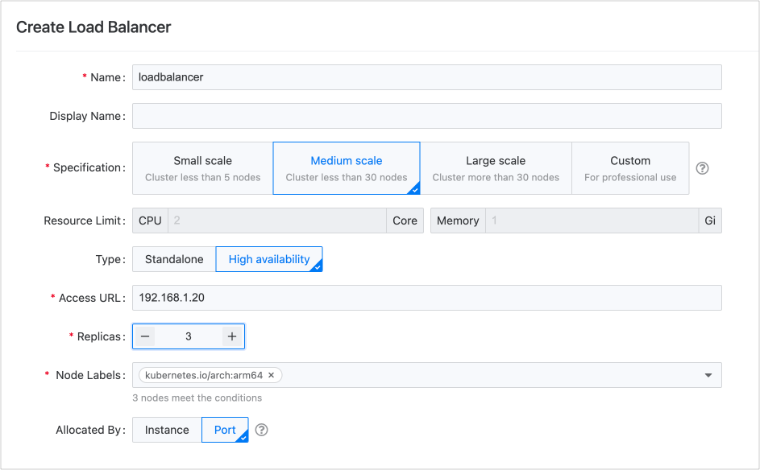

# 负载均衡器选型及规划 

针对平台拟定的 **小型**、**中型**、**大型** 和 **自定义** 生产环境规格及 **实例** 、**端口** 的资源分配方式，可参考下述建议进行部署。      

    
    
### 小型生产环境

如果业务规模较小，例如集群中节点个数不超过 5 个，且仅用于运行常规应用，使用 **单个** 负载均衡器即可。建议采用至少有 2 个副本的 **高可用** 模式，以保证环境稳定。

您可通过 **端口** 隔离方式，将负载均衡器提供给多项目共用。

此种规格在实验室环境下测得的 QPS 峰值约为 300 次/每秒。

### 中型生产环境

当业务量达到一定规模时，例如集群中节点个数不超过 30 个，除了运行常规应用，还需要处理高并发业务，使用 **单个** 负载均衡器也已足够。建议采用至少有 3 个副本的 **高可用** 模式，以保证环境稳定。

您可通过 **端口** 隔离或  **实例** 分配方式，将负载均衡器提供给多项目共用。当然，您也可新建负载均衡器供核心项目独占使用。

此种规格在实验室环境下测得的 QPS 峰值约为 10000 次/每秒。

### 大型生产环境

当业务量规模较大时，例如集群中包含不止 30 个节点，且除了运行常规应用，还需要处理高并发业务，甚至要处理长链接数据时，建议您使用 **多个** 负载均衡器，且每个负载均衡器均属于至少有 3 个副本的 **高可用** 类型，以保证环境稳定。

您可通过 **端口** 隔离或  **实例** 分配方式，将负载均衡器提供给多项目共用。当然，您也可新建负载均衡器供核心项目独占使用。

此种规格在实验室环境下测得的 QPS 峰值约为 20000 次/每秒。

### 特殊场景部署建议

|场景| 部署建议                                                     |
| -------------- | ------------------------------------------------------------ |
|**功能试用**| 建议部署 **单实例** 的负载均衡器即可。                       |
|**测试环境**| 若测试环境满足上述 **小型** 或 **中型** 的定义时，使用 **单点** 等负载均衡器即可。且可将负载均衡器 **实例** 提供给 **多项目共用**。 |
|**核心应用**| 建议为核心应用独占使用特定的负载均衡器。                     |
|**传输大规模数据**| 由于负载均衡器本身导致的内存消耗甚微，即使对于 **大型** 规格，预留 2Gi 内存也已足够。但如果业务需要传输大规模数据，也即将导致大量内存消耗，应对应调高负载均衡器的内存规格。  建议您在 **自定义** 规格场景下，逐步扩充负载均衡器的内存。通过密切监控负载均衡器的内存使用情况，最终获得可达到合理内存使用率时的内存大小。 |

        
### 负载均衡器使用方式选型

|使用方式|优势|劣势|
|---|---|---|
|**（推荐）负载均衡器按实例的资源分配方式分配给单个项目使用**|<ul><li>管理较为简单。</li><li>每个项目拥有自己的负载均衡器，相互之间规则隔离、资源隔离，不会相互影响。</li></ul>|主机网络模式的情况下，需要集群具备大量供负载均衡器使用的节点，对资源损耗要求高。|
|**负载均衡器按实例的资源分配方式分配给多个项目使用**|管理较为简单。|由于被分配的项目都拥有此负载均衡器实例的所有权限，当某个项目配置了负载均衡器的端口、规则时，可能会出现下述情况：<ul><li>此项目配置的规则会影响到其他项目。</li><li>修改负载均衡器配置时误操作修改了其他项目的配置。</li><li>某个业务的流量请求，可能会影响整个负载均衡器实例的可用性。</li></ul>|
|**负载均衡器按端口的资源分配方式进行分配，不同项目使用不同的端口**|项目间规则是项目隔离的，不会相互受到影响。|<ul><li>管理的复杂度上升。需要平台管理员主动为项目规划和分配端口，并配置好对外服务发布的映射。</li><li>按端口分配功能成熟度更低。目前使用客户较少，功能打磨不足。</li><li>资源冲突。所有业务使用同一个负载均衡器，存在单个业务影响整个负载均衡器的情况。</li></ul>|

