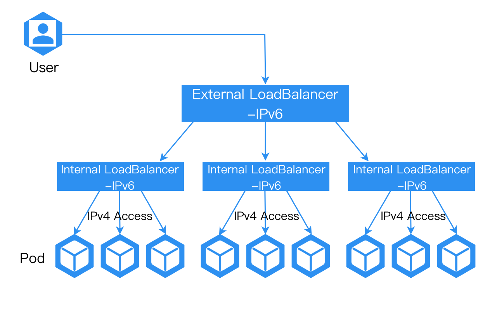
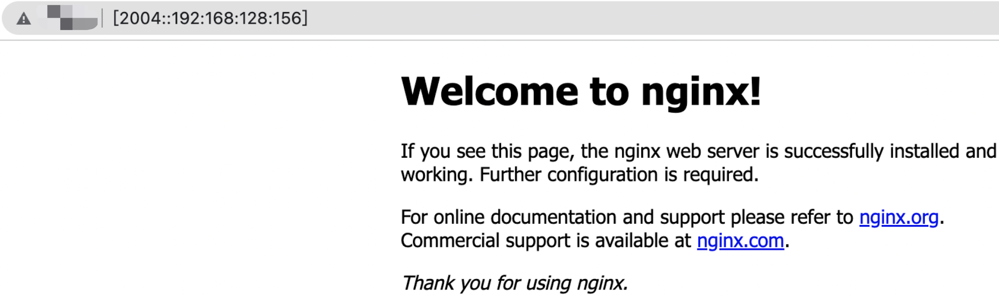

# IPv6 流量转发至集群内 IPv4 地址

通过配置集群外负载均衡器，实现将 IPv6 流量转发至集群内部的 IPv4 地址，从而使我们能够在现有 IPv4 网络基础上引入 IPv6，为系统架构赋予更大的灵活性和可扩展性，更好应对各种网络需求。

### 配置方法

1. 为负载均衡器所在节点配置 IPv6 地址。

2. 确保集群外负载均衡器拥有 IPv6 地址，并使得访问负载均衡器 IPv6 地址的流量能够转发至负载均衡器所在节点的 IPv6 地址。

完成上述配置后，挂载在负载均衡器后的 IPv4 服务即可通过负载均衡器对外提供 IPv6 访问的能力。

### 结果验证

配置完成后，通过访问集群外负载均衡器的 IPv6 地址即可正常访问应用。

