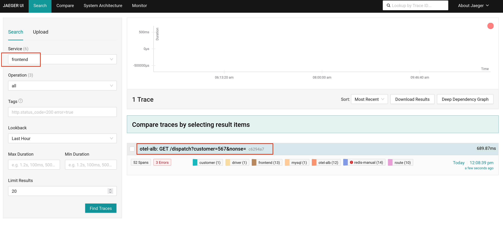
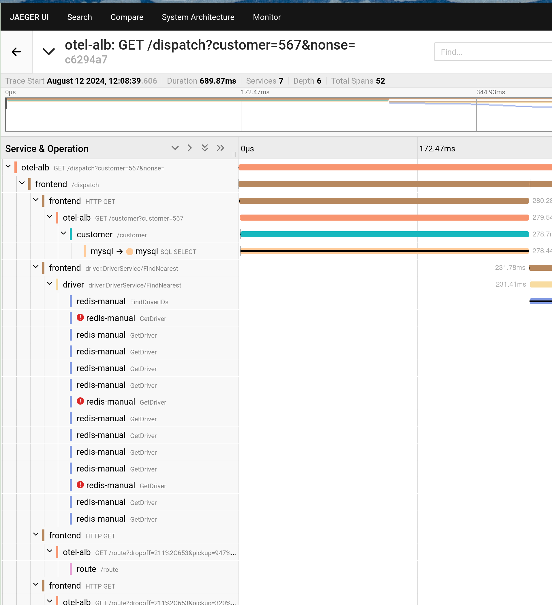

# 配置 OpenTelemetry

OpenTelemetry（OTel）是一个开源项目，旨在为分布式系统（如微服务架构）提供一个厂商中立的标准，用于收集、处理和导出遥测数据，它支持开发人员更轻松地分析软件的性能和行为，从而更容易地诊断和排除应用问题。

## 名词解释

| 名词 | 解释 |
|------|------|
| **Trace** | 提交到 OTel Server 的数据，是一系列相关的事件或操作的集合，用于跟踪请求在分布式系统中的流动，每个 Trace 由多个 Span 组成。 |
| **Span** | Trace 中的一个独立的操作或事件，包含开始时间、持续时间和其他相关信息。 |
| **OTel Server** |  OTel 服务器，能够接收和存储 Trace 数据的服务器，例如 Jaeger、Prometheus 等。 |
| **Jaeger** | 一个开源的分布式追踪系统，用于监控和故障排除微服务架构，支持与 OpenTelemetry 集成。 |
| **Attributes** | 附加在 Trace 或 Span 上的键值对，用于提供更多上下文信息。包括资源属性（Resource Attributes）和 Span 属性（Span Attributes），具体请参考 [Attributes](#attri)。 |
| **Sampler** | 决定是否采集和上报 Trace 的策略组件。可以配置不同的采样策略，例如全量采样、比例采样等。 |
|**ALB（Another Load Balancer）**|是一种把网络请求分散到一个集群中的可用节点上的软件或硬件设备，平台中使用的负载均衡器（ALB）为七层软件负载均衡器，可以配置 OTel 以监控流量。ALB 支持提交 Trace 到指定 Collector 上，支持不同的采样策略，支持在 Ingress 级别单独配置是否提交 Trace。|
| **FT（Frontend）** |  ALB 的端口配置，指定端口级别的配置。 |
| **Rule** | 端口（FT）上的路由规则，用来匹配具体的路由。 |
| **HotROD（Rides on Demand）** |是 Jaeger 提供的一个示例应用程序，用于演示分布式追踪的使用，具体说明请参考 [Hot R.O.D. - Rides on Demand](https://github.com/jaegertracing/jaeger/tree/main/examples/hotrod) 。|
| **hotrod-with-proxy** | 通过环境变量指定 HotROD 内部各微服务地址，具体请参考 [hotrod-with-proxy](https://github.com/woodgear/hotrod-with-proxy/blob/master/services/frontend/best_eta.go#L53) 。 |


## 前提条件

* **确保存在可操作的 ALB**：创建或使用已存在的 ALB，该 ALB 的名称在文档中使用 `<otel-alb>` 代替。若需创建 ALB，具体的创建方式请参考 [创建负载均衡器](../functions/create_loadbalancer.mdx)。

* **确保存在 OTel 数据上报的服务器地址**：此地址以下简称为 `<jaeger-server>`。

## 操作步骤

### 更新 ALB 配置

1. 在集群 Master 节点上，使用 CLI 工具执行下述命令编辑 ALB 配置。
    
    ```
    kubectl edit alb2 -n cpaas-system <otel-alb> # 需使用 ALB 名称替换 <otel-alb> 部分
    ```
    
2. 在 `spec.config` 字段下添加下述字段。

   ```yaml
   otel:
     enable: true
     exporter:
       collector:
         address: "<jaeger-server>" # 需使用 OTel 数据上报的服务器地址替换 <jaeger-server> 部分
         request_timeout: 1000
   ```
   配置完成示例：
   
    ```yaml
    spec:
      address: 192.168.1.1
      config:
        otel:
         enable: true
         exporter:
           collector:
             address: "http://jaeger.default.svc.cluster.local:4318"
             request_timeout: 1000
        antiAffinityKey: system
        defaultSSLCert: cpaas-system/cpaas-system
        defaultSSLStrategy: Both
        gateway:
        ...
    type: nginx
    ```

3. 执行下述命令保存更新。更新完成后，ALB 将默认开启 OpenTelemetry，并将所有请求的 Trace 信息上报至 Jaeger Server。

    ```
    :wq
    ```

## 相关操作

### 在 Ingress 中配置 OTel

* **在 Ingress 上开启或关闭 OTel**

    通过配置是否在 Ingress 上开启 OTel，可以更好地监控和调试应用程序的请求流，通过追踪请求在不同服务间的传播路径，识别性能瓶颈或错误。
    
    **操作步骤**
    
    在 Ingress 的 metadata.annotations 字段下增加下述配置：
    
    ```
    nginx.ingress.kubernetes.io/enable-opentelemetry: "true"
    ```
    
    参数说明：
    
    * **nginx.ingress.kubernetes.io/enable-opentelemetry**：当设置为 `true` 时，表示 Ingress 控制器在处理通过该 Ingress 的请求时，启用 OpenTelemetry 功能，即请求的 Trace 信息将被收集和报告；当设置为 `false` 或删除此注释时则表示不收集或报告请求的 Trace 信息。
    


* **在 Ingress 上开启或关闭 OTel Trust**

    OTel Trust 的作用是 Ingress 是否信任和使用传入请求中的 OTel 的 Trace 信息（例如 trace ID）。
    
    **操作步骤**
    
    在 Ingress 的 metadata.annotations 字段下增加下述配置：
    
    ```
    nginx.ingress.kubernetes.io/opentelemetry-trust-incoming-span: "true"
    ```
    
    参数说明：
    
    * **nginx.ingress.kubernetes.io/opentelemetry-trust-incoming-span**：当设置为 `true` 时 Ingress 会继续使用已经存在的 Trace 信息，有助于维持跨服务的追踪一致性，使得整个请求链条可以在分布式追踪系统中被完整地追踪和分析；当设置为 `false` 时，则会为该请求生成新的追踪信息，这可能会导致请求在进入该 Ingress 后被视为新的追踪链条的一部分，从而中断跨服务的追踪连续性。


* **在 Ingress 上增加不同的 OTel 配置**

    此配置允许您为不同的 Ingress 资源自定义 OTel 的行为和数据导出方式，允许对每个服务进行细粒度的控制，有助于配置不同的追踪策略或目标的服务。
    
    **操作步骤**
    
    在 Ingress 的 metadata.annotations 字段下增加下述配置：
    
    ```yaml
    apiVersion: networking.k8s.io/v1
    kind: Ingress
    metadata:
      annotations:
        alb.ingress.cpaas.io/otel: >
         {
            "enable": true,
            "exporter": {
                "collector": {
                    "address": "<jaeger-server>", # 需使用 OTel 数据上报的服务器地址替换 <jaeger-server> 部分，例如："address": "http://128.0.0.1:4318"
                    "request_timeout": 1000
                }
            }
         }
    ```
    
    参数说明：
    
    * **exporter**：指定如何将收集到的 Trace 数据发送到 OTel Collector（ OTel 数据上报的服务器）。
    * **address**：指定了 OTel Collector 的地址。
    * **request_timeout**：指定请求超时时间。


### 在应用中使用 OTel

下述配置展示了完整的 OTel 配置结构，可以用于定义如何在应用中启用和使用 OTel 功能。

可以在集群 Master 节点上，使用 CLI 工具执行下述命令获取 OTel 的完整配置结构。

```
kubectl get crd alaudaloadbalancer2.crd.alauda.io -o json|jq ".spec.versions[2].schema.openAPIV3Schema.properties.spec.properties.config.properties.otel"
```

回显结果：

```
{
    "otel": {
        "enable": true
    }
    "exporter": {
        "collector": {
            "address": ""
          },
    },
    "flags": { 
        "hide_upstream_attrs": false
        "notrust_incoming_span": false
        "report_http_request_header": false
        "report_http_response_header": false
    },
    "sampler": {
        "name": "", 
        "options": {
            "fraction": ""
            "parent_name": ""
          },
      },
 }
```

参数说明：

|参数|说明|
|---|---|
|**otel.enable**|是否启用 OTel 功能。|
|**exporter.collector.address**|OTel 数据上报的服务器地址，支持 http/https 协议，支持域名。|
|**flags.hide_upstream_attrs**|是否上报关于 upstream（上游） 的规则的信息。|
|**flag.notrust_incoming_span**|是否信任和使用传入请求中的 OTel 的 Trace 信息（例如 trace ID）。|
|**flags.report_http_request_header**|是否上报请求 Header。 |
|**flags.report_http_response_header**|是否上报响应 Header。|
|**sampler.name**|采样策略名，具体请参考 [采样策略](#sampoli)。|
|**sampler.options.fraction**|采样率。|
|**sampler.options.parent_name**|parent_base 采样策略的 parent 策略。|


### 继承

默认情况下，若 ALB 配置了某些 OTel 参数，而 FT 未配置，则 FT 会使用 ALB 的参数作为自己的配置项，即 FT 继承了 ALB 的配置，而 Rule 可以继承 ALB 和 FT 的配置。

*  **ALB**：ALB 上的配置通常是全局性和默认的配置。可以在这里配置如 Collector 地址等全局参数，这些参数会被下层的 FT 和 Rule 继承。
   
* **FT**：FT 可以继承 ALB 的配置，即某些 OTel 参数如果在 FT 上未配置则会使用 ALB 的配置。但也可以对 FT 进一步细化，例如：可以在 FT 上选择性地开启或关闭 OTel，而不影响其他 FT 或 ALB 的全局设置。

* **Rule**：Rule 可以继承 ALB 和 FT 的配置。但也可以对 Rule 进一步细化，例如，某个特定的 Rule 可以选择不信任传入的 OTel 的 Trace 信息，或者调整采样策略等。

**操作步骤**

通过配置 ALB、FT、Rule 的 YAML 文件中 `spec.config.otel` 字段，可以增加 OTel 的相关配置。


## 相关说明

### 采样策略\{#sampoli}

| 参数 | 说明 |
|---|---|
| **always on** | 始终上报所有追踪数据。 |
| **always off** | 永不上报追踪数据。 |
| **traceid-ratio** | 根据 `traceid` 决定是否上报。`traceparent` 的格式为 `xx-traceid-xx-flag`，其中 `traceid` 的前 16 个字符表示一个 32 位的十六进制整数。如果该整数小于 `fraction` 乘以 4294967295（即 \(2^32-1\)），则进行上报。 |
| **parent-base** | 根据请求的 traceparent 中的 flag 部分决定是否上报。当 flag 为 01 时上报，例如：`curl -v "http://$ALB_IP/" -H 'traceparent: 00-xx-xx-01'`；当 flag 为 02 时不上报，例如：`curl -v "http://$ALB_IP/" -H 'traceparent: 00-xx-xx-02'`。 |

### Attributes\{#attri}

* **Resource Attributes**

    该部分属性默认上报。

    | 参数            | 说明             |
    |---------------------|------------------|
    | **hostname**            | ALB Pod 的 hostname |
    | **service.name**        | ALB 的名称       |
    | **service.namespace**   | ALB 所在的命名空间         |
    | **service.type**        | 默认为 ALB        |
    | **service.instance.id** | ALB Pod 的名称   |

* **Span Attributes**

    * 默认上报的属性
    
        | 参数                     | 说明                                   |
        |---------------------------|------------------------------------------|
        | **http.status_code**          | status code                              |
        | **http.request.resend_count** | 重试次数                                 |
        | **alb.rule.rule_name**        | 此请求匹配到的规则名                   |
        | **alb.rule.source_type**      | 此请求匹配到的规则类型，目前只有 Ingress |
        | **alb.rule.source_name**      | Ingress 的名称                           |
        | **alb.rule.source_ns**        | Ingress所在的命名空间                             |
    
    * 默认上报但可以通过修改 flag.hide_upstream_attrs 字段取消上报的属性
    
        | 参数                  | 说明              |
        |-----------------------|------------------|
        | **alb.upstream.svc_name** | 转发到的 Service（内部路由）的名称 |
        | **alb.upstream.svc_ns**   | 转发到的 Service（内部路由）所在的命名空间    |
        | **alb.upstream.peer**     | 转发到 Pod 的 IP 地址和端口 |
    
    * 默认不上报但可以通过修改 flag.report_http_request_header 字段上报的属性
    
        | 参数                         | 说明       |
        |------------------------------|----------|
        | `**http.request.header.<header>**` | 请求 Header |
        
    
    * 默认不上报但可以通过修改 flag.report_http_response_header 字段上报的属性
    
        | 参数                          | 说明       |
        |-------------------------------|----------|
        | `**http.response.header.<header>**` | 响应header |


## 配置示例

在下面的 YAML 配置中，部署了一个 ALB，并使用 Jaeger 作为 OTel 服务器，Hotrod-proxy 作为演示后端。通过配置 Ingress 规则，当客户端请求 ALB 时，流量会被转发到 HotROD。同时，HotROD 内部的微服务之间的通信也通过 ALB 进行转发。

1. 将下述 YAML 保存至名称为 all.yaml 的文件中。

    ```yaml
    apiVersion: apps/v1
    kind: Deployment
    metadata:
      name: hotrod
    spec:
      replicas: 1
      selector:
        matchLabels:
          service.cpaas.io/name: hotrod
          service_name: hotrod
      template:
        metadata:
          labels:
            service.cpaas.io/name: hotrod
            service_name: hotrod
        spec:
          containers:
            - name: hotrod
              env:
                - name: PROXY_PORT
                  value: "80"
                - name: PROXY_ADDR
                  value: "otel-alb.default.svc.cluster.local:"
                - name: OTEL_EXPORTER_OTLP_ENDPOINT
                  value: "http://jaeger.default.svc.cluster.local:4318"
              image: theseedoaa/hotrod-with-proxy:latest
              imagePullPolicy: IfNotPresent
              command: ["/bin/hotrod","all","-v"]
    ---
    apiVersion: networking.k8s.io/v1
    kind: Ingress
    metadata:
      name: hotrod-frontend
    spec:
      ingressClassName: otel-alb
      rules:
      - http:
          paths:
          - backend:
              service:
                name: hotrod
                port:
                  number: 8080
            path: /dispatch
            pathType: ImplementationSpecific
          - backend:
              service:
                name: hotrod
                port:
                  number: 8080
            path: /frontend
            pathType: ImplementationSpecific
    ---
    apiVersion: networking.k8s.io/v1
    kind: Ingress
    metadata:
      name: hotrod-customer
    spec:
      ingressClassName: otel-alb
      rules:
      - http:
          paths:
          - backend:
              service:
                name: hotrod
                port:
                  number: 8081
            path: /customer
            pathType: ImplementationSpecific
    ---
    apiVersion: networking.k8s.io/v1
    kind: Ingress
    metadata:
      name: hotrod-route
    spec:
      ingressClassName: otel-alb
      rules:
      - http:
          paths:
          - backend:
              service:
                name: hotrod
                port:
                  number: 8083
            path: /route
            pathType: ImplementationSpecific
    ---
    apiVersion: v1
    kind: Service
    metadata:
      name: hotrod
    spec:
      internalTrafficPolicy: Cluster
      ipFamilies:
        - IPv4
      ipFamilyPolicy: SingleStack
      ports:
        - name: frontend
          port: 8080
          protocol: TCP
          targetPort: 8080
        - name: customer
          port: 8081
          protocol: TCP
          targetPort: 8081
        - name: router
          port: 8083
          protocol: TCP
          targetPort: 8083
      selector:
        service_name: hotrod
      sessionAffinity: None
      type: ClusterIP
    ---
    apiVersion: apps/v1
    kind: Deployment
    metadata:
      name: jaeger
    spec:
      replicas: 1
      selector:
        matchLabels:
          service.cpaas.io/name: jaeger
          service_name: jaeger
      template:
        metadata:
          labels:
            service.cpaas.io/name: jaeger
            service_name: jaeger
        spec:
          containers:
            - name: jaeger
              env:
               - name: LOG_LEVEL
                 value: debug
              image: jaegertracing/all-in-one:1.58.1
              imagePullPolicy: IfNotPresent
          hostNetwork: true
          tolerations:
            - operator: Exists
    ---
    apiVersion: v1
    kind: Service
    metadata:
      name: jaeger
    spec:
      internalTrafficPolicy: Cluster
      ipFamilies:
        - IPv4
      ipFamilyPolicy: SingleStack
      ports:
        - name: http
          port: 4318
          protocol: TCP
          targetPort: 4318
      selector:
        service_name: jaeger
      sessionAffinity: None
      type: ClusterIP
    ---
    apiVersion: crd.alauda.io/v2
    kind: ALB2
    metadata:
      name: otel-alb
    spec:
      config:
        loadbalancerName: otel-alb
        otel:
          enable: true
          exporter:
            collector:
              address: "http://jaeger.default.svc.cluster.local:4318"
              request_timeout: 1000
        projects:
        - ALL_ALL
        replicas: 1
        resources:
          alb:
            limits:
              cpu: 200m
              memory: 2Gi
            requests:
              cpu: 50m
              memory: 128Mi
          limits:
            cpu: "1"
            memory: 1Gi
          requests:
            cpu: 50m
            memory: 128Mi
      type: nginx
    ```


2. 在 CLI 工具中执行下述命令部署 Jaeger、ALB、HotROD 以及测试需要的所有 CR。

    ```
    kubectl apply ./all.yaml
    ```

3. <span id="jaeger">执行下述命令获取 Jaeger 的访问地址。</span>

    ```
    export JAEGER_IP=$(kubectl get po -A -o wide |grep jaeger | awk '{print $7}');echo "http://$JAEGER_IP:16686"
    ```

4. 执行下述命令获取 otel-alb 的访问地址。
    
    ```
    export ALB_IP=$(kubectl get po -A -o wide|grep otel-alb | awk '{print $7}');echo $ALB_IP
    ```

5. 执行下述命令通过 ALB 向 HotROD 发送请求。其中，ALB 会将 Trace 上报到 Jaeger 中。

    ```
    curl -v "http://<$ALB_IP>:80/dispatch?customer=567&nonse=" # 使用上述步骤中获取的 otel-alb 访问地址替换命令中的 <$ALB_IP> 部分
    ```

6. 打开 [步骤 3](#jaeger) 中获取的 Jaeger 的访问地址查看结果。

    
    
    


