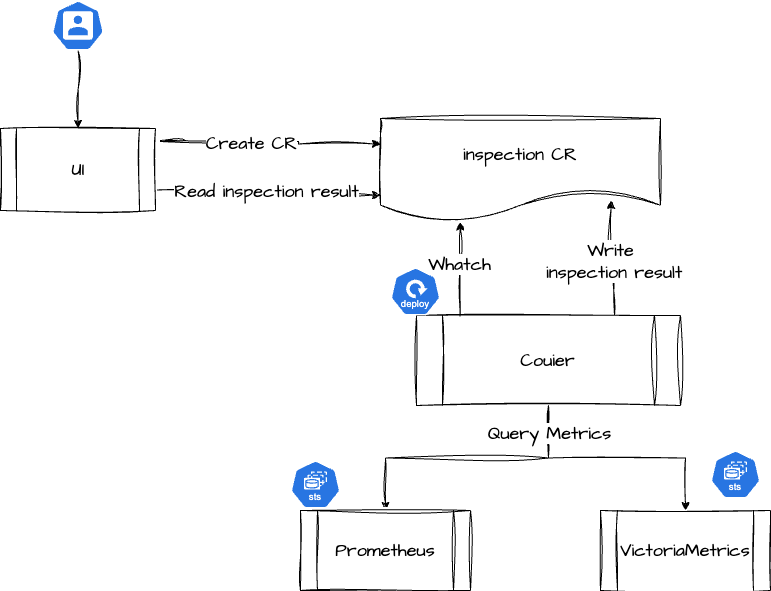
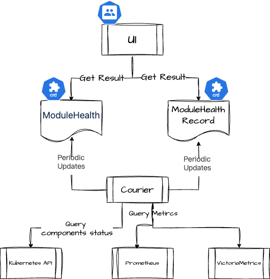

# 架构

## 巡检

巡检模块由平台组件 Courier 和监控组件共同提供，涉及的业务流程如下：

- 创建巡检任务：平台向 Global 集群提交一个 inspection 类型的 CR。
- 巡检任务执行：Courier 组件监测 inspection 类型 CR 的生成，并向各集群的监控组件查询巡检所涉及的各项指标数据。
- 巡检结果写入：Courier 组件完成各巡检项的评估后，会将巡检结果再次写入对应的 inspection CR 中。
- 巡检结果查看：用户可以通过平台查看巡检任务状态和巡检结果，其中数据会从对应的 inspection CR 中获取。

## 组件健康状态

组件健康状态由平台组件 Courier 和监控组件共同提供，涉及的业务流程如下：

- 预置组件监测列表：平台向 Global 集群中预置了两种 CRD，用于定义需要监测的组件清单和监测方式：
   - ModuleHealth ：定义需要监测的组件和监测方式
   - ModuleHealthRecord：定义各集群对应组件的监测结果
- 定期监测组件状态：Courier 会 Watch ModuleHealth，对指定功能进行检查，然后将检查结果写到 ModuleHealth 和 ModuleHealthRecord 的 CR资源中
- 组件状态判断：Courier 会请求 Kubernetes 和监控组件获取数据，以判断组件的实际状态和存在的问题
   - Kubernets:检查组件是否部署，以及组件副本数是否正常。
   - Promethues / VictoriaMetrics ：基于各组件提供的 Metrics，查询和判断组件是否能够正常提供服务。
- 组件健康状态查看：用户可以通过平台查看各组件健康状态，其中数据会从对应的ModuleHealth 和 ModuleHealthRecord 的 CR 资源中获取。