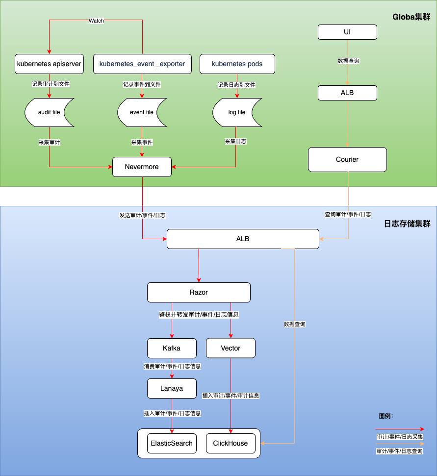

# 日志模块架构

## 整体架构说明

日志系统由以下核心功能模块组成:
1. 日志采集
   - 基于开源组件 filebeat 提供
   - 日志采集：支持采集标准输出日志、文件日志、Kubernetes 事件、审计
   
2. 日志存储
   - 基于开源组件 Clickhouse 和 ElasticSearch 提供了两种不同的日志存储套件。
   - 日志存储：支持长期存储日志文件
   - 日志存储时间管理：支持以项目为维度管理日志存储时长

3. 日志可视化
   - 提供便捷可靠的日志查询、日志导出、日志分析能力

## 日志采集

### 组件部署方式
nevermore 以 daemonset 形式部署在各个集群的 cpaas-system 命名空间下，该组件一共是由 4 个 container 组成:

   | 名称 | 功能 |
   | ---- | ---- |
   | audit | 采集审计数据 |
   | event | 采集事件数据 |
   | log | 采集日志数据（含标准输出和文件日志）|
   | node-problem-detctor | 采集节点上的异常信息 |

### 数据采集流程

nevermore 采集审计/事件/日志信息后，会发送给日志存储集群，经过 Razor 鉴权后，最终存放到 ElasticSearch 或 ClickHouse 中

## 日志消费及存储

### Razor

Razor 负责鉴权和接收转发日志消息
   - Razor 接收各个业务集群的 nevermore 发送的请求后，会首先根据请求里面的 Token 进行认证，如果认证失败就拒绝请求。
   - 如果部署的日志存储组件是 ElasticSearch，就会将对应的日志写入到 Kafka 集群内。
   - 如果部署的日志存储组件是 Clickhouse，就会将对应的日志传递给 Vector，并最终写入到 Clickhouse。

### Lanaya

Lanaya 在 ElasticSearch 日志存储链路中负责消费和转发日志数据
   - lanaya会订阅kafka里面的主题，从订阅中拿到消息后，先对消息进行解压缩。
   - 解压缩后会先对消息进行预处理，补充必要的字段，对字段进行转换，对数据进行切割。
   - 最终会根据消息的时间和和类型，存储到ElasticSearch的对应的索引中。

### Vector

Vector 在 Clickhouse 日志存储链路中负责处理和转发日志数据，最终将日志存储到 Clickhouse 对应的表中。

## 日志可视化

1、用户可以从产品 UI 界面查询审计/事件/日志查询 URL 来进行展示：
   - 日志查询 /platform/logging.alauda.io/v1 
   - 事件查询 /platform/events.alauda.io/v1 
   - 审计查询 /platform/audits.alauda.io/v1
2、请求会由高级 API 组件 Courier 进行处理，并最终从日志存储集群 ElasticSearch 或是 Clickhouse 中查询日志数据并返回至页面。
