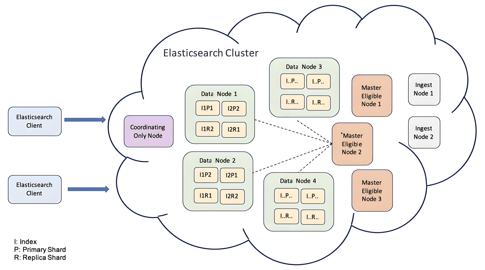
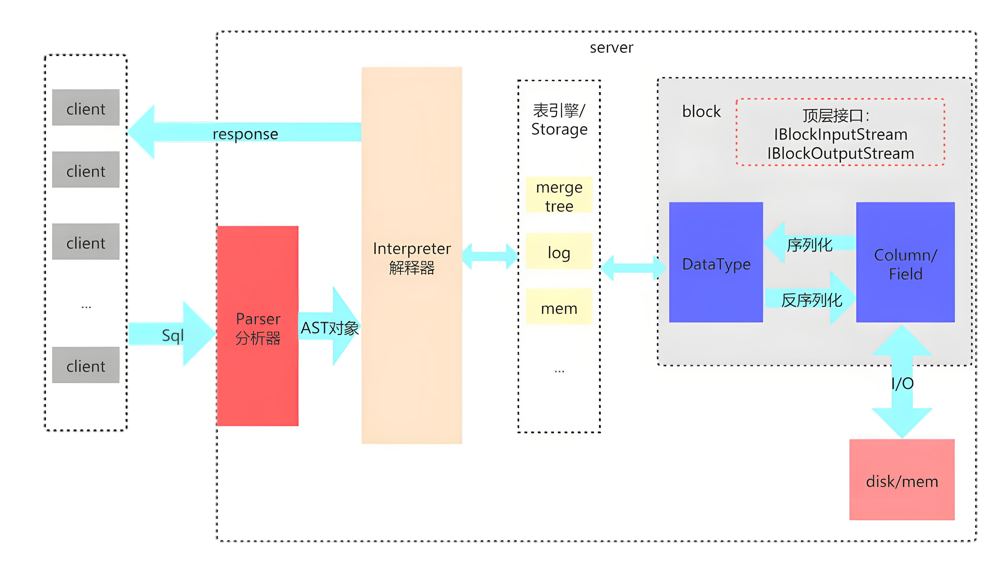

---
weight: 30
--- 

# 日志组件选型指南

在部署集群监控时，平台提供了 ElasticSearch 和 Clickhouse 两种日志存储组件供您选择。本文将详细介绍这两种组件的特点和适用场景，帮助您做出最适合的选择。

## 重要说明

- 集群日志存储组件部署时只能选择 ElasticSearch 或 Clickhouse 其中之一。
- 日志采集组件可以选择任意集群的日志存储组件对接存储数据。
- 从 3.18 Clickhouse 已升级至 Beta 版本，具备生产环境使用条件。

## 架构对比

### ElasticSearch 架构

ElasticSearch是一款开源的分布式搜索引擎，基于Lucene构建，专为快速全文搜索和分析而设计。其优势包括：

- 高性能搜索：支持实时搜索，能够快速处理海量数据。
- 灵活的查询能力：提供强大的查询DSL，支持复杂的查询需求。
- 可扩展性：可根据需要轻松水平扩展，适合各类规模的应用。
- 多样的数据支持：能够处理结构化和非结构化数据，适用范围广泛。

### Clickhouse 架构

Clickhouse是一款高性能的列式数据库，专为在线分析处理（OLAP）而设计。其优势包括：

- 快速数据处理：通过列式存储和数据压缩，支持快速查询和分析。
- 实时分析：能够处理实时数据流，适合实时数据分析场景。
- 高吞吐量：优化了大规模数据写入和查询的性能，非常适合大数据场景。
- 灵活的SQL支持：兼容标准SQL，易于上手，降低使用门槛。

## 功能比对

| 特性                       | Elasticsearch                               | ClickHouse                                   |
|----------------------------|--------------------------------------------|---------------------------------------------|
| **高可用部署**             | 支持分布式集群，自动分片和副本，数据冗余   | 也支持分布式架构，但需手动配置复制和分片   |
| **数据存储效率**           | 支持压缩和索引优化，适合文本数据           | 优化的列式存储，压缩率高，适合大规模数据，相同规模下存储消耗约为 ElasticSearch 的 2/3  |
| **查询性能**               | 全文搜索性能强，适合复杂查询                | 针对分析查询性能卓越，尤其是聚合查询       |
| **CPU内存资源消耗**       | 内存消耗较高，尤其是在高并发情况下         | CPU使用率较低，内存占用相对合理,相同规模下，CPU消耗约为 ElasticSearch 的 1/3，内存消耗为 2/3          |
| **社区支持**               | 有广泛的社区支持，文档和插件丰富          | 社区逐渐壮大，但相对较新，支持文档较少      |
| **数据模型**               | 文档存储，灵活支持非结构化数据            | 列式存储，适合结构化数据                     |
| **实时性**                 | 实时数据插入和搜索                         | 支持批量插入，实时查询稍逊色                 |
| **数据更新**               | 支持数据更新和删除，但性能较低             | 更新性能差，适合写一次读多次的场景         |

## 选择建议

### 适合使用 Elasticsearch 的场景：
- **实时搜索需求**：如果需要对日志进行实时搜索和分析，Elasticsearch 的全文搜索能力非常强大。
- **复杂查询**：适合需要执行复杂查询和分析的场景，例如对日志数据进行多维分析。
- **非结构化数据**：如果日志数据的结构不固定，Elasticsearch 的文档存储模型能够灵活应对。

### 适合使用 ClickHouse 的场景：
- **大规模数据分析**：适合需要处理大规模日志数据并进行快速分析的场景，尤其是聚合查询。
- **资源消耗优化**：在资源有限的情况下，ClickHouse 的低 CPU 和内存使用使其成为更合适的选择。
- **批量数据处理**：适合以批量方式插入数据的场景，尤其是在数据写入较频繁的情况下。