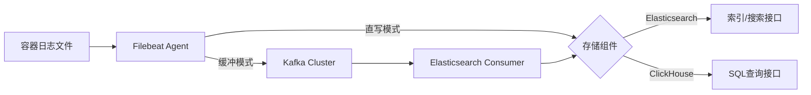

# 概念

## 开源组件

### Filebeat

**定位**：轻量级日志采集器  
**说明**：安装在容器节点上的开源日志采集组件，负责实时监控指定路径的日志文件。通过输入模块收集日志数据，经过处理后，通过输出模块将日志转发至Kafka或直接投递到存储组件。支持多行日志合并和字段过滤等预处理能力。

### Elasticsearch

**定位**：分布式搜索和分析引擎  
**说明**：基于Lucene的全文检索引擎，以JSON文档格式存储日志数据，并提供近实时的搜索能力。支持动态映射以自动识别字段类型，并通过倒排索引实现快速关键词检索，适合用于日志搜索和监控告警。

### ClickHouse

**定位**：列式分析型数据库  
**说明**：高性能的列式存储数据库，专为OLAP场景设计，采用MergeTree引擎实现PB级日志数据存储。支持高速聚合查询、时间分区和数据TTL策略，适用于日志分析和统计报告等批量计算场景。

### Kafka

**定位**：分布式消息队列  
**说明**：作为日志管道系统的消息中间件，提供高吞吐量的日志缓冲能力。当Elasticsearch集群出现处理瓶颈时，通过Topic接收Filebeat发送的日志数据，实现流量削峰和异步消费，确保日志采集端的稳定性。

## 核心功能概念

### 日志采集管道

**说明**：日志数据从产生到存储的完整链路，包含四个阶段：`采集 -> 传输 -> 缓存 -> 存储`。支持两种管道模式：
- **直写模式**：Filebeat → Elasticsearch/ClickHouse
- **缓冲模式**：Filebeat → Kafka → Elasticsearch

### 索引

**说明**：Elasticsearch中的逻辑数据分区单位，类似于数据库中的表结构。支持按时间滚动创建索引（例如：logstash-2023.10.01），并通过索引生命周期管理（ILM）实现自动化的热-温-冷分层存储。

### 分片与副本

**说明**：
- **分片**：Elasticsearch将索引进行水平拆分的物理存储单元，支持分布式扩展。
- **副本**：每个分片的复制品，提供数据的高可用性及查询负载均衡。

### 列式存储

**说明**：ClickHouse的核心存储机制，数据按列进行压缩存储，显著减少I/O消耗。支持以下特性：
- 向量化查询执行引擎
- 数据分区和分片
- 物化视图用于预聚合

## 关键技术术语

### Ingest Pipeline

**说明**：Elasticsearch中的数据预处理管道，能够在数据写入之前执行字段重命名、Grok解析和条件逻辑等ETL操作。

### 消费者组

**说明**：Kafka的并行消费机制，同一消费者组中的多个实例可以并行消费来自不同分区的消息，确保消息的顺序处理。

### TTL（Time To Live）

**说明**：数据存活时间策略，支持两种实现方式：
- Elasticsearch：通过ILM策略自动删除过期的索引。
- ClickHouse：通过TTL表达式自动删除表的分区。

### 副本因子

**说明**：Kafka Topic级别的数据冗余配置，定义每条消息在不同Broker上存在的副本数量，以增强数据可靠性。

## 数据流模型

