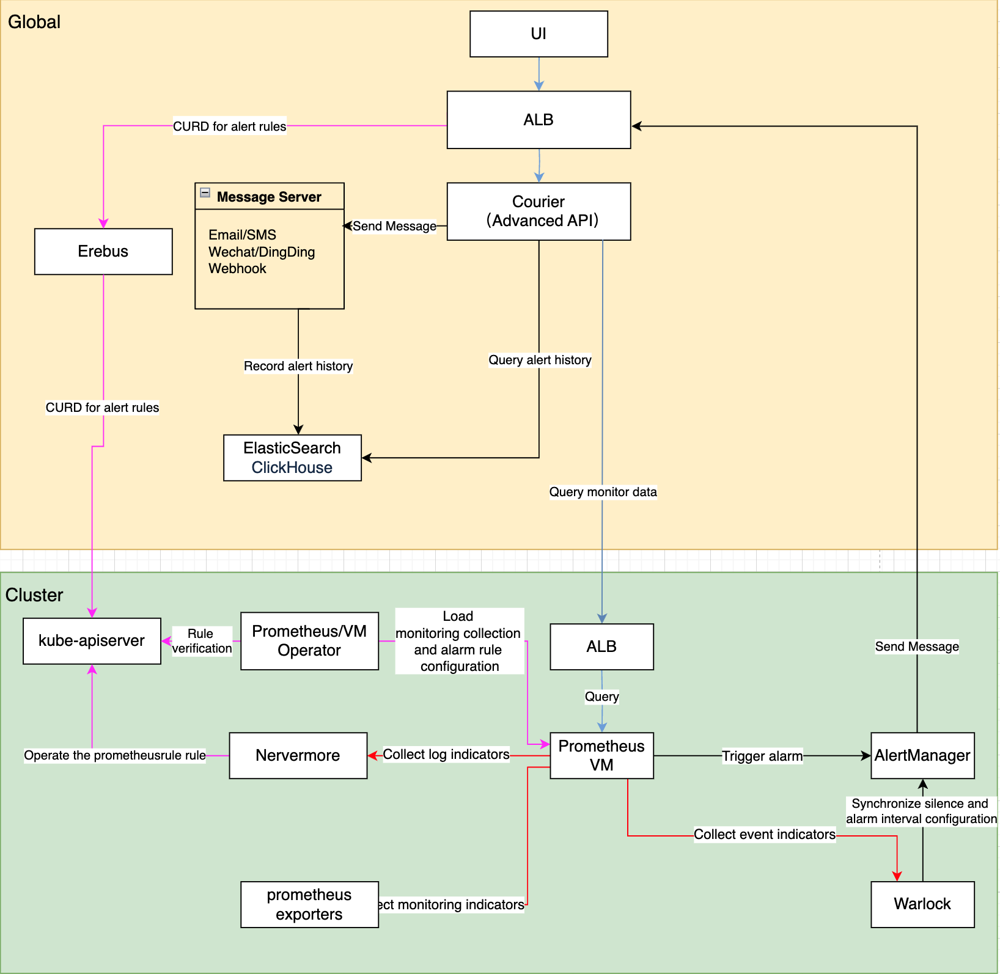

# 监控模块架构

## 整体架构说明

监控系统由以下核心功能模块组成:
1. 监控系统
   - 数据采集与存储: 从多个来源收集和持久化监控指标
   - 数据查询与展示: 提供灵活的监控数据查询和可视化能力
2. 告警系统
   - 告警规则管理: 配置和管理告警策略
   - 告警触发与通知: 评估告警规则并分发通知
   - 实时告警状态: 提供系统当前告警状态的实时视图
3. 通知系统
   - 通知配置: 管理通知模版、联系组和策略
   - 通知服务器: 管理各类通知渠道的配置

## 监控系统

### 数据采集与存储
1. Prometheus/VM Operator 职责:
   - 加载并验证监控采集配置
   - 加载并验证告警规则配置
   - 将配置同步到 Prometheus/VM 实例
2. 监控数据来源:
   - Nevermore: 生成日志相关指标
   - Warlock: 生成事件相关指标
   - Prometheus/VM: 通过 ServiceMonitor 发现并采集各类 exporters 指标

### 数据查询与展示
1. 监控数据查询流程:
   - 浏览器发起查询请求(路径: `/platform/monitoring.alauda.io/v1beta1`)
   - ALB 将请求转发至 Courier 组件
   - Courier API 处理查询:
     * 内置指标: 通过 indicators 接口获取 PromQL 并查询
     * 自定义指标: 直接转发 PromQL 到监控组件
   - 监控面板获取数据并展示

2. 监控面板管理流程:
   - 用户访问 Global 集群 ALB(路径: `/kubernetes/集群名`)
   - ALB 转发请求至 Erebus 组件
   - Erebus 路由请求到目标监控集群
   - Warlock 组件负责:
     * 校验监控面板配置的合法性
     * 管理 MonitorDashboard CR 资源

## 告警系统

### 告警规则管理
告警规则配置流程:
1. 用户访问 Global 集群 ALB(路径: `/kubernetes/集群名`)
2. 请求经由 ALB -> Erebus -> 目标集群 kube-apiserver
3. 各组件职责:
   - Prometheus/VM Operator:
     * 校验告警规则合法性
     * 管理 PrometheusRule CR
   - Nevermore: 监听并处理日志告警指标
   - Warlock: 监听并处理事件告警指标

### 告警处理流程
1. 告警评估:
   - PrometheusRule/VMRule 定义告警规则
   - Prometheus/VM 定期评估规则
2. 告警通知:
   - 告警触发后发送至 Alertmanager
   - Alertmanager -> ALB -> Courier API
   - Courier API 负责通知分发
3. 告警存储:
   - 告警历史保存在 ElasticSearch/ClickHouse

### 实时告警状态
1. 状态收集:
   - Global 集群 Courier 生成指标:
     * cpaas_active_alerts: 当前活动告警
     * cpaas_active_silences: 当前静默配置
   - Global Prometheus 15s 采集一次
2. 状态展示:
   - 前端通过 Courier API 查询展示实时状态

## 通知系统

### 通知配置管理
通知模版、通知联系组、通知策略的管理流程如下:
1. 用户通过浏览器访问 Global 集群的标准 API
   - 访问路径: `/apis/ait.alauda.io/v1beta1/namespaces/cpaas-system`
2. 管理相关资源
3. Courier 负责:
   - 校验通知模版的合法性
   - 校验通知联系组的合法性
   - 校验通知策略的合法性

### 通知服务器管理
1. 用户通过浏览器访问 Global 集群的 ALB
   - 访问路径: `/kubernetes/global/api/v1/namespaces/cpaas-system/secrets`
2. 管理并提交通知服务器配置
3. Courier 负责:
   - 校验通知服务器配置的合法性